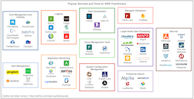
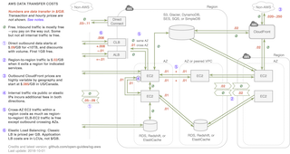
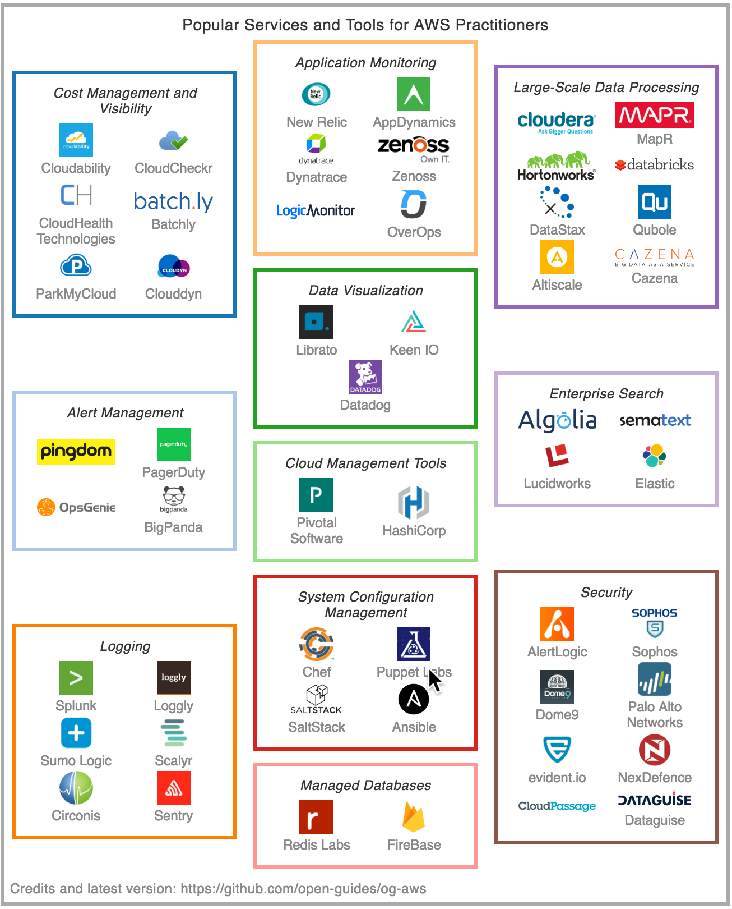
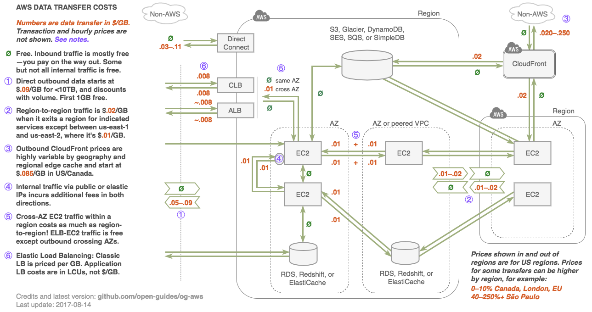

The Open Guide to Amazon Web Services
=====================================

[](https://og-aws-slack.lexikon.io/) ⇦ Join us!

[Credits](AUTHORS.md) ∙ [Contributing guidelines](CONTRIBUTING.md)

Table of Contents
-----------------

**Purpose**

-	[Why an Open Guide?](#why-an-open-guide)
-	[Scope](#scope)
-	[Legend](#legend)

**AWS in General**

-	[General Information](#general-information)
-	[Learning and Career Development](#learning-and-career-development)
-	[Managing AWS](#managing-aws)
-	[Managing Servers and Applications](#managing-servers-and-applications)

| Specific AWS Services                 | Basics                         | Tips                          | Gotchas                                        |
|---------------------------------------|--------------------------------|-------------------------------|------------------------------------------------|
| [Security and IAM](#security-and-iam) | [📗](#security-and-iam-basics) | [📘](#security-and-iam-tips) | [📙](#security-and-iam-gotchas-and-limitations) |
| [S3](#s3) | [📗](#s3-basics) | [📘](#s3-tips) | [📙](#s3-gotchas-and-limitations) |
| [EC2](#ec2) | [📗](#ec2-basics) | [📘](#ec2-tips) | [📙](#ec2-gotchas-and-limitations) |
| [CloudWatch](#cloudwatch) | [📗](#cloudwatch-basics) | [📘](#cloudwatch-tips) | [📙](#cloudwatch-gotchas-and-limitations) |
| [AMIs](#amis) | [📗](#ami-basics) | [📘](#ami-tips) | [📙](#ami-gotchas-and-limitations) |
| [Auto Scaling](#auto-scaling) | [📗](#auto-scaling-basics) | [📘](#auto-scaling-tips) | [📙](#auto-scaling-gotchas-and-limitations) |
| [EBS](#ebs) | [📗](#ebs-basics) | [📘](#ebs-tips) | [📙](#ebs-gotchas-and-limitations) |
| [EFS](#efs) | [📗](#efs-basics) | [📘](#efs-tips) | [📙](#efs-gotchas-and-limitations) |
| [Load Balancers](#load-balancers) | [📗](#load-balancer-basics) | [📘](#load-balancer-tips) | [📙](#load-balancer-gotchas-and-limitations) |
| [CLB (ELB)](#clb) | [📗](#clb-basics) | [📘](#clb-tips) | [📙](#clb-gotchas-and-limitations) |
| [ALB](#alb) | [📗](#alb-basics) | [📘](#alb-tips) | [📙](#alb-gotchas-and-limitations) |
| [Elastic IPs](#elastic-ips) | [📗](#elastic-ip-basics) | [📘](#elastic-ip-tips) | [📙](#elastic-ip-gotchas-and-limitations) |
| [Glacier](#glacier) | [📗](#glacier-basics) | [📘](#glacier-tips) | [📙](#glacier-gotchas-and-limitations) |
| [RDS](#rds) | [📗](#rds-basics) | [📘](#rds-tips) | [📙](#rds-gotchas-and-limitations) |
| [RDS MySQL and MariaDB](#rds-mysql-and-mariadb) | [📗](#rds-mysql-and-mariadb-basics) | [📘](#rds-mysql-and-mariadb-tips) | [📙](#rds-mysql-and-mariadb-gotchas-and-limitations) |
| [RDS PostgreSQL](#rds-postgresql) | [📗](#rds-postgresql-basics) | [📘](#rds-postgresql-tips) | [📙](#rds-postgresql-gotchas-and-limitations) |
| [RDS SQL Server](#rds-sql-server) | [📗](#rds-sql-server-basics) | [📘](#rds-sql-server-tips) | [📙](#rds-sql-server-gotchas-and-limitations) |
| [RDS Aurora](#rds-aurora) | [📗](#rds-aurora-basics) |
| [RDS Aurora MySQL](#rds-aurora-mysql) | [📗](#rds-aurora-mysql-basics) | [📘](#rds-aurora-mysql-tips) | [📙](#rds-aurora-mysql-gotchas-and-limitations) |
| [RDS Aurora PostgreSQL](#rds-aurora-postgresql) | [📗](#rds-aurora-postgresql-basics) | [📘](#rds-aurora-postgresql-tips) | [📙](#rds-aurora-postgresql-gotchas-and-limitations) |
| [DynamoDB](#dynamodb) | [📗](#dynamodb-basics) | [📘](#dynamodb-tips) | [📙](#dynamodb-gotchas-and-limitations) |
| [ElastiCache](#elasticache) | [📗](#elasticache-basics) | [📘](#elasticache-tips) | [📙](#elasticache-gotchas-and-limitations) |
| [ECS](#ecs) | [📗](#ecs-basics) | [📘](#ecs-tips) | |
| [EKS](#eks) | [📗](#eks-basics) | [📘](#eks-tips) | [📙](#eks-gotchas-limitations)  |
| [Fargate](#fargate) | [📗](#fargate-basics) | [📘](#fargate-tips) | [📙](#fargate-gotchas-and-limitations) |
| [Lambda](#lambda) | [📗](#lambda-basics) | [📘](#lambda-tips) | [📙](#lambda-gotchas-and-limitations) |
| [API Gateway](#api-gateway) | [📗](#api-gateway-basics) | [📘](#api-gateway-tips) | [📙](#api-gateway-gotchas-and-limitations) |
| [Step Functions](#step-functions) | [📗](#step-function-basics) | [📘](#step-function-tips) | [📙](#step-function-gotchas-and-limitations) |
| [Route 53](#route-53) | [📗](#route-53-basics) | [📘](#route-53-tips) | [📙](#route-53-gotchas-and-limitations) |
| [CloudFormation](#cloudformation) | [📗](#cloudformation-basics) | [📘](#cloudformation-tips) | [📙](#cloudformation-gotchas-and-limitations) |
| [VPCs, Network Security, and Security Groups](#vpcs-network-security-and-security-groups) | [📗](#vpc-basics) | [📘](#vpc-and-network-security-tips) | [📙](#vpc-and-network-security-gotchas-and-limitations) |
| [KMS](#kms) | [📗](#kms-basics) | [📘](#kms-tips) | [📙](#kms-gotchas-and-limitations) |
| [CloudFront](#cloudfront) | [📗](#cloudfront-basics) | [📘](#cloudfront-tips) | [📙](#cloudfront-gotchas-and-limitations) |
| [DirectConnect](#directconnect) | [📗](#directconnect-basics) | [📘](#directconnect-tips) |  |
| [Redshift](#redshift) | [📗](#redshift-basics) | [📘](#redshift-tips) | [📙](#redshift-gotchas-and-limitations) |
| [EMR](#emr) | [📗](#emr-basics) | [📘](#emr-tips) | [📙](#emr-gotchas-and-limitations) |
| [Kinesis Streams](#kinesis-streams) | [📗](#kinesis-streams-basics) | [📘](#kinesis-streams-tips) | [📙](#kinesis-streams-gotchas-and-limitations) |
| [Kinesis Firehose](#kinesis-firehose) |  |  | [📙](#kinesis-firehose-gotchas-and-limitations) |
| [Device Farm](#device-farm) | [📗](#device-farm-basics) | [📘](#device-farm-tips) | [📙](#device-farm-gotchas-and-limitations) |
| [Mobile Hub](#mobile-hub) | [📗](#mobile-hub-basics) | [📘](#mobile-hub-tips) | [📙](#mobile-hub-gotchas-and-limitations) |
| [IoT](#iot) | [📗](#iot-basics) | [📘](#iot-tips) | [📙](#iot-gotchas-and-limitations) |
| [SES](#ses) | [📗](#ses-basics) | [📘](#ses-tips) | [📙](#ses-gotchas-and-limitations) |
| [Certificate Manager](#certificate-manager) | [📗](#certificate-manager-basics) | [📘](#certificate-manager-tips) | [📙](#certificate-manager-gotchas-and-limitations) |
| [WAF](#waf) | [📗](#waf-basics) | [📘](#waf-tips) | [📙](#waf-gotchas-and-limitations) |
| [OpsWorks](#opsworks) | [📗](#opsworks-basics) | [📘](#opsworks-tips) | [📙](#opsworks-gotchas-and-limitations) |
| [Batch](#batch) | [📗](#batch-basics) | [📘](#batch-tips) |
| [SQS](#sqs) | [📗](#sqs-basics) | [📘](#sqs-tips) | [📙](#sqs-gotchas-and-limitations) |
| [SNS](#sns) | [📗](#sns-basics) | [📘](#sns-tips) | [📙](#sns-gotchas-and-limitations) |

**Special Topics**

-	[High Availability](#high-availability)
-	[Billing and Cost Management](#billing-and-cost-management)
-	[Further Reading](#further-reading)

**Legal**

-	[Disclaimer](#disclaimer)
-	[License](#license)

**Figures and Tables**

[](#tools-and-services-market-landscape) [](#aws-data-transfer-costs)

-	[Figure: Tools and Services Market Landscape](#tools-and-services-market-landscape): A selection of third-party companies/products
-	[Figure: AWS Data Transfer Costs](#aws-data-transfer-costs): Visual overview of data transfer costs
-	[Table: Service Matrix](#service-matrix): How AWS services compare to alternatives
-	[Table: AWS Product Maturity and Releases](#aws-product-maturity-and-releases): AWS product releases
-	[Table: Storage Durability, Availability, and Price](#storage-durability-availability-and-price): A quantitative comparison

Why an Open Guide?
------------------

A lot of information on AWS is already written. Most people learn AWS by reading a blog or a “[getting started guide](http://docs.aws.amazon.com/AWSEC2/latest/UserGuide/EC2_GetStarted.html)” and referring to the [standard AWS references](https://aws.amazon.com/documentation/). Nonetheless, trustworthy and practical information and recommendations aren’t easy to come by. AWS’s own documentation is a great but sprawling resource few have time to read fully, and it doesn’t include anything but official facts, so omits experiences of engineers. The information in blogs or [Stack Overflow](http://stackoverflow.com/questions/tagged/amazon-web-services) is also not consistently up to date.

This guide is by and for engineers who use AWS. It aims to be a useful, living reference that consolidates links, tips, gotchas, and best practices. It arose from discussion and editing over beers by [several engineers](AUTHORS.md) who have used AWS extensively.

Before using the guide, please read the [**license**](#license) and [**disclaimer**](#disclaimer).

### Please help!

**This is an early in-progress draft!** It’s our first attempt at assembling this information, so is far from comprehensive still, and likely to have omissions or errors.

[](https://og-aws-slack.lexikon.io/)

Please help by [**joining the Slack channel**](https://og-aws-slack.lexikon.io/) (we like to talk about AWS in general, even if you only have questions — discussion helps the community and guides improvements) and [**contributing to the guide**](CONTRIBUTING.md). This guide is *open to contributions*, so unlike a blog, it can keep improving. Like any open source effort, we combine efforts but also review to ensure high quality.

Scope
-----

-	Currently, this guide covers selected “core” services, such as EC2, S3, Load Balancers, EBS, and IAM, and partial details and tips around other services. We expect it to expand.
-	It is not a tutorial, but rather a collection of information you can read and return to. It is for both beginners and the experienced.
-	The goal of this guide is to be:
	-	**Brief:** Keep it dense and use links
	-	**Practical:** Basic facts, concrete details, advice, gotchas, and other “folk knowledge”
	-	**Current:** We can keep updating it, and anyone can contribute improvements
	-	**Thoughtful:** The goal is to be helpful rather than present dry facts. Thoughtful opinion with rationale is welcome. Suggestions, notes, and opinions based on real experience can be extremely valuable. (We believe this is both possible with a guide of this format, unlike in some [other venues](http://meta.stackexchange.com/questions/201994/is-there-a-place-to-ask-opinion-based-questions).)
-	This guide is not sponsored by AWS or AWS-affiliated vendors. It is written by and for engineers who use AWS.

Legend
------

-	📒 Marks standard/official AWS pages and docs
-	🔹 Important or often overlooked tip
-	❗ “Serious” gotcha (used where risks or time or resource costs are significant: critical security risks, mistakes with significant financial cost, or poor architectural choices that are fundamentally difficult to correct)
-	🔸 “Regular” gotcha, limitation, or quirk (used where consequences are things not working, breaking, or not scaling gracefully)
-	📜 Undocumented feature (folklore)
-	🐥 Relatively new (and perhaps immature) services or features
-	⏱ Performance discussions
-	⛓ Lock-in: Products or decisions that are likely to tie you to AWS in a new or significant way — that is, later moving to a non-AWS alternative would be costly in terms of engineering effort
-	🚪 Alternative non-AWS options
-	💸 Cost issues, discussion, and gotchas
-	🕍 A mild warning attached to “full solution” or opinionated frameworks that may take significant time to understand and/or might not fit your needs exactly; the opposite of a point solution (the cathedral is a nod to [Raymond’s metaphor](https://en.wikipedia.org/wiki/The_Cathedral_and_the_Bazaar)\)
-	📗📘📙 Colors indicate basics, tips, and gotchas, respectively.
-	🚧 Areas where correction or improvement are needed (possibly with link to an issue — do help!)

General Information
-------------------

### When to Use AWS

-	[AWS](https://en.wikipedia.org/wiki/Amazon_Web_Services) is the dominant public cloud computing provider.
	-	In general, “[cloud computing](https://en.wikipedia.org/wiki/Cloud_computing)” can refer to one of three types of cloud: “public,” “private,” and “hybrid.” AWS is a public cloud provider, since anyone can use it. Private clouds are within a single (usually large) organization. Many companies use a hybrid of private and public clouds.
	-	The core features of AWS are [infrastructure-as-a-service](https://en.wikipedia.org/wiki/Cloud_computing#Infrastructure_as_a_service_.28IaaS.29) (IaaS) — that is, virtual machines and supporting infrastructure. Other cloud service models include [platform-as-a-service](https://en.wikipedia.org/wiki/Cloud_computing#Platform_as_a_service_.28PaaS.29) (PaaS), which typically are more fully managed services that deploy customers’ applications, or [software-as-a-service](https://en.wikipedia.org/wiki/Cloud_computing#Software_as_a_service_.28SaaS.29) (SaaS), which are cloud-based applications. AWS does offer a few products that fit into these other models, too.
	-	In business terms, with infrastructure-as-a-service you have a variable cost model — it is [OpEx, not CapEx](http://www.investopedia.com/ask/answers/020915/what-difference-between-capex-and-opex.asp) (though some [pre-purchased contracts](https://aws.amazon.com/ec2/purchasing-options/reserved-instances/) are still CapEx).
-	AWS’s annual revenue was [**$17.46 billion**](http://phx.corporate-ir.net/phoenix.zhtml?c=97664&p=irol-sec&control_selectgroup=Annual%20Filings#15414896) in 2017 according to their SEC 10-K filing, or roughly **10%** of Amazon.com’s total 2017 revenue.
-	**Main reasons to use AWS:**
	-	If your company is building systems or products that may need to scale
	-	and you have technical know-how
	-	and you want the most flexible tools
	-	and you’re not significantly tied into different infrastructure already
	-	and you don’t have internal, regulatory, or compliance reasons you can’t use a public cloud-based solution
	-	and you’re not on a Microsoft-first tech stack
	-	and you don’t have a specific reason to use Google Cloud
	-	and you can afford, manage, or negotiate its somewhat higher costs
	-	... then AWS is likely a good option for your company.
-	Each of those reasons above might point to situations where other services are preferable. In practice, many, if not most, tech startups as well as a number of modern large companies can or already do benefit from using AWS. Many large enterprises are partly migrating internal infrastructure to Azure, Google Cloud, and AWS.
-	**Costs:** Billing and cost management are such big topics that we have [an entire section on this](#billing-and-cost-management).
-	🔹**EC2 vs. other services:** Most users of AWS are most familiar with [EC2](#ec2), AWS’ flagship virtual server product, and possibly a few others like S3 and CLBs. But AWS products now extend far beyond basic IaaS, and often companies do not properly understand or appreciate all the many AWS services and how they can be applied, due to the [sharply growing](#which-services-to-use) number of services, their novelty and complexity, branding confusion, and fear of ⛓lock-in to proprietary AWS technology. Although a bit daunting, it’s important for technical decision-makers in companies to understand the breadth of the AWS services and make informed decisions. (We hope this guide will help.)
-	🚪**AWS vs. other cloud providers:** While AWS is the dominant IaaS provider (31% market share in [this 2016 estimate](https://www.srgresearch.com/articles/aws-remains-dominant-despite-microsoft-and-google-growth-surges)), there is significant competition and alternatives that are better suited to some companies. [This Gartner report](https://www.gartner.com/doc/reprints?id=1-2G2O5FC&ct=150519&st=sb) has a good overview of the major cloud players :
	-	[**Google Cloud Platform**](https://cloud.google.com/). GCP arrived later to market than AWS, but has vast resources and is now used widely by many companies, including a few large ones. It is gaining market share. Not all AWS services have similar or analogous services in GCP. And vice versa: In particular, GCP offers some more advanced machine learning-based services like the [Vision](https://cloud.google.com/vision/), [Speech](https://cloud.google.com/speech/), and [Natural Language](https://cloud.google.com/natural-language/) APIs. It’s not common to switch once you’re up and running, but it does happen: [Spotify migrated](http://www.wsj.com/articles/google-cloud-lures-amazon-web-services-customer-spotify-1456270951) from AWS to Google Cloud. There is more discussion [on Quora](https://www.quora.com/What-are-the-reasons-to-choose-AWS-over-Google-Cloud-or-vice-versa-for-a-high-traffic-web-application) about relative benefits. Of particular note is that VPCs in GCP are [global by default](https://cloud.google.com/vpc/) with subnetworks per region, while AWS’ VPCs have to live within a particular region. This gives GCP an edge if you’re designing applications with geo-replication from the beginning. It’s also possible to [share one GCP VPC](https://cloud.google.com/compute/docs/shared-vpc/) between multiple projects (roughly analogous to AWS accounts), while in AWS you’d have to peer them. It’s also possible to [peer GCP VPCs](https://cloud.google.com/compute/docs/vpc/vpc-peering) in a similar manner to how it’s done in AWS.
	-	[**Microsoft Azure**](https://azure.microsoft.com/en) is the de facto choice for companies and teams that are focused on a Microsoft stack, and it has now placed significant emphasis on Linux as well
	-	In **China**, AWS’ footprint is relatively small. The market is dominated by Alibaba’s [Aliyun](https://intl.aliyun.com/).
	-	Companies at (very) large scale may want to reduce costs by managing their own infrastructure. For example, [Dropbox migrated](https://news.ycombinator.com/item?id=11282948) to their own infrastructure.
	-	Other cloud providers such as [Digital Ocean](https://www.digitalocean.com/) offer similar services, sometimes with greater ease of use, more personalized support, or lower cost. However, none of these match the breadth of products, mind-share, and market domination AWS now enjoys.
	-	Traditional managed hosting providers such as [Rackspace](https://www.rackspace.com/) offer cloud solutions as well.
-	🚪**AWS vs. PaaS:** If your goal is just to put up a single service that does something relatively simple, and you’re trying to minimize time managing operations engineering, consider a [platform-as-a-service](https://en.wikipedia.org/wiki/Platform_as_a_service) such as [Heroku](https://www.heroku.com/). The AWS approach to PaaS, Elastic Beanstalk, is arguably more complex, especially for simple use cases.
-	🚪**AWS vs. web hosting:** If your main goal is to host a website or blog, and you don’t expect to be building an app or more complex service, you may wish consider one of the myriad [web hosting services](https://www.google.com/search?q=web+hosting).
-	🚪**AWS vs. managed hosting:** Traditionally, many companies pay [managed hosting](https://en.wikipedia.org/wiki/Dedicated_hosting_service) providers to maintain physical servers for them, then build and deploy their software on top of the rented hardware. This makes sense for businesses who want direct control over hardware, due to legacy, performance, or special compliance constraints, but is usually considered old fashioned or unnecessary by many developer-centric startups and younger tech companies.
-	**Complexity:** AWS will let you build and scale systems to the size of the largest companies, but the complexity of the services when used at scale requires significant depth of knowledge and experience. Even very simple use cases often require more knowledge to do “right” in AWS than in a simpler environment like Heroku or Digital Ocean. (This guide may help!)
-	**Geographic locations:** AWS has data centers in [over a dozen geographic locations](http://docs.aws.amazon.com/AWSEC2/latest/UserGuide/using-regions-availability-zones.html#concepts-available-regions), known as **regions**, in Europe, East Asia, North and South America, and now Australia and India. It also has many more **edge locations** globally for reduced latency of services like CloudFront.
	-	See the [current list](https://aws.amazon.com/about-aws/global-infrastructure/) of regions and edge locations, including upcoming ones.
	-	If your infrastructure needs to be in close physical proximity to another service for latency or throughput reasons (for example, latency to an ad exchange), viability of AWS may depend on the location.
-	⛓**Lock-in:** As you use AWS, it’s important to be aware when you are depending on AWS services that do not have equivalents elsewhere.
	-	Lock-in may be completely fine for your company, or a significant risk. It’s important from a business perspective to make this choice explicitly, and consider the cost, operational, business continuity, and competitive risks of being tied to AWS. AWS is such a dominant and reliable vendor, many companies are comfortable with using AWS to its full extent. Others can tell stories about the [dangers of “cloud jail” when costs spiral](http://firstround.com/review/the-three-infrastructure-mistakes-your-company-must-not-make/).
	-	Generally, the more AWS services you use, the more lock-in you have to AWS — that is, the more engineering resources (time and money) it will take to change to other providers in the future.
	-	Basic services like virtual servers and standard databases are usually easy to migrate to other providers or on premises. Others like load balancers and IAM are specific to AWS but have close equivalents from other providers. The key thing to consider is whether engineers are architecting systems around specific AWS services that are not open source or relatively interchangeable. For example, Lambda, API Gateway, Kinesis, Redshift, and DynamoDB do not have substantially equivalent open source or commercial service equivalents, while EC2, RDS (MySQL or Postgres), EMR, and ElastiCache more or less do. (See more [below](#which-services-to-use), where these are noted with ⛓.)
-	**Combining AWS and other cloud providers:** Many customers combine AWS with other non-AWS services. For example, legacy systems or secure data might be in a managed hosting provider, while other systems are AWS. Or a company might only use S3 with another provider doing everything else. However small startups or projects starting fresh will typically stick to AWS or Google Cloud only.
-	**Hybrid cloud:** In larger enterprises, it is common to have [hybrid deployments](https://aws.amazon.com/enterprise/hybrid/) encompassing private cloud or on-premises servers and AWS — or other enterprise cloud providers like [IBM](https://www.ibm.com/it-infrastructure/us-en/hybrid-cloud/)/[Bluemix](http://www.ibm.com/cloud-computing/bluemix/hybrid/), [Microsoft](https://www.microsoft.com/en-us/cloud-platform/hybrid-cloud)/[Azure](https://azure.microsoft.com/en-us/overview/azure-stack/), [NetApp](http://www.netapp.com/us/solutions/cloud/hybrid-cloud/), or [EMC](http://www.emc.com/en-us/cloud/hybrid-cloud-computing/index.htm).
-	**Major customers:** Who uses AWS and Google Cloud?
	-	AWS’s [list of customers](https://aws.amazon.com/solutions/case-studies/) includes large numbers of mainstream online properties and major brands, such as Netflix, Pinterest, Spotify (moving to Google Cloud), Airbnb, Expedia, Yelp, Zynga, Comcast, Nokia, and Bristol-Myers Squibb.
	-	Azure’s [list of customers](https://azure.microsoft.com/en-us/case-studies/) includes companies such as NBC Universal, 3M and Honeywell Inc.
	-	Google Cloud’s [list of customers](https://cloud.google.com/customers/) is large as well, and includes a few mainstream sites, such as [Snapchat](http://www.businessinsider.com/snapchat-is-built-on-googles-cloud-2014-1), Best Buy, Domino’s, and Sony Music.

### Which Services to Use

-	AWS offers a *lot* of different services — [about a hundred](https://aws.amazon.com/products/) at last count.
-	Most customers use a few services heavily, a few services lightly, and the rest not at all. What services you’ll use depends on your use cases. Choices differ substantially from company to company.
-	**Immature and unpopular services:** Just because AWS has a service that sounds promising, it doesn’t mean you should use it. Some services are very narrow in use case, not mature, are overly opinionated, or have limitations, so building your own solution may be better. We try to give a sense for this by breaking products into categories.
-	**Must-know infrastructure:** Most typical small to medium-size users will focus on the following services first. If you manage use of AWS systems, you likely need to know at least a little about all of these. (Even if you don’t use them, you should learn enough to make that choice intelligently.)
	-	[IAM](#security-and-iam): User accounts and identities (you need to think about accounts early on!)
	-	[EC2](#ec2): Virtual servers and associated components, including:
		-	[AMIs](#amis): Machine Images
		-	[Load Balancers](#load-balancers): CLBs and ALBs
		-	[Autoscaling](#auto-scaling): Capacity scaling (adding and removing servers based on load)
		-	[EBS](#ebs): Network-attached disks
		-	[Elastic IPs](#elastic-ips): Assigned IP addresses
	-	[S3](#s3): Storage of files
	-	[Route 53](#route-53): DNS and domain registration
	-	[VPC](#vpcs-network-security-and-security-groups): Virtual networking, network security, and co-location; you automatically use
	-	[CloudFront](#cloudfront): CDN for hosting content
	-	[CloudWatch](#cloudwatch): Alerts, paging, monitoring
-	**Managed services:** Existing software solutions you could run on your own, but with managed deployment:
	-	[RDS](#rds): Managed relational databases (managed MySQL, Postgres, and Amazon’s own Aurora database)
	-	[EMR](#emr): Managed Hadoop
	-	[Elasticsearch](https://aws.amazon.com/elasticsearch-service/): Managed Elasticsearch
	-	[ElastiCache](https://aws.amazon.com/elasticache/): Managed Redis and Memcached
-	**Optional but important infrastructure:** These are key and useful infrastructure components that are less widely known and used. You may have legitimate reasons to prefer alternatives, so evaluate with care to be sure they fit your needs:
	-	⛓[Lambda](#lambda): Running small, fully managed tasks “serverless”
	-	[CloudTrail](https://aws.amazon.com/cloudtrail/): AWS API logging and audit (often neglected but important)
	-	⛓🕍[CloudFormation](#cloudformation): Templatized configuration of collections of AWS resources
	-	🕍[Elastic Beanstalk](https://aws.amazon.com/elasticbeanstalk/): Fully managed (PaaS) deployment of packaged Java, .NET, PHP, Node.js, Python, Ruby, Go, and Docker applications
	-	🐥[EFS](#efs): Network filesystem compatible with NFSv4.1
	-	⛓🕍[ECS](#ecs): Docker container/cluster management (note Docker can also be used directly, without ECS)
	-   🕍 [EKS](#eks): Kubernetes (K8) Docker Container/Cluster management 
	-	⛓[ECR](https://aws.amazon.com/ecr/): Hosted private Docker registry
	-	🐥[Config](https://aws.amazon.com/config/): AWS configuration inventory, history, change notifications
	-	🐥[X-Ray](https://aws.amazon.com/xray/): Trace analysis and debugging for distributed applications such as microservices.
-	**Special-purpose infrastructure:** These services are focused on specific use cases and should be evaluated if they apply to your situation. Many also are proprietary architectures, so tend to tie you to AWS.
	-	⛓[DynamoDB](#dynamodb): Low-latency NoSQL key-value store
	-	⛓[Glacier](#glacier): Slow and cheap alternative to S3
	-	⛓[Kinesis](https://aws.amazon.com/kinesis/): Streaming (distributed log) service
	-	⛓[SQS](https://aws.amazon.com/sqs/): Message queueing service
	-	⛓[Redshift](#redshift): Data warehouse
	-	🐥[QuickSight](https://aws.amazon.com/quicksight/): Business intelligence service
	-	[SES](https://aws.amazon.com/ses/): Send and receive e-mail for marketing or transactions
	-	⛓[API Gateway](https://aws.amazon.com/api-gateway/): Proxy, manage, and secure API calls
	-	⛓[IoT](#iot): Manage bidirectional communication over HTTP, WebSockets, and MQTT between AWS and clients (often but not necessarily “things” like appliances or sensors)
	-	⛓[WAF](https://aws.amazon.com/waf/): Web firewall for CloudFront to deflect attacks
	-	⛓[KMS](#kms): Store and manage encryption keys securely
	-	[Inspector](https://aws.amazon.com/inspector/): Security audit
	-	[Trusted Advisor](https://aws.amazon.com/premiumsupport/trustedadvisor/): Automated tips on reducing cost or making improvements
	-	🐥[Certificate Manager](https://aws.amazon.com/certificate-manager/): Manage SSL/TLS certificates for AWS services
	-	🐥⛓[Fargate](https://aws.amazon.com/fargate/): Docker containers management, backend for ECS and EKS
-	**Compound services:** These are similarly specific, but are full-blown services that tackle complex problems and may tie you in. Usefulness depends on your requirements. If you have large or significant need, you may have these already managed by in-house systems and engineering teams.
	-	[Machine Learning](https://aws.amazon.com/machine-learning/): Machine learning model training and classification
	-	[Lex](https://aws.amazon.com/lex/): Automatic speech recognition (ASR) and natural language understanding (NLU)
	-	[Polly](https://aws.amazon.com/polly/): Text-to-speech engine in the cloud
	-	[Rekognition](https://aws.amazon.com/rekognition/): Service for image recognition
	-	⛓🕍[Data Pipeline](https://aws.amazon.com/datapipeline/): Managed ETL service
	-	⛓🕍[SWF](https://aws.amazon.com/swf/): Managed state tracker for distributed polyglot job workflow
	-	⛓🕍[Lumberyard](https://aws.amazon.com/lumberyard/): 3D game engine
-	**Mobile/app development:**
	-	[SNS](https://aws.amazon.com/sns/): Manage app push notifications and other end-user notifications
	-	⛓🕍[Cognito](https://aws.amazon.com/cognito/): User authentication via Facebook, Twitter, etc.
	-	[Device Farm](https://aws.amazon.com/device-farm/): Cloud-based device testing
	-	[Mobile Analytics](https://aws.amazon.com/mobileanalytics/): Analytics solution for app usage
	-	🕍[Mobile Hub](https://aws.amazon.com/mobile/): Comprehensive, managed mobile app framework
-	**Enterprise services:** These are relevant if you have significant corporate cloud-based or hybrid needs. Many smaller companies and startups use other solutions, like Google Apps or Box. Larger companies may also have their own non-AWS IT solutions.
	-	[AppStream](https://aws.amazon.com/appstream/): Windows apps in the cloud, with access from many devices
	-	[Workspaces](https://aws.amazon.com/workspaces/): Windows desktop in the cloud, with access from many devices
	-	[WorkDocs](https://aws.amazon.com/workdocs/) (formerly Zocalo): Enterprise document sharing
	-	[WorkMail](https://aws.amazon.com/workmail/): Enterprise managed e-mail and calendaring service
	-	[Directory Service](https://aws.amazon.com/directoryservice/): Microsoft Active Directory in the cloud
	-	[Direct Connect](https://aws.amazon.com/directconnect/): Dedicated network connection between office or data center and AWS
	-	[Storage Gateway](https://aws.amazon.com/storagegateway/): Bridge between on-premises IT and cloud storage
	-	[Service Catalog](https://aws.amazon.com/servicecatalog/): IT service approval and compliance
-	**Probably-don't-need-to-know services:** Bottom line, our informal polling indicates these services are just not broadly used — and often for good reasons:
	-	[Snowball](https://aws.amazon.com/importexport/): If you want to ship petabytes of data into or out of Amazon using a physical appliance, read on.
	-	[Snowmobile](https://aws.amazon.com/snowmobile/): Appliances are great, but if you've got exabyte scale data to get into Amazon, nothing beats a tractor trailer full of drives.
	-	[CodeCommit](https://aws.amazon.com/codecommit/): Git service. You’re probably already using GitHub or your own solution ([Stackshare](http://stackshare.io/stackups/github-vs-bitbucket-vs-aws-codecommit) has informal stats).
	-	🕍[CodePipeline](https://aws.amazon.com/codepipeline/): Continuous integration. You likely have another solution already.
	-	🕍[CodeDeploy](https://aws.amazon.com/codedeploy/): Deployment of code to EC2 servers. Again, you likely have another solution.
	-	🕍[OpsWorks](https://aws.amazon.com/opsworks/): Management of your deployments using Chef or (as of November 2017) Puppet Enterprise.
-	[AWS in Plain English](https://www.expeditedssl.com/aws-in-plain-english) offers more friendly explanation of what all the other different services are.

### Tools and Services Market Landscape

There are now enough cloud and “big data” enterprise companies and products that few can keep up with the market landscape. (See the [Big Data Evolving Landscape – 2016](https://practicalanalytics.co/2016/02/09/big-data-evolving-landscape-2016/) for one attempt at this.)

We’ve assembled a landscape of a few of the services. This is far from complete, but tries to emphasize services that are popular with AWS practitioners — services that specifically help with AWS, or a complementary, or tools almost anyone using AWS must learn.



🚧 *Suggestions to improve this figure? Please [file an issue](CONTRIBUTING.md).*


### Common Concepts

-	📒 The AWS [**General Reference**](https://docs.aws.amazon.com/general/latest/gr/Welcome.html) covers a bunch of common concepts that are relevant for multiple services.
-	AWS allows deployments in [**regions**](https://docs.aws.amazon.com/general/latest/gr/rande.html), which are isolated geographic locations that help you reduce latency or offer additional redundancy. Regions contain availability zones(AZs), which are typically the first tool of choice for [high availability](#high-availability)). AZs are [physically separate from one another](https://www.youtube.com/watch?v=JIQETrFC_SQ&feature=youtu.be&t=1428) even within the same region, and [may span multiple physical data centers](https://blog.rackspace.com/aws-101-regions-availability-zones). While they are connected via low latency links, natural disasters afflicting one should not affect others.
-	Each service has API **endpoints** for each region. Endpoints differ from service to service and not all services are available in each region, as listed in [these tables](https://docs.aws.amazon.com/general/latest/gr/rande.html).
-	[**Amazon Resource Names (ARNs)**](https://docs.aws.amazon.com/general/latest/gr/aws-arns-and-namespaces.html) are specially formatted identifiers for identifying resources. They start with 'arn:' and are used in many services, and in particular for IAM policies.

### Service Matrix

Many services within AWS can at least be compared with Google Cloud offerings or with internal Google services. And often times you could assemble the same thing yourself with open source software. This table is an effort at listing these rough correspondences. (Remember that this table is imperfect as in almost every case there are subtle differences of features!)

| Service                       | AWS                                                                          | Google Cloud                 | Google Internal | Microsoft Azure                    | Other providers                   | Open source “build your own”                               |
|-------------------------------|------------------------------------------------------------------------------|------------------------------|-----------------|------------------------------------|-----------------------------------|------------------------------------------------------------|
| Virtual server                | EC2                                                                          | Compute Engine (GCE)         |                 | Virtual Machine                    | DigitalOcean                      | OpenStack                                                  |
| PaaS                          | Elastic Beanstalk                                                            | App Engine                   | App Engine      | Web Apps                           | Heroku, AppFog, OpenShift | Meteor, AppScale, Cloud Foundry, Convox                    |
| Serverless, microservices     | Lambda, API Gateway                                                          | Functions                    |                 | Function Apps                      | PubNub Blocks, Auth0 Webtask      | Kong, Tyk                                                  |
| Container, cluster manager    | ECS, EKS, Fargate                                                                 | Container Engine, Kubernetes | Borg or Omega   | Container Service                  |                                   | Kubernetes, Mesos, Aurora                                  |
| Object storage                  | S3                                                                           | Cloud Storage                | GFS             | Storage Account                    | DigitalOcean Spaces               | Swift, HDFS, Minio                                         |
| Block storage                 | EBS                                                                          | Persistent Disk              |                 | Storage Account                    | DigitalOcean Volumes              | NFS                                                        |
| SQL datastore                 | RDS                                                                          | Cloud SQL                    |                 | SQL Database                       |                                   | MySQL, PostgreSQL                                          |
| Sharded RDBMS                 |                                                                              | Cloud Spanner                | F1, Spanner     |                                    |                                   | Crate.io, CockroachDB                                      |
| Bigtable                      |                                                                              | Cloud Bigtable               | Bigtable        |                                    |                                   | HBase                                                      |
| Key-value store, column store | DynamoDB                                                                     | Cloud Datastore              | Megastore       | Tables, DocumentDB                 |                                   | Cassandra, CouchDB, RethinkDB, Redis                       |
| Memory cache                  | ElastiCache                                                                  | App Engine Memcache          |                 | Redis Cache                        |                                   | Memcached, Redis                                           |
| Search                        | CloudSearch, Elasticsearch (managed)                                         |                              |                 | Search                             | Algolia, QBox, Elastic Cloud                     | Elasticsearch, Solr                                        |
| Data warehouse                | Redshift                                                                     | BigQuery                     | Dremel          | SQL Data Warehouse                 | Oracle, IBM, SAP, HP, many others | Greenplum                                                  |
| Business intelligence         | QuickSight                                                                   | Data Studio 360               |                 | Power BI                           | Tableau                           |                                                            |
| Lock manager                  | [DynamoDB (weak)](https://gist.github.com/ryandotsmith/c95fd21fab91b0823328) |                              | Chubby          | Lease blobs in Storage Account     |                                   | ZooKeeper, Etcd, Consul                                    |
| Message broker                | SQS, SNS, IoT                                                                | Pub/Sub                      | PubSub2         | Service Bus                        |                                   | RabbitMQ, Kafka, 0MQ                                       |
| Streaming, distributed log    | Kinesis                                                                      | Dataflow                     | PubSub2         | Event Hubs                         |                                   | Kafka Streams, Apex, Flink, Spark Streaming, Storm         |
| MapReduce                     | EMR                                                                          | Dataproc                     | MapReduce       | HDInsight, DataLake Analytics      | Qubole                            | Hadoop                                                     |
| Monitoring                    | CloudWatch                                                                   | Monitoring                   | Borgmon         | Monitor                            |                                   | Prometheus(?)                                              |
| Metric management             |                                                                              |                              | Borgmon, TSDB   | Application Insights               |                                   | Graphite, InfluxDB, OpenTSDB, Grafana, Riemann, Prometheus |
| CDN                           | CloudFront                                                                   | Cloud CDN                    |                 | CDN                                |  Akamai, Fastly, Cloudflare, Limelight Networks                                 | Apache Traffic Server                                      |
| Load balancer                 | CLB/ALB                                                                      | Load Balancing               | GFE             | Load Balancer, Application Gateway |                                   | nginx, HAProxy, Apache Traffic Server                      |
| DNS                           | Route53                                                                      | DNS                          |                 | DNS                                |                                   | bind                                                       |
| Email                         | SES                                                                          |                              |                 |                                    | Sendgrid, Mandrill, Postmark      |                                                            |
| Git hosting                   | CodeCommit                                                                   | Cloud Source Repositories    |                 | Visual Studio Team Services        | GitHub, BitBucket                 | GitLab                                                     |
| User authentication           | Cognito                                                                      |    Firebase Authentication                          |                 | Azure Active Directory             |                                   | oauth.io                                                   |
| Mobile app analytics          | Mobile Analytics                                                             | Firebase Analytics           |                 | HockeyApp                          | Mixpanel                          |                                                            |
| Mobile app testing            | Device Farm                                                                  | Firebase Test Lab            |                 | Xamarin Test Cloud                 | BrowserStack, Sauce Labs, Testdroid                                                            |
| Managing SSL/TLS certificates            | Certificate Manager                                                                  |                |                 |                 | Let's Encrypt, Comodo, Symantec, GlobalSign |
| Automatic speech recognition and natural language understanding            | Lex   | Cloud Speech API, Natural Language API             |                 | Cognitive services                | AYLIEN Text Analysis API, Ambiverse Natural Language Understanding API  |Stanford's Core NLP Suite, Apache OpenNLP, Apache UIMA, spaCy |
| Text-to-speech engine in the cloud            | Polly                                                                  |                |                 |                 |Nuance, Vocalware, IBM | Mimic, eSpeak, MaryTTS |
| Image recognition            | Rekognition                                                            |   Vision API              |                |Cognitive services                 | IBM Watson, Clarifai |TensorFlow, OpenCV |
| File Share and Sync          | WorkDocs                                                                   |   Google Docs                 |                 |OneDrive                  |       Dropbox, Box, Citrix File Share                  |ownCloud |
| Machine Learning          | SageMaker, DeepLens, ML                                                                   |   ML Engine, Auto ML                 |                 |ML Studio                  |       Watson ML                  |  |


🚧 [*Please help fill this table in.*](CONTRIBUTING.md)

Selected resources with more detail on this chart:

-	Google internal: [MapReduce](http://research.google.com/archive/mapreduce.html), [Bigtable](http://research.google.com/archive/bigtable.html), [Spanner](http://research.google.com/archive/spanner.html), [F1 vs Spanner](http://highscalability.com/blog/2013/10/8/f1-and-spanner-holistically-compared.html), [Bigtable vs Megastore](http://perspectives.mvdirona.com/2008/07/google-megastore/)

### AWS Product Maturity and Releases

It’s important to know the maturity of each AWS product. Here is a mostly complete list of first release date, with links to the [release notes](https://aws.amazon.com/releasenotes/). Most recently released services are first. Not all services are available in all regions; see [this table](https://aws.amazon.com/about-aws/global-infrastructure/regional-product-services/).

| Service                                                                                                    | Original release | Availability                                                                  | CLI Support | HIPAA Compliant | PCI-DSS Compliant |
|------------------------------------------------------------------------------------------------------------|------------------|-------------------------------------------------------------------------------|:-----------:|:---------------:|:-----------------:|
| 🐥[X-Ray](https://aws.amazon.com/releasenotes/AWS-X-Ray?browse=1)										  | 2016-12          | General																	  |✓            |                 |                   |
| 🐥[Lex](https://aws.amazon.com/releasenotes/Amazon-Lex?browse=1)                                           | 2016-11          | Preview                                                                       |             |                 |                   |
| 🐥[Polly](https://aws.amazon.com/releasenotes/Amazon-Polly?browse=1)                                       | 2016-11          | General                                                                       |✓            |                 |                   |
| 🐥[Rekognition](https://aws.amazon.com/releasenotes/Amazon-Rekognition?browse=1) 							 | 2016-11          | General                                                                       |✓            |					 |  				|
| 🐥[Athena](http://docs.aws.amazon.com/athena/latest/ug/what-is.html) 										 | 2016-11          | General                                                                       |✓             |                |					|
| 🐥[Batch](http://docs.aws.amazon.com/batch/latest/userguide/what-is-batch.html) 							 | 2016-11          | General                                                                       |✓             |				|					|
| 🐥[Database Migration Service](https://aws.amazon.com/releasenotes/AWS-Database-Migration-Service?browse=1) | 2016-03          | General                                                                      |              | ✓         		|	✓    			|
| 🐥[Certificate Manager](https://aws.amazon.com/blogs/aws/new-aws-certificate-manager-deploy-ssltls-based-apps-on-aws/) | 2016-01          | General                                                            | ✓		   |				|					|
| 🐥[IoT](https://aws.amazon.com/blogs/aws/aws-iot-now-generally-available/)                                  | 2015-08          | General                                                                       | ✓           |				|					|
| 🐥[WAF](https://aws.amazon.com/releasenotes/AWS-WAF?browse=1)                                               | 2015-10          | General                                                                       | ✓           | ✓         		|	✓    			|
| 🐥[Data Pipeline](https://aws.amazon.com/releasenotes/AWS-Data-Pipeline?browse=1)                           | 2015-10          | General                                                                       | ✓           |				|					|
| 🐥[Elasticsearch](https://aws.amazon.com/releasenotes/Amazon-Elasticsearch-Service?browse=1)                | 2015-10          | General                                                                       | ✓           |				|					|
| 🐥[Aurora](https://aws.amazon.com/releasenotes/2775579329314699)                                            | 2015-07          | General                                                                       | ✓           | ✓<sup>[3](#user-content-hipaa-aurora)</sup> |	✓<sup>[3](#user-content-hipaa-aurora)</sup>			|
| 🐥[Service Catalog](https://aws.amazon.com/releasenotes/AWS-Service-Catalog?browse=1)                       | 2015-07          | General                                                                       | ✓           |				|					|
| 🐥[Device Farm](https://aws.amazon.com/releasenotes/AWS-Device-Farm?browse=1)                         	  | 2015-07          | General                                                                       | ✓           |				|					|
| 🐥[CodePipeline](https://aws.amazon.com/releasenotes/AWS-CodePipeline?browse=1)                             | 2015-07          | General                                                                       | ✓           |				|					|
| 🐥[CodeCommit](https://aws.amazon.com/releasenotes/AWS-CodeCommit?browse=1)                                 | 2015-07          | General                                                                       | ✓           |				|					|
| 🐥[API Gateway](https://aws.amazon.com/releasenotes/Amazon-API-Gateway?browse=1)                            | 2015-07          | General                                                                       | ✓           | ✓<sup>[1](#user-content-hipaa-apigateway)</sup>  |	 ✓ 			|
| 🐥[Config](https://aws.amazon.com/releasenotes/AWS-Config?browse=1)                                         | 2015-06          | General                                                                       | ✓           |                 |  ✓              |
| 🐥[EFS](https://aws.amazon.com/releasenotes/Amazon-EFS?browse=1)                                            | 2015-05          | General                                                                       | ✓           |                 |                  |
| 🐥[Machine Learning](https://aws.amazon.com/releasenotes/AmazonML?browse=1)                                 | 2015-04          | General                                                                       | ✓           |                 |                  |
| [Lambda](https://aws.amazon.com/releasenotes/AWS-Lambda?browse=1)                                          | 2014-11          | General                                                                       | ✓           |                 |   ✓             |
| [ECS](https://aws.amazon.com/ecs/release-notes/)                                                           | 2014-11          | General                                                                       | ✓           | ✓         		|	✓   			|
| [EKS](https://docs.aws.amazon.com/eks/latest/userguide/platform-versions.html)                                                           | 2018-06          | General                                                                       | ✓<sup>[12](#user-content-eks-cli)</sup>           |          		|	  			|
| [KMS](https://aws.amazon.com/releasenotes/AWS-KMS?browse=1)                                                | 2014-11          | General                                                                       | ✓           |                 |   ✓             |
| [CodeDeploy](https://aws.amazon.com/releasenotes/AWS-CodeDeploy?browse=1)                                  | 2014-11          | General                                                                       | ✓           |                 |                  |
| [Kinesis](https://aws.amazon.com/releasenotes/Amazon-Kinesis?browse=1)                                     | 2013-12          | General                                                                       | ✓           |                 |   ✓<sup>[11](#user-content-pci-kinesis)</sup>    |
| [CloudTrail](https://aws.amazon.com/releasenotes/AWS-CloudTrail?browse=1)                                  | 2013-11          | General                                                                       | ✓           |                 |   ✓             |
| [AppStream](https://aws.amazon.com/releasenotes/Amazon-AppStream?browse=1)                                 | 2013-11          | Preview                                                                       |             |                 |                  |
| [CloudHSM](https://aws.amazon.com/releasenotes/AWS-CloudHSM?browse=1)                                      | 2013-03          | General                                                                       | ✓           |                 |   ✓            |
| [Silk](https://aws.amazon.com/releasenotes/Amazon-Silk?browse=1)                                           | 2013-03          | Obsolete?                                                                     |             |                 |                  |
| [OpsWorks](https://aws.amazon.com/releasenotes/AWS-OpsWorks?browse=1)                                      | 2013-02          | General                                                                       | ✓           |                 |   ✓             |
| [Redshift](https://aws.amazon.com/releasenotes/Amazon-Redshift?browse=1)                                   | 2013-02          | General                                                                       | ✓           | ✓         		|	✓   			|
| [Elastic Transcoder](https://aws.amazon.com/releasenotes/Amazon-Elastic-Transcoder?browse=1)               | 2013-01          | General                                                                       | ✓           |                 |                  |
| [Glacier](https://aws.amazon.com/releasenotes/Amazon-Glacier?browse=1)                                     | 2012-08          | General                                                                       | ✓           | ✓         		|	✓	    		|
| [CloudSearch](https://aws.amazon.com/releasenotes/Amazon-CloudSearch?browse=1)                             | 2012-04          | General                                                                       | ✓           |                 |                  |
| [SWF](https://aws.amazon.com/releasenotes/Amazon-SWF?browse=1)                                             | 2012-02          | General                                                                       | ✓           |                 | ✓                |
| [Storage Gateway](https://aws.amazon.com/releasenotes/AWS-Storage-Gateway?browse=1)                        | 2012-01          | General                                                                       | ✓           |                 |                  |
| [DynamoDB](https://aws.amazon.com/releasenotes/Amazon-DynamoDB?browse=1)                                   | 2012-01          | General                                                                       | ✓           | ✓         		|	  ✓  			|
| [DirectConnect](https://aws.amazon.com/releasenotes/AWS-Direct-Connect?browse=1)                           | 2011-08          | General                                                                       | ✓           | ✓         		|	✓   			|
| [ElastiCache](https://aws.amazon.com/releasenotes/Amazon-ElastiCache?browse=1)                             | 2011-08          | General                                                                       | ✓           |                 |                  |
| [CloudFormation](https://aws.amazon.com/releasenotes/AWS-CloudFormation?browse=1)                          | 2011-04          | General                                                                       | ✓           |                 |  ✓              |
| [SES](https://aws.amazon.com/releasenotes/Amazon-SES?browse=1)                                             | 2011-01          | General                                                                       | ✓           |                 |                  |
| [Elastic Beanstalk](https://aws.amazon.com/releasenotes/AWS-Elastic-Beanstalk?browse=1)                    | 2010-12          | General                                                                       | ✓           |                 |  ✓              |
| [Route 53](https://aws.amazon.com/releasenotes/Amazon-Route-53?browse=1)                                   | 2010-10          | General                                                                       | ✓           |                 | ✓               |
| [IAM](https://aws.amazon.com/releasenotes/AWS-Identity-and-Access-Management?browse=1)                     | 2010-09          | General                                                                       | ✓           |                 |  ✓              |
| [SNS](https://aws.amazon.com/releasenotes/Amazon-SNS?browse=1)                                             | 2010-04          | General                                                                       | ✓           | ✓         		|					|
| [EMR](https://aws.amazon.com/releasenotes/Elastic-MapReduce?browse=1)                                      | 2010-04          | General                                                                       | ✓           | ✓         		|	✓   			|
| [RDS](https://aws.amazon.com/releasenotes/Amazon-RDS?browse=1)                                             | 2009-12          | General                                                                       | ✓           |✓<sup>[2](#user-content-hipaa-rds)</sup>        |✓<sup>[9](#user-content-pci-rds)</sup>				|    
| [VPC](https://aws.amazon.com/releasenotes/Amazon-VPC?browse=1)                                             | 2009-08          | General                                                                       | ✓           | ✓         		|	✓   			|
| [Snowball](https://aws.amazon.com/releasenotes/AWS-ImportExport?browse=1)                                  | 2015-10          | General                                                                       | ✓           | ✓         		|					|
| [Snowmobile](https://aws.amazon.com/snowmobile/)                                                           | 2016-11          | General                                                                       |            |                 |                  |
| [CloudWatch](https://aws.amazon.com/releasenotes/CloudWatch?browse=1)                                      | 2009-05          | General                                                                       | ✓           |✓                |  ✓               |
| [CloudFront](https://aws.amazon.com/releasenotes/CloudFront?browse=1)                                      | 2008-11          | General                                                                       | ✓           | ✓<sup>[4](#user-content-hipaa-cloudfront)</sup>        |  ✓				|
| [Fulfillment Web Service](https://aws.amazon.com/releasenotes/Amazon-FWS?browse=1)                         | 2008-03          | Obsolete?                                                                     |             |                 |                  |
| [SimpleDB](https://aws.amazon.com/releasenotes/Amazon-SimpleDB?browse=1)                                   | 2007-12          | ❗[Nearly obsolete](https://forums.aws.amazon.com/thread.jspa?threadID=121711) | ✓           |                 |  ✓              |
| [DevPay](https://aws.amazon.com/releasenotes/DevPay?browse=1)                                              | 2007-12          | General                                                                       |             |                 |                  |
| [Flexible Payments Service](https://aws.amazon.com/releasenotes/Amazon-FPS?browse=1)                       | 2007-08          | Retired                                                                       |             |                 |                  |
| [EC2](https://aws.amazon.com/releasenotes/Amazon-EC2?browse=1)                                             | 2006-08          | General                                                                       | ✓           | ✓<sup>[5](#user-content-hipaa-ec2sysmgr),[6](#user-content-hipaa-ec2ebs),[7](#user-content-hipaa-ec2elb)</sup>          |	✓<sup>[6](#user-content-hipaa-ec2ebs),[7](#user-content-hipaa-ec2elb),[10](#user-content-pci-asg)</sup>			|
| [SQS](https://aws.amazon.com/releasenotes/Amazon-SQS?browse=1)                                             | 2006-07          | General                                                                       | ✓           | ✓         		| ✓               |
| [S3](https://aws.amazon.com/releasenotes/Amazon-S3?browse=1)                                               | 2006-03          | General                                                                       | ✓           | ✓<sup>[8](#user-content-hipaa-s3)</sup>   |	✓   			|
| [Alexa Top Sites](https://aws.amazon.com/alexa-top-sites/)                                                 | 2006-01          | General ❗HTTP-only                                                            |             |                 |                  |
| [Alexa Web Information Service](https://aws.amazon.com/awis/)                                              | 2005-10          | General ❗HTTP-only                                                            |             |                 |                  |

##### Footnotes
<a name="user-content-hipaa-apigateway">**1**</a>: Excludes use of Amazon API Gateway caching<br />
<a name="user-content-hipaa-rds">**2**</a>: RDS MySQL, Oracle, and PostgreSQL engines only<br />
<a name="user-content-hipaa-aurora">**3**</a>: MySQL-compatible Aurora edition only<br />
<a name="user-content-hipaa-cloudfront">**4**</a>: Excludes Lambda@Edge<br />
<a name="user-content-hipaa-ec2sysmgr">**5**</a>: Includes EC2 Systems Manager<br />
<a name="user-content-hipaa-ec2ebs">**6**</a>: Includes Elastic Block Storage (EBS)<br />
<a name="user-content-hipaa-ec2elb">**7**</a>: Includes Elastic Load Balancing<br />
<a name="user-content-hipaa-s3">**8**</a>: Includes S3 Transfer Acceleration<br />
<a name="user-content-pci-rds">**9**</a>: Includes RDS MySQL, Oracle, PostgreSQL, SQL Server, and MariaDB</br>
<a name="user-content-pci-asg">**10**</a>: Includes Auto-Scaling</br>
<a name="user-content-pci-kinesis">**11**</a>: Streams only</br>
<a name="user-content-eks-cli">**12**</a>: Kubernetes uses a custom CLI for Pod/Service management called kubectl. AWS CLI only handles Kubernetes Master concerns</br>


### Compliance

-	Many applications have strict requirements around reliability, security, or data privacy. The [AWS Compliance](https://aws.amazon.com/compliance/) page has details about AWS’s certifications, which include **PCI DSS Level 1**, **SOC 1,2, and 3**, **HIPAA**, and **ISO 9001**.
-	Security in the cloud is a complex topic, based on a [shared responsibility model](https://aws.amazon.com/compliance/shared-responsibility-model/), where some elements of compliance are provided by AWS, and some are provided by your company.
-	Several third-party vendors offer assistance with compliance, security, and auditing on AWS. If you have substantial needs in these areas, assistance is a good idea.
-	From inside **China**, AWS services outside China [are generally accessible](https://en.greatfire.org/aws.amazon.com), though there are at times breakages in service. There are also AWS services [inside China](https://www.amazonaws.cn/en/).

### Getting Help and Support

-	**Forums:** For many problems, it’s worth searching or asking for help in the [discussion forums](https://forums.aws.amazon.com/index.jspa) to see if it’s a known issue.
-	**Premium support:** AWS offers several levels of [premium support](https://aws.amazon.com/premiumsupport/).
	-	The first tier, called "Developer support" lets you file support tickets with 12 to 24 hour turnaround time, it starts at $29 but once your monthly spend reaches around $1000 it changes to a 3% surcharge on your bill.
	-	The higher-level support services are quite expensive — and increase your bill by up to 10%. Many large and effective companies never pay for this level of support. They are usually more helpful for midsize or larger companies needing rapid turnaround on deeper or more perplexing problems.
	-	Keep in mind, a flexible architecture can reduce need for support. You shouldn’t be relying on AWS to solve your problems often. For example, if you can easily re-provision a new server, it may not be urgent to solve a rare kernel-level issue unique to one EC2 instance. If your EBS volumes have recent snapshots, you may be able to restore a volume before support can rectify the issue with the old volume. If your services have an issue in one availability zone, you should in any case be able to rely on a redundant zone or migrate services to another zone.
	-	Larger customers also get access to AWS Enterprise support, with dedicated technical account managers (TAMs) and shorter response time SLAs.
	-	There is definitely some controversy about how useful the paid support is. The support staff don’t always seem to have the information and authority to solve the problems that are brought to their attention. Often your ability to have a problem solved may depend on your relationship with your account rep.
-	**Account manager:** If you are at significant levels of spend (thousands of US dollars plus per month), you may be assigned (or may wish to ask for) a dedicated account manager.
	-	These are a great resource, even if you’re not paying for premium support. Build a good relationship with them and make use of them, for questions, problems, and guidance.
	-	Assign a single point of contact on your company’s side, to avoid confusing or overwhelming them.
-	**Contact:** The main web contact point for AWS is [here](https://aws.amazon.com/contact-us/). Many technical requests can be made via these channels.
-	**Consulting and managed services:** For more hands-on assistance, AWS has established relationships with many [consulting partners](https://aws.amazon.com/partners/consulting/) and [managed service partners](https://aws.amazon.com/partners/msp/). The big consultants won’t be cheap, but depending on your needs, may save you costs long term by helping you set up your architecture more effectively, or offering specific expertise, e.g. security. Managed service providers provide longer-term full-service management of cloud resources.
-	**AWS Professional Services:** AWS provides [consulting services](https://aws.amazon.com/professional-services/) alone or in combination with partners.

### Restrictions and Other Notes

-	🔸Lots of resources in Amazon have [**limits**](http://docs.aws.amazon.com/general/latest/gr/aws_service_limits.html) on them. This is actually helpful, so you don’t incur large costs accidentally. You have to request that quotas be increased by opening support tickets. Some limits are easy to raise, and some are not. (Some of these are noted in sections below.)
	- **Obtaining Current Limits and Usage:** Limit information for a service may be available from the service API, Trusted Advisor, both or neither (in which case you'll need to contact Support). [This page](http://awslimitchecker.readthedocs.io/en/latest/limits.html) from the awslimitchecker tool's documentation provides a nice summary of available retrieval options for each limit. The [tool](https://github.com/jantman/awslimitchecker) itself is also valuable for automating limit checks.
-	🔸[**AWS terms of service**](https://aws.amazon.com/service-terms/) are extensive. Much is expected boilerplate, but it does contain important notes and restrictions on each service. In particular, there are restrictions against using many AWS services in **safety-critical systems**. (Those appreciative of legal humor may wish to review clause 57.10.)

### Related Topics

-	[OpenStack](https://www.openstack.org/) is a private cloud alternative to AWS used by large companies that wish to avoid public cloud offerings.

Learning and Career Development
-------------------------------

### Certifications

-	**Certifications:** AWS offers [**certifications**](https://aws.amazon.com/certification/) for IT professionals who want to demonstrate their knowledge.
  -	[Certified Cloud Practitioner](https://aws.amazon.com/certification/certified-cloud-practitioner/)
  -	[Certified Solutions Architect Associate](https://aws.amazon.com/certification/certified-solutions-architect-associate/)
  -	[Certified Developer Associate](https://aws.amazon.com/certification/certified-developer-associate/)
  -	[Certified SysOps Administrator Associate](https://aws.amazon.com/certification/certified-sysops-admin-associate/)
  -	[Certified Solutions Architect Professional](https://aws.amazon.com/certification/certified-solutions-architect-professional/)
  -	[Certified DevOps Engineer Professional](https://aws.amazon.com/certification/certified-devops-engineer-professional/)
-	**Getting certified:** If you’re interested in studying for and getting certifications, [this practical overview](https://gist.github.com/leonardofed/bbf6459ad154ad5215d354f3825435dc) tells you a lot of what you need to know. The official page is [here](https://aws.amazon.com/training/) and there is an [FAQ](https://aws.amazon.com/certification/faqs/).
-	**Do you need a certification?** Especially in consulting companies or when working in key tech roles in large non-tech companies, certifications are important credentials. In others, including in many tech companies and startups, certifications are not common or considered necessary. (In fact, fairly or not, some Silicon Valley hiring managers and engineers see them as a “negative” signal on a resume.)

Managing AWS
------------

### Managing Infrastructure State and Change

A great challenge in using AWS to build complex systems (and with DevOps in general) is to manage infrastructure state effectively over time. In general, this boils down to three broad goals for the state of your infrastructure:

-	**Visibility**: Do you know the state of your infrastructure (what services you are using, and exactly how)? Do you also know when you — and anyone on your team — make changes? Can you detect misconfigurations, problems, and incidents with your service?
-	**Automation**: Can you reconfigure your infrastructure to reproduce past configurations or scale up existing ones without a lot of extra manual work, or requiring knowledge that’s only in someone’s head? Can you respond to incidents easily or automatically?
-	**Flexibility**: Can you improve your configurations and scale up in new ways without significant effort? Can you add more complexity using the same tools? Do you share, review, and improve your configurations within your team?

Much of what we discuss below is really about how to improve the answers to these questions.

There are several approaches to deploying infrastructure with AWS, from the console to complex automation tools, to third-party services, all of which attempt to help achieve visibility, automation, and flexibility.

### AWS Configuration Management

The first way most people experiment with AWS is via its web interface, the AWS Console. But using the Console is a highly manual process, and often works against automation or flexibility.

So if you’re not going to manage your AWS configurations manually, what should you do? Sadly, there are no simple, universal answers — each approach has pros and cons, and the approaches taken by different companies vary widely, and include directly using APIs (and building tooling on top yourself), using command-line tools, and using third-party tools and services.

### AWS Console

-	The [AWS Console](https://aws.amazon.com/console/) lets you control much (but not all) functionality of AWS via a web interface.
-	Ideally, you should only use the AWS Console in a few specific situations:
	-	It’s great for read-only usage. If you’re trying to understand the state of your system, logging in and browsing it is very helpful.
	-	It is also reasonably workable for very small systems and teams (for example, one engineer setting up one server that doesn’t change often).
	-	It can be useful for operations you’re only going to do rarely, like less than once a month (for example, a one-time VPC setup you probably won’t revisit for a year). In this case using the console can be the simplest approach.
-	❗**Think before you use the console:** The AWS Console is convenient, but also the enemy of automation, reproducibility, and team communication. If you’re likely to be making the same change multiple times, avoid the console. Favor some sort of automation, or at least have a path toward automation, as discussed next. Not only does using the console preclude automation, which wastes time later, but it prevents documentation, clarity, and standardization around processes for yourself and your team.

### Command-Line tools

-	The [**aws command-line interface**](https://aws.amazon.com/cli/) (CLI), used via the **aws** command, is the most basic way to save and automate AWS operations.
-	Don’t underestimate its power. It also has the advantage of being well-maintained — it covers a large proportion of all AWS services, and is up to date.
-	In general, whenever you can, prefer the command line to the AWS Console for performing operations.
-	🔹Even in the absence of fancier tools, you can **write simple Bash scripts** that invoke *aws* with specific arguments, and check these into Git. This is a primitive but effective way to document operations you’ve performed. It improves automation, allows code review and sharing on a team, and gives others a starting point for future work.
-	🔹For use that is primarily interactive (not scripted), consider instead using the [**aws-shell**](https://github.com/awslabs/aws-shell) tool from AWS. It is easier to use, with auto-completion and a colorful UI, but still works on the command line. If you’re using [SAWS](https://github.com/donnemartin/saws), a previous version of the program, [you should migrate to aws-shell](https://github.com/donnemartin/saws/issues/68#issuecomment-240067034).

### APIs and SDKs

-	**SDKs** for using AWS APIs are available in most major languages, with [Go](https://github.com/aws/aws-sdk-go), [iOS](https://github.com/aws/aws-sdk-ios), [Java](https://github.com/aws/aws-sdk-java), [JavaScript](https://github.com/aws/aws-sdk-js), [Python](https://github.com/boto/boto3), [Ruby](https://github.com/aws/aws-sdk-ruby), and [PHP](https://github.com/aws/aws-sdk-php) being most heavily used. AWS maintains [a short list](https://aws.amazon.com/tools/#sdk), but the [awesome-aws list](https://github.com/donnemartin/awesome-aws#sdks-and-samples) is the most comprehensive and current. Note [support for C++](https://github.com/donnemartin/awesome-aws#c-sdk) is [still new](https://aws.amazon.com/blogs/aws/introducing-the-aws-sdk-for-c/).
-	**Retry logic:** An important aspect to consider whenever using SDKs is error handling; under heavy use, a wide variety of failures, from programming errors to throttling to AWS-related outages or failures, can be expected to occur. SDKs typically implement [**exponential backoff**](https://docs.aws.amazon.com/general/latest/gr/api-retries.html) to address this, but this may need to be understood and adjusted over time for some applications. For example, it is often helpful to alert on some error codes and not on others.
-	❗Don’t use APIs directly. Although AWS documentation includes lots of API details, it’s better to use the SDKs for your preferred language to access APIs. SDKs are more mature, robust, and well-maintained than something you’d write yourself.

### Boto

-	A good way to automate operations in a custom way is [**Boto3**](https://github.com/boto/boto3), also known as the [Amazon SDK for Python](http://aws.amazon.com/sdk-for-python/). [**Boto2**](https://github.com/boto/boto), the previous version of this library, has been in wide use for years, but now there is a newer version with official support from Amazon, so prefer Boto3 for new projects.
-	Boto3 contains a variety of APIs that operate at either a high level or a low level, here some explanation of both:
	-	The low level APIs (Client APIs) are mapped to AWS Cloud service-specific APIs, and all service operations are supported by clients. Clients are generated from a JSON service definition file.
	-	The high level option, Resource APIs, allows you to avoid calling the network at the low level and instead provide an object-oriented way to interact with AWS Cloud services.
-	Boto3 has a lot of helpful [**features**](https://boto3.readthedocs.io/en/latest/guide/index.html#general-feature-guides) like *waiters*, which provide a structure that allows for code to wait for changes to occur in the cloud, for example, when you are creating an EC2 instance and need wait until the instance is running in order to perform another task.
-	If you find yourself writing a Bash script with more than one or two CLI commands, you’re probably doing it wrong. Stop, and consider writing a Boto script instead. This has the advantages that you can:
	-	Check return codes easily so success of each step depends on success of past steps.
	-	Grab interesting bits of data from responses, like instance ids or DNS names.
	-	Add useful environment information (for example, tag your instances with git revisions, or inject the latest build identifier into your initialization script).

### General Visibility

-	🔹[**Tagging resources**](http://docs.aws.amazon.com/AWSEC2/latest/UserGuide/Using_Tags.html) is an essential practice, especially as organizations grow, to better understand your resource usage. For example, through automation or convention, you can add tags:
	-	For the org or developer that “owns” that resource
	-	For the product that resource supports
	-	To label lifecycles, such as temporary resources or one that should be deprovisioned in the future
	-	To distinguish production-critical infrastructure (e.g. serving systems vs backend pipelines)
	-	To distinguish resources with special security or compliance requirements
	-	To (once enabled) [allocate cost](https://docs.aws.amazon.com/awsaccountbilling/latest/aboutv2/cost-alloc-tags.html). Note that cost allocation tags only apply on a forward-looking basis; you can't retroactively apply them to items already billed.
	-	For many years, there was a notorious 10 tag limit per resource, which could not be raised and caused many companies significant pain. As of 2016, this was [raised](https://aws.amazon.com/blogs/security/now-organize-your-aws-resources-by-using-up-to-50-tags-per-resource/) to 50 tags per resource.
	-	🔹In 2017, AWS introduced the ability to [enforce tagging](https://aws.amazon.com/blogs/aws/new-tag-ec2-instances-ebs-volumes-on-creation/) on instance and volume creation, deprecating portions of third party tools such as [Cloud Custodian](https://github.com/capitalone/cloud-custodian).
	-	🔸 There is a bug in the ASG console where spaces after tag names are preserved. So if you type "Name " with a space at the end you will not get the expected behavior. This is probably true in other locations and SDKs also. Be sure you do not add trailing spaces to tag keys unless you really mean it. (As of Jul 2018)

Managing Servers and Applications
---------------------------------

### AWS vs Server Configuration

This guide is about AWS, not DevOps or server configuration management in general. But before getting into AWS in detail, it’s worth noting that in addition to the configuration management for your AWS resources, there is the long-standing problem of configuration management for servers themselves.

### Philosophy

-	Heroku’s [**Twelve-Factor App**](http://12factor.net/) principles list some established general best practices for deploying applications.
-	**Pets vs cattle:** Treat servers [like cattle, not pets](https://blog.engineyard.com/2014/pets-vs-cattle). That is, design systems so infrastructure is disposable. It should be minimally worrisome if a server is unexpectedly destroyed.
-	The concept of [**immutable infrastructure**](http://radar.oreilly.com/2015/06/an-introduction-to-immutable-infrastructure.html) is an extension of this idea.
-	Minimize application state on EC2 instances. In general, instances should be able to be killed or die unexpectedly with minimal impact. State that is in your application should quickly move to RDS, S3, DynamoDB, EFS, or other data stores not on that instance. EBS is also an option, though it generally should not be the bootable volume, and EBS will require manual or automated re-mounting.

### Server Configuration Management

-	There is a [large set](https://en.wikipedia.org/wiki/Comparison_of_open-source_configuration_management_software) of open source tools for managing configuration of server instances.
-	These are generally not dependent on any particular cloud infrastructure, and work with any variety of Linux (or in many cases, a variety of operating systems).
-	Leading configuration management tools are [Puppet](https://github.com/puppetlabs/puppet), [Chef](https://github.com/chef/chef), [Ansible](https://github.com/ansible/ansible), and [Saltstack](https://github.com/saltstack/salt). These aren’t the focus of this guide, but we may mention them as they relate to AWS.

### Containers and AWS

-	[Docker](http://blog.scottlowe.org/2014/03/11/a-quick-introduction-to-docker/) and the containerization trend are changing the way many servers and services are deployed in general.
-	Containers are designed as a way to package up your application(s) and all of their dependencies in a known way. When you build a container, you are including every library or binary your application needs, outside of the kernel. A big advantage of this approach is that it’s easy to test and validate a container locally without worrying about some difference between your computer and the servers you deploy on.
-	A consequence of this is that you need fewer AMIs and boot scripts; for most deployments, the only boot script you need is a template that fetches an exported docker image and runs it.
-	Companies that are embracing [microservice architectures](http://martinfowler.com/articles/microservices.html) will often turn to container-based deployments.
-	AWS launched [ECS](https://aws.amazon.com/ecs/) as a service to manage clusters via Docker in late 2014, though many people still deploy Docker directly themselves. See the [ECS section](#ecs) for more details.
-	AWS launched [EKS](https://aws.amazon.com/eks/) as a service to manage Kubernetes Clusters mid 2018, though many people still deploy ECS or use Docker directly themselves. See the [EKS section](#eks) for more details. 

### Visibility

-	Store and track instance metadata (such as instance id, availability zone, etc.) and deployment info (application build id, Git revision, etc.) in your logs or reports. The [**instance metadata service**](https://docs.aws.amazon.com/AWSEC2/latest/UserGuide/ec2-instance-metadata.html) can help collect some of the AWS data you’ll need.
-	**Use log management services:** Be sure to set up a way to view and manage logs externally from servers.
	-	Cloud-based services such as [Sumo Logic](https://www.sumologic.com/), [Splunk Cloud](http://www.splunk.com/en_us/cloud.html), [Scalyr](https://www.scalyr.com/), and [Loggly](https://www.loggly.com/) are the easiest to set up and use (and also the most expensive, which may be a factor depending on how much log data you have).
	-	Major open source alternatives include [Elasticsearch](https://github.com/elastic/elasticsearch), [Logstash](https://github.com/elastic/logstash), and [Kibana](https://github.com/elastic/kibana) (the “[Elastic Stack](https://www.elastic.co/webinars/introduction-elk-stack)”) and [Graylog](https://www.graylog.org/).
	-	If you can afford it (you have little data or lots of money) and don’t have special needs, it makes sense to use hosted services whenever possible, since setting up your own scalable log processing systems is notoriously time consuming.
-	**Track and graph metrics:** The AWS Console can show you simple graphs from CloudWatch, you typically will want to track and graph many kinds of metrics, from CloudWatch and your applications. Collect and export helpful metrics everywhere you can (and as long as volume is manageable enough you can afford it).
	-	Services like [Librato](https://www.librato.com/), [KeenIO](https://keen.io/), and [Datadog](https://www.datadoghq.com/) have fancier features or better user interfaces that can save a lot of time. (A more detailed comparison is [here](http://blog.takipi.com/production-tools-guide/visualization-and-metrics/).)
	-	Use [Prometheus](https://prometheus.io) or [Graphite](https://github.com/graphite-project/graphite-web) as timeseries databases for your metrics (both are open source).
	-	[Grafana](https://github.com/grafana/grafana) can visualize with dashboards the stored metrics of both timeseries databases (also open source).

### Tips for Managing Servers

-	❗**Timezone settings on servers**: unless *absolutely necessary*, always **set the timezone on servers to [UTC](https://en.wikipedia.org/wiki/Coordinated_Universal_Time)** (see instructions for your distribution, such as [Ubuntu](https://www.digitalocean.com/community/tutorials/how-to-set-up-timezone-and-ntp-synchronization-on-ubuntu-14-04-quickstart), [CentOS](https://www.vultr.com/docs/setup-timezone-and-ntp-on-centos-6) or [Amazon](https://docs.aws.amazon.com/AWSEC2/latest/UserGuide/set-time.html) Linux). Numerous distributed systems rely on time for synchronization and coordination and UTC [provides](https://blog.serverdensity.com/set-your-server-timezone-to-utc/) the universal reference plane: it is not subject to  daylight savings changes and adjustments in local time. It will also save you a lot of headache debugging [elusive timezone issues](http://yellerapp.com/posts/2015-01-12-the-worst-server-setup-you-can-make.html) and provide coherent timeline of events in your logging and audit systems.
-	**NTP and accurate time:** If you are not using Amazon Linux (which comes preconfigured), you should confirm your servers [configure NTP correctly](https://docs.aws.amazon.com/AWSEC2/latest/UserGuide/set-time.html#configure_ntp), to avoid insidious time drift (which can then cause all sorts of issues, from breaking API calls to misleading logs). This should be part of your automatic configuration for every server. If time has already drifted substantially (generally >1000 seconds), remember NTP won’t shift it back, so you may need to remediate manually (for example, [like this](http://askubuntu.com/questions/254826/how-to-force-a-clock-update-using-ntp) on Ubuntu).
-	**Testing immutable infrastructure:** If you want to be proactive about testing your service’s ability to cope with instance termination or failure, it can be helpful to introduce random instance termination during business hours, which will expose any such issues at a time when engineers are available to identify and fix them. Netflix’s [Simian Army](https://github.com/Netflix/SimianArmy) (specifically, [Chaos Monkey](https://github.com/Netflix/SimianArmy/wiki/Chaos-Monkey)) is a popular tool for this. Alternatively, [chaos-lambda](https://github.com/bbc/chaos-lambda) by the BBC is a lightweight option which runs on AWS [Lambda](#lambda).

Security and IAM
----------------

We cover security basics first, since configuring user accounts is something you usually have to do early on when setting up your system.

### Security and IAM Basics

-	📒 IAM [Homepage](https://aws.amazon.com/iam/) ∙ [User guide](https://docs.aws.amazon.com/IAM/latest/UserGuide/introduction.html) ∙ [FAQ](https://aws.amazon.com/iam/faqs/)
-	The [AWS Security Blog](https://blogs.aws.amazon.com/security) is one of the best sources of news and information on AWS security.
-	**IAM** is the service you use to manage accounts and permissioning for AWS.
-	Managing security and access control with AWS is critical, so every AWS administrator needs to use and understand IAM, at least at a basic level.
-	[IAM identities](https://docs.aws.amazon.com/IAM/latest/UserGuide/id.html) include users (people or services that are using AWS), groups (containers for sets of users and their permissions), and roles (containers for permissions assigned to AWS service instances). [Permissions](https://docs.aws.amazon.com/IAM/latest/UserGuide/access_permissions.html) for these identities are governed by [policies](https://docs.aws.amazon.com/IAM/latest/UserGuide/access_policies.html) You can use AWS pre-defined policies or custom policies that you create.
-	IAM manages various kinds of authentication, for both users and for software services that may need to authenticate with AWS, including:
	-	[**Passwords**](https://docs.aws.amazon.com/IAM/latest/UserGuide/id_credentials_passwords.html) to log into the console. These are a username and password for real users.
	-	[**Access keys**](https://docs.aws.amazon.com/IAM/latest/UserGuide/id_credentials_access-keys.html), which you may use with command-line tools. These are two strings, one the “id”, which is an upper-case alphabetic string of the form 'AXXXXXXXXXXXXXXXXXXX', and the other is the secret, which is a 40-character mixed-case base64-style string. These are often set up for services, not just users.
		-	📜 Access keys that start with AKIA are normal keys. Access keys that start with ASIA are session/temporary keys from STS, and will require an additional "SessionToken" parameter to be sent along with the id and secret.
	-	[**Multi-factor authentication (MFA)**](https://aws.amazon.com/iam/details/mfa/), which is the highly recommended practice of using a keychain fob or smartphone app as a second layer of protection for user authentication.
-	IAM allows complex and fine-grained control of permissions, dividing users into groups, assigning permissions to roles, and so on. There is a [policy language](https://docs.aws.amazon.com/IAM/latest/UserGuide/access_policies.html) that can be used to customize security policies in a fine-grained way.
	-	An excellent high level overview of IAM policy concepts lives at [IAM Policies In A Nutshell](http://start.jcolemorrison.com/aws-iam-policies-in-a-nutshell/).
	-	🔸The policy language has a complex and error-prone JSON syntax that’s quite confusing, so unless you are an expert, it is wise to base yours off trusted examples or AWS’ own pre-defined [managed policies](https://docs.aws.amazon.com/IAM/latest/UserGuide/access_policies_managed-vs-inline.html).
-	At the beginning, IAM policy may be very simple, but for large systems, it will grow in complexity, and need to be managed with care.
	-	🔹Make sure one person (perhaps with a backup) in your organization is formally assigned ownership of managing IAM policies, make sure every administrator works with that person to have changes reviewed. This goes a long way to avoiding accidental and serious misconfigurations.
-	It is best to give each user or service the minimum privileges needed to perform their duties. This is the [principle of least privilege](https://en.wikipedia.org/wiki/Principle_of_least_privilege), one of the foundations of good security. Organize all IAM users and groups according to levels of access they need.
-	IAM has the [permission hierarchy](http://docs.aws.amazon.com/IAM/latest/UserGuide/reference_policies_evaluation-logic.html) of:
	1. Explicit deny: The most restrictive policy wins.
	2. Explicit allow: Access permissions to any resource has to be explicitly given.
	3. Implicit deny: All permissions are implicitly denied by default.
-	You can test policy permissions via the AWS IAM [policy simulator tool tool](https://policysim.aws.amazon.com/home/index.jsp). This is particularly useful if you write custom policies.


### Security and IAM Tips

-	🔹Use IAM to create individual user accounts and **use IAM accounts for all users from the beginning**. This is slightly more work, but not that much.
	-	That way, you define different users, and groups with different levels of privilege (if you want, choose from Amazon’s default suggestions, of administrator, power user, etc.).
	-	This allows credential revocation, which is critical in some situations. If an employee leaves, or a key is compromised, you can revoke credentials with little effort.
	-	You can set up [Active Directory federation](https://blogs.aws.amazon.com/security/post/Tx71TWXXJ3UI14/Enabling-Federation-to-AWS-using-Windows-Active-Directory-ADFS-and-SAML-2-0) to use organizational accounts in AWS.
-	❗**Enable [MFA](https://aws.amazon.com/iam/details/mfa/)** on your account.
	-	You should always use MFA, and the sooner the better — enabling it when you already have many users is extra work.
	-	Unfortunately it can’t be enforced in software, so an administrative policy has to be established.
	-	Most users can use the Google Authenticator app (on [iOS](https://itunes.apple.com/us/app/google-authenticator/id388497605) or [Android](https://play.google.com/store/apps/details?id=com.google.android.apps.authenticator2)) to support two-factor authentication. For the root account, consider a hardware fob.
- ❗Restrict use of significant IAM credentials as much as possible. Remember that in the cloud, loss of a highly capable IAM credential could essentially mean “game over,” for your deployment, your users, or your whole company.
  -	**Do NOT use the [IAM Root User account](http://docs.aws.amazon.com/IAM/latest/UserGuide/id_root-user.html)** other than when you initially create your account.  Create custom IAM users and/or roles and use those for your applications instead.
	- Lock up access and use of the root credentials as much as possible. Ideally they should be effectively “offline.” For critical deployments, this means attached to an actual MFA device, physically secured and rarely used.
-	❗**Turn on CloudTrail:** One of the first things you should do is [enable CloudTrail](https://docs.aws.amazon.com/awscloudtrail/latest/userguide/cloudtrail-create-a-trail-using-the-console-first-time.html). Even if you are not a security hawk, there is little reason not to do this from the beginning, so you have data on what has been happening in your AWS account should you need that information. You’ll likely also want to set up a [log management service](#visibility) to search and access these logs.
-	🔹**Use IAM roles for EC2:** Rather than assign IAM users to applications like services and then sharing the sensitive credentials, [define and assign roles to EC2 instances](https://docs.aws.amazon.com/AWSEC2/latest/UserGuide/iam-roles-for-amazon-ec2.html) and have applications retrieve credentials from the [instance metadata](https://docs.aws.amazon.com/AWSEC2/latest/UserGuide/ec2-instance-metadata.html).
-	Assign IAM roles by realm — for example, to development, staging, and production. If you’re setting up a role, it should be tied to a specific realm so you have clean separation. This prevents, for example, a development instance from connecting to a production database.
-	**Best practices:** AWS’ [list of best practices](https://docs.aws.amazon.com/IAM/latest/UserGuide/best-practices.html) is worth reading in full up front.
-	**IAM Reference:** [This interactive reference for all IAM actions, effects, and resources](https://iam.cloudonaut.io/) is great to have open while writing new or trying to understand existing IAM policies.
-	**Multiple accounts:** Decide on whether you want to use multiple AWS accounts and [research](https://dab35129f0361dca3159-2fe04d8054667ffada6c4002813eccf0.ssl.cf1.rackcdn.com/downloads/pdfs/Rackspace%20Best%20Practices%20for%20AWS%20-%20Identity%20Managment%20-%20Billing%20-%20Auditing.pdf) how to organize access across them. Factors to consider:
	-	Number of users
	-	Importance of isolation
		-	Resource Limits
		-	Permission granularity
		-	Security
		-	API Limits
	-	Regulatory issues
	-	Workload
	-	Size of infrastructure
	-	Cost of multi-account “overhead”: Internal AWS service management tools may need to be custom built or adapted.
	-	🔹It can help to use separate AWS accounts for independent parts of your infrastructure if you expect a high rate of AWS API calls, since AWS [throttles calls](http://docs.aws.amazon.com/AWSEC2/latest/APIReference/query-api-troubleshooting.html#api-request-rate) at the AWS account level.
-	[**Inspector**](https://aws.amazon.com/inspector/) is an automated security assessment service from AWS that helps identify common security risks. This allows validation that you adhere to certain security practices and may help with compliance.
-	[**Trusted Advisor**](https://aws.amazon.com/blogs/aws/trusted-advisor-console-basic/) addresses a variety of best practices, but also offers some basic security checks around IAM usage, security group configurations, and MFA. At paid support tiers, Trusted Advisor exposes additional checks around other areas, such as reserved instance optimization.
-	**Use KMS for managing keys**: AWS offers [KMS](#kms) for securely managing encryption keys, which is usually a far better option than handling key security yourself. See [below](#kms).
-	[**AWS WAF**](https://aws.amazon.com/waf) is a web application firewall to help you protect your applications from common attack patterns.
-	**Security auditing:**
	-	[Security Monkey](https://github.com/Netflix/security_monkey) is an open source tool that is designed to assist with security audits.
	-	[Scout2](https://github.com/nccgroup/Scout2) is an open source tool that uses AWS APIs to assess an environment’s security posture. Scout2 is stable and actively maintained.
	-	🔹**Export and audit security settings:** You can audit security policies simply by exporting settings using AWS APIs, e.g. using a Boto script like [SecConfig.py](https://gist.github.com/jlevy/cce1b44fc24f94599d0a4b3e613cc15d) (from [this 2013 talk](http://www.slideshare.net/AmazonWebServices/intrusion-detection-in-the-cloud-sec402-aws-reinvent-2013)) and then reviewing and monitoring changes manually or automatically.

### Security and IAM Gotchas and Limitations

-	❗**Don’t share user credentials:** It’s remarkably common for first-time AWS users to create one account and one set of credentials (access key or password), and then use them for a while, sharing among engineers and others within a company. This is easy. But *don’t do this*. This is an insecure practice for many reasons, but in particular, if you do, you will have reduced ability to revoke credentials on a per-user or per-service basis (for example, if an employee leaves or a key is compromised), which can lead to serious complications.
-	❗**Instance metadata throttling:** The [instance metadata service](https://docs.aws.amazon.com/AWSEC2/latest/UserGuide/ec2-instance-metadata.html) has rate limiting on API calls. If you deploy IAM roles widely (as you should!) and have lots of services, you may hit global account limits easily.
	-	One solution is to have code or scripts cache and reuse the credentials locally for a short period (say 2 minutes). For example, they can be put into the ~/.aws/credentials file but must also be refreshed automatically.
	-	But be careful not to cache credentials for too long, as [they expire](http://docs.aws.amazon.com/AWSEC2/latest/UserGuide/iam-roles-for-amazon-ec2.html#instance-metadata-security-credentials). (Note the other [dynamic metadata](http://docs.aws.amazon.com/AWSEC2/latest/UserGuide/ec2-instance-metadata.html#dynamic-data-categories) also changes over time and should not be cached a long time, either.)
-	🔸Some IAM operations are slower than other API calls (many seconds), since AWS needs to propagate these globally across regions.
-	❗The uptime of IAM’s API has historically been lower than that of the instance metadata API. Be wary of incorporating a dependency on IAM’s API into critical paths or subsystems — for example, if you validate a user’s IAM group membership when they log into an instance and aren’t careful about precaching group membership or maintaining a back door, you might end up locking users out altogether when the API isn’t available.
-	❗**Don't check in AWS credentials or secrets to a git repository.** There are bots that scan GitHub looking for credentials. Use scripts or tools, such as [git-secrets](https://github.com/awslabs/git-secrets) to prevent anyone on your team from checking in sensitive information to your git repositories.

S3
--

### S3 Basics

-	📒 [Homepage](https://aws.amazon.com/s3/) ∙ [Developer guide](https://docs.aws.amazon.com/AmazonS3/latest/dev/Welcome.html) ∙ [FAQ](https://aws.amazon.com/s3/faqs/) ∙ [Pricing](https://aws.amazon.com/s3/pricing/)
-	**S3** (Simple Storage Service) is AWS’ standard cloud storage service, offering file (opaque “blob”) storage of arbitrary numbers of files of almost any size, from 0 to **5TB**. (Prior to [2011](https://aws.amazon.com/releasenotes/Amazon-S3/1917932037969964) the maximum size was 5 GB; larger sizes are now well supported via [multipart support](https://docs.aws.amazon.com/AmazonS3/latest/dev/mpuoverview.html).)
-	Items, or **objects**, are placed into named **buckets** stored with names which are usually called **keys**. The main content is the **value**.
-	Objects are created, deleted, or updated. Large objects can be streamed, but you cannot modify parts of a value; you need to update the whole object. Partial data access can work via [S3 Select](https://aws.amazon.com/blogs/aws/s3-glacier-select/).
-	Every object also has [**metadata**](https://docs.aws.amazon.com/AmazonS3/latest/dev/UsingMetadata.html), which includes arbitrary key-value pairs, and is used in a way similar to HTTP headers. Some metadata is system-defined, some are significant when serving HTTP content from buckets or CloudFront, and you can also define arbitrary metadata for your own use.
-	**S3 URIs:** Although often bucket and key names are provided in APIs individually, it’s also common practice to write an S3 location in the form 's3://bucket-name/path/to/key' (where the key here is 'path/to/key'). (You’ll also see 's3n://' and 's3a://' prefixes [in Hadoop systems](https://wiki.apache.org/hadoop/AmazonS3).)
-	**S3 vs Glacier, EBS, and EFS:** AWS offers many storage services, and several besides S3 offer file-type abstractions. [Glacier](#glacier) is for cheaper and infrequently accessed archival storage. [EBS](#ebs), unlike S3, allows random access to file contents via a traditional filesystem, but can only be attached to one EC2 instance at a time. [EFS](#efs) is a network filesystem many instances can connect to, but at higher cost. See the [comparison table](#storage-durability-availability-and-price).

### S3 Tips

-	For most practical purposes, you can consider S3 capacity unlimited, both in total size of files and number of objects. The number of objects in a bucket is essentially also unlimited. Customers routinely have millions of objects.
-   ❗**Permissions:**
    -   🔸If you're storing business data on Amazon S3, it’s important to manage permissions sensibly. In 2017 companies like [Dow Jones and Verizon](http://www.techrepublic.com/article/massive-amazon-s3-breaches-highlight-blind-spots-in-enterprise-race-to-the-cloud/) saw data breaches due to poorly-chosen S3 configuration for sensitive data. Fixing this later can be a difficult task if you have a lot of assets and internal users.
    -   🔸There are 3 different ways to grant permissions to access Amazon S3 content in your buckets.
        + **IAM policies** use the familiar [Identity and Authentication Management](#security-and-iam) permission scheme to control access to specific operations.
        + **Bucket policies** grant or deny permissions to an entire bucket. You might use this when hosting a website in S3, to make the bucket publicly readable, or to restrict access to a bucket by IP address. Amazon's [sample bucket policies](http://docs.aws.amazon.com/AmazonS3/latest/dev/example-bucket-policies.html) show a number of use cases where these policies come in handy.
        + **[Access Control Lists](http://docs.aws.amazon.com/AmazonS3/latest/dev/acl-overview.html)** (ACLs) can also be applied to every bucket and object stored in S3. ACLs grant additional permissions beyond those specified in IAM or bucket policies. ACLs can be used to grant access to another AWS user, or to predefined groups like the general public. This is powerful but can be dangerous, because you need to inspect every object to see who has access.
    -   🔸AWS' [predefined access control groups](http://docs.aws.amazon.com/AmazonS3/latest/dev/acl-overview.html#specifying-grantee-predefined-groups) allow access that may not be what you'd expect from their names:
        +   **"All Users", or "Everyone", grants permission to the general public**, not only to users defined in your own AWS account. If an object is available to All Users, then it can be retrieved with a simple HTTP request of the form `http://s3.amazonaws.com/bucket-name/filename`. No authorization or signature is required to access data in this category.
        +   **"Authenticated Users" grants permissions to anyone with an AWS account**, again not limited to your own users. Because anyone can sign up for AWS, for all intents and purposes **this is also open to the general public**.
        +   **"Log Delivery" group is used by AWS to write logs to buckets** and should be safe to enable on the buckets that need it.
        +   A typical use case of this ACL is used in conjunction with the [requester pays](http://docs.aws.amazon.com/AmazonS3/latest/dev/RequesterPaysBuckets.html) functionality of S3.
    -   ❗ Bucket permissions and object permissions are two different things and independent of each other. A private object in a public bucket can be seen when listing the bucket, but not downloaded. At the same time, a public object in a private bucket won't be seen because the bucket contents can't be listed, but can still be downloaded by anyone who knows its exact key. Users that don't have access to set bucket permissions can still make objects public if they have `s3:PutObjectAcl` or `s3:PutObjectVersionAcl` [permissions](http://docs.aws.amazon.com/AmazonS3/latest/dev/using-with-s3-actions.html).
    -   🐥In August 2017, AWS added [AWS Config rules to ensure your S3 buckets are secure](https://aws.amazon.com/blogs/aws/aws-config-update-new-managed-rules-to-secure-s3-buckets/).
        +    ❗These AWS Config rules only check the security of your bucket policy and bucket-level ACLs. You can still create object ACLs that grant additional permissions, including opening files to the whole world.
    -   🔹Do create new buckets if you have different types of data with different sensitivity levels. This is much less error prone than complex permissions rules. For example, if data is for administrators only, like log data, put it in a new bucket that only administrators can access.
    -   For more guidance, see:
        +   [How to Secure an Amazon S3 Bucket](https://read.acloud.guru/how-to-secure-an-s3-bucket-7e2dbd34e81b)
        +   [Deep dive into S3 access controls](https://labs.detectify.com/2017/07/13/a-deep-dive-into-aws-s3-access-controls-taking-full-control-over-your-assets/).
        +   [How do S3 permissions work?](https://brandonwamboldt.ca/understanding-s3-permissions-1662/).
-	**Bucket naming:** Buckets are chosen from a global namespace (across all regions, even though S3 itself stores data in [whichever S3 region](https://docs.aws.amazon.com/general/latest/gr/rande.html#s3_region) you select), so you’ll find many bucket names are already taken. Creating a bucket means taking ownership of the name until you delete it. Bucket names have [a few restrictions](https://docs.aws.amazon.com/AmazonS3/latest/dev/BucketRestrictions.html) on them.
	-	Bucket names can be used as part of the hostname when accessing the bucket or its contents, like `<bucket_name>.s3-us-east-1.amazonaws.com`, as long as the name is [DNS compliant](http://docs.aws.amazon.com/AmazonS3/latest/dev/BucketRestrictions.html).
	-	A common practice is to use the company name acronym or abbreviation to prefix (or suffix, if you prefer DNS-style hierarchy) all bucket names (but please, don’t use a check on this as a security measure — this is highly insecure and easily circumvented!).
	-	🔸Bucket names with '.' (periods) in them [can cause certificate mismatches](https://forums.aws.amazon.com/thread.jspa?threadID=169951) when used with SSL. Use '-' instead, since this then conforms with both SSL expectations and is DNS compliant.
-	**Versioning:** S3 has [optional versioning support](https://docs.aws.amazon.com/AmazonS3/latest/dev/ObjectVersioning.html), so that all versions of objects are preserved on a bucket. This is mostly useful if you want an archive of changes or the ability to back out mistakes (caution: it lacks the featureset of full version control systems like Git).
-	**Durability:** Durability of S3 is extremely high, since internally it keeps several replicas. If you don’t delete it by accident, you can count on S3 not losing your data. (AWS offers the seemingly improbable durability rate of [99.999999999%](https://aws.amazon.com/s3/faqs/#How_durable_is_Amazon_S3), but this is a mathematical calculation based on independent failure rates and levels of replication — not a true probability estimate. Either way, S3 has had [a very good record](https://www.quora.com/Has-Amazon-S3-ever-lost-data-permanently) of durability.) Note this is *much* higher durability than EBS!
-	💸**S3 pricing** depends on [storage, requests, and transfer](https://aws.amazon.com/s3/pricing/).
	-	For transfer, putting data into AWS is free, but you’ll pay on the way out. Transfer from S3 to EC2 in the *same region* is free. Transfer to other regions or the Internet in general is not free.
	-	Deletes are free.
-	**S3 Reduced Redundancy and Infrequent Access:** Most people use the Standard storage class in S3, but there are other storage classes with lower cost:
	-	🔸[Reduced Redundancy Storage (RRS)](https://aws.amazon.com/s3/reduced-redundancy/) has been [effectively deprecated](https://www.quinnadvisory.com/blog/2017/4/13/reduced-redundancy-s3-is-dead), and has lower durability (99.99%, so just four nines) than standard S3. Note that it no longer participates in S3 price reductions, so it offers worse redundancy for more money than standard S3. As a result, there's no reason to use it.
	-	[Infrequent Access (IA)](https://aws.amazon.com/s3/storage-classes/#Infrequent_Access) lets you get cheaper storage in exchange for more expensive access. This is great for archives like logs you already processed, but might want to look at later. To get an idea of the cost savings when using Infrequent Access (IA), you can use this [S3 Infrequent Access Calculator](http://www.gulamshakir.com/apps/s3calc/index.html).
	-	[Glacier](#glacier) is a third alternative discussed as a separate product.
	-	See [the comparison table](#storage-durability-availability-and-price).
-	⏱**Performance:** Maximizing S3 performance means improving overall throughput in terms of bandwidth and number of operations per second.
	-	S3 is highly scalable, so in principle you can get arbitrarily high throughput. (A good example of this is [S3DistCp](https://docs.aws.amazon.com/ElasticMapReduce/latest/ReleaseGuide/UsingEMR_s3distcp.html).)
	-	But usually you are constrained by the pipe between the source and S3 and/or the level of concurrency of operations.
	-	Throughput is of course highest from within AWS to S3, and between EC2 instances and S3 buckets that are in the same region.
	-	Bandwidth from EC2 depends on instance type. See the “Network Performance” column at [ec2instances.info](http://www.ec2instances.info/).
	-	Throughput of many objects is extremely high when data is accessed in a distributed way, from many EC2 instances. It’s possible to read or write objects from S3 from hundreds or thousands of instances at once.
	-	However, throughput is very limited when objects accessed sequentially from a single instance. Individual operations take many milliseconds, and bandwidth to and from instances is limited.
	-	Therefore, to perform large numbers of operations, it’s necessary to use multiple worker threads and connections on individual instances, and for larger jobs, multiple EC2 instances as well.
	-	**Multi-part uploads:** For large objects you want to take advantage of the multi-part uploading capabilities (starting with minimum chunk sizes of 5 MB).
	-	**Large downloads:** Also you can download chunks of a single large object in parallel by exploiting the HTTP GET range-header capability.
	-	🔸**List pagination:** Listing contents happens at 1000 responses per request, so for buckets with many millions of objects listings will take time.
	-	❗**Key prefixes:** Previously randomness in the beginning of key names was necessary in order to avoid hot spots, but that is [no longer necessary](https://aws.amazon.com/about-aws/whats-new/2018/07/amazon-s3-announces-increased-request-rate-performance/) as of July, 2018.
	-	For data outside AWS, [**DirectConnect**](https://aws.amazon.com/directconnect/) and [**S3 Transfer Acceleration**](https://aws.amazon.com/blogs/aws/aws-storage-update-amazon-s3-transfer-acceleration-larger-snowballs-in-more-regions/) can help. For S3 Transfer Acceleration, you [pay](https://aws.amazon.com/s3/pricing/) about the equivalent of 1-2 months of storage for the transfer in either direction for using nearer endpoints.
-	**Command-line applications:** There are a few ways to use S3 from the command line:
	-	Originally, [**s3cmd**](https://github.com/s3tools/s3cmd) was the best tool for the job. It’s still used heavily by many.
	-	The regular [**aws**](https://aws.amazon.com/cli/) command-line interface now supports S3 well, and is useful for most situations.
	-	[**s4cmd**](https://github.com/bloomreach/s4cmd) is a replacement, with greater emphasis on performance via multi-threading, which is helpful for large files and large sets of files, and also offers Unix-like globbing support.
-	**GUI applications:** You may prefer a GUI, or wish to support GUI access for less technical users. Some options:
	-	The [AWS Console](https://aws.amazon.com/console/) does offer a graphical way to use S3. Use caution telling non-technical people to use it, however, since without tight permissions, it offers access to many other AWS features.
	-	[Transmit](https://panic.com/transmit/) is a good option on macOS for most use cases.
	-	[Cyberduck](https://cyberduck.io/) is a good option on macOS and Windows with support for multipart uploads, ACLs, versioning, lifecycle configuration, storage classes and server side encryption (SSE-S3 and SSE-KMS).
-	**S3 and CloudFront:** S3 is tightly integrated with the CloudFront CDN. See the CloudFront section for more information, as well as [S3 transfer acceleration](https://docs.aws.amazon.com/AmazonS3/latest/dev/transfer-acceleration.html).
-	**Static website hosting:**
	-	S3 has a [static website hosting option](http://docs.aws.amazon.com/AmazonS3/latest/dev/WebsiteHosting.html) that is simply a setting that enables configurable HTTP index and error pages and [HTTP redirect support](http://docs.aws.amazon.com/AmazonS3/latest/dev/how-to-page-redirect.html) to [public content](http://docs.aws.amazon.com/AmazonS3/latest/dev/WebsiteAccessPermissionsReqd.html) in S3. It’s a simple way to host static assets or a fully static website.
	-	Consider using CloudFront in front of most or all assets:
		-	Like any CDN, CloudFront improves performance significantly.
		-	🔸SSL is only supported on the built-in amazonaws.com domain for S3. S3 supports serving these sites through a [custom domain](http://docs.aws.amazon.com/AmazonS3/latest/dev/website-hosting-custom-domain-walkthrough.html), but [not over SSL on a custom domain](http://stackoverflow.com/questions/11201316/how-to-configure-ssl-for-amazon-s3-bucket). However, [CloudFront allows you to serve a custom domain over https](http://docs.aws.amazon.com/acm/latest/userguide/gs-cf.html). Amazon provides free SNI SSL/TLS certificates via Amazon Certificate Manager. [SNI does not work on very outdated browsers/operating systems](https://en.wikipedia.org/wiki/Server_Name_Indication#Support). Alternatively, you can provide your own certificate to use on CloudFront to support all browsers/operating systems for a fee.
		-	🔸If you are including resources across domains, such as fonts inside CSS files, you may need to [configure CORS](https://docs.aws.amazon.com/AmazonS3/latest/dev/cors.html) for the bucket serving those resources.
		-	Since pretty much everything is moving to SSL nowadays, and you likely want control over the domain, you probably want to set up CloudFront with your own certificate in front of S3 (and to ignore the [AWS example on this](http://docs.aws.amazon.com/AmazonS3/latest/dev/website-hosting-custom-domain-walkthrough.html) as it is non-SSL only).
		-	That said, if you do, you’ll need to think through invalidation or updates on CloudFront. You may wish to [include versions or hashes in filenames](https://abhishek-tiwari.com/CloudFront-design-patterns-and-best-practices) so invalidation is not necessary.
-	**Data lifecycles:**
	-	When managing data, the understanding the lifecycle of the data is as important as understanding the data itself. When putting data into a bucket, think about its lifecycle — its end of life, not just its beginning.
	-	🔹In general, data with different expiration policies should be stored under separate prefixes at the top level. For example, some voluminous logs might need to be deleted automatically monthly, while other data is critical and should never be deleted. Having the former in a separate bucket or at least a separate folder is wise.
	-	🔸Thinking about this up front will save you pain. It’s very hard to clean up large collections of files created by many engineers with varying lifecycles and no coherent organization.
	-	Alternatively you can set a lifecycle policy to archive old data to Glacier. [Be careful](https://alestic.com/2012/12/s3-glacier-costs/) with archiving large numbers of small objects to Glacier, since it may actually cost more.
	-	There is also a storage class called [**Infrequent Access**](https://aws.amazon.com/s3/storage-classes/#Infrequent_Access) that has the same durability as Standard S3, but is discounted per GB. It is suitable for objects that are infrequently accessed.
-	**Data consistency:** Understanding [data consistency](https://docs.aws.amazon.com/AmazonS3/latest/dev/Introduction.html#ConsistencyModel) is critical for any use of S3 where there are multiple producers and consumers of data.
	-	Creation and updates to individual objects in S3 are **atomic**, in that you’ll never upload a new object or change an object and have another client see only part half the change.
	- The uncertainty lies with *when* your clients and other clients see updates.
	-	**New objects:** If you create a new object, you’ll be able to read it instantly, which is called **read-after-write consistency**.
		-	Well, with the additional caveat that if you do a read on an object before it exists, then create it, [you get eventual consistency](https://docs.aws.amazon.com/AmazonS3/latest/dev/Introduction.html#ConsistencyModel) (not read-after-write).
		-	This does not apply to any list operations; newly created objects are [not guaranteed to appear in a list operation right away](https://docs.aws.amazon.com/AmazonS3/latest/dev/Introduction.html#ConsistencyModel)
	-	**Updates to objects:** If you overwrite or delete an object, you’re only guaranteed **eventual consistency**, i.e. the change will happen but you have no guarantee of when.
	- 🔹For many use cases, treating S3 objects as **immutable** (i.e. deciding by convention they will be created or deleted but not updated) can greatly simplify the code that uses them, avoiding complex state management.
	-	🔹Note that [until 2015](https://aws.amazon.com/about-aws/whats-new/2015/08/amazon-s3-introduces-new-usability-enhancements/), 'us-standard' region had had a weaker eventual consistency model, and the other (newer) regions were read-after-write. This was finally corrected — but watch for many old blogs mentioning this!
	-	**Slow updates:** In practice, “eventual consistency” usually means within seconds, but expect rare cases of minutes or [hours](http://www.stackdriver.com/eventual-consistency-really-eventual/).
-	**S3 as a filesystem:**
	-	In general S3’s APIs have inherent limitations that make S3 hard to use directly as a POSIX-style filesystem while still preserving S3’s own object format. For example, appending to a file requires rewriting, which cripples performance, and atomic rename of directories, mutual exclusion on opening files, and hardlinks are impossible.
	-	[s3fs](https://github.com/s3fs-fuse/s3fs-fuse) is a FUSE filesystem that goes ahead and tries anyway, but it has performance limitations and surprises for these reasons.
	-	[Riofs](https://github.com/skoobe/riofs) (C) and [Goofys](https://github.com/kahing/goofys) (Go) are more recent efforts that attempt adopt a different data storage format to address those issues, and so are likely improvements on s3fs.
	-	[S3QL](https://github.com/s3ql/s3ql) ([discussion](https://news.ycombinator.com/item?id=10150684)) is a Python implementation that offers data de-duplication, snap-shotting, and encryption, but only one client at a time.
	-	[ObjectiveFS](https://objectivefs.com/) ([discussion](https://news.ycombinator.com/item?id=10117506)) is a commercial solution that supports filesystem features and concurrent clients.
-	If you are primarily using a VPC, consider setting up a [VPC Endpoint](http://docs.aws.amazon.com/AmazonVPC/latest/UserGuide/vpc-endpoints.html) for S3 in order to allow your VPC-hosted resources to easily access it without the need for extra network configuration or hops.
-	**Cross-region replication:** S3 has [a feature](https://docs.aws.amazon.com/AmazonS3/latest/dev/crr.html) for replicating a bucket between one region and another. Note that S3 is already highly replicated within one region, so usually this isn’t necessary for durability, but it could be useful for compliance (geographically distributed data storage), lower latency, or as a strategy to reduce region-to-region bandwidth costs by mirroring heavily used data in a second region.
-	**IPv4 vs IPv6:** For a long time S3 only supported IPv4 at the default endpoint `https://BUCKET.s3.amazonaws.com`. However, [as of Aug 11, 2016](https://aws.amazon.com/blogs/aws/now-available-ipv6-support-for-amazon-s3/) it now supports both IPv4 & IPv6! To use both, you have to [enable dualstack](http://docs.aws.amazon.com/AmazonS3/latest/dev/dual-stack-endpoints.html) either in your preferred API client or by directly using this url scheme `https://BUCKET.s3.dualstack.REGION.amazonaws.com`. This extends to S3 Transfer Acceleration as well.
-	**S3 event notifications:** S3 can be configured to send an [SNS notification](https://aws.amazon.com/blogs/aws/introducing-the-amazon-simple-notification-service/), [SQS message](http://docs.aws.amazon.com/AWSSimpleQueueService/latest/SQSDeveloperGuide/Welcome.html), or [AWS Lambda function](http://docs.aws.amazon.com/lambda/latest/dg/welcome.html) on [bucket events](http://docs.aws.amazon.com/AmazonS3/latest/dev/NotificationHowTo.html).
-   💸Limit your individual users (or IAM roles) to the minimal required S3 locations, and catalog the “approved” locations. Otherwise, S3 tends to become the dumping ground where people put data to random locations that are not cleaned up for years, costing you big bucks.
- If a bucket is deleted in S3, it can take up to 10 hours before a bucket with the same name can be created again. ([discussion](https://forums.aws.amazon.com/thread.jspa?threadID=37532))

### S3 Gotchas and Limitations

-   ❗S3 buckets sit outside the VPC and can be accessed from anywhere in the world if bucket policies are not set to deny it. Read the permissions section above carefully, there are countless cases of buckets exposed to the public.
-	🔸For many years, there was a notorious [**100-bucket limit**](https://docs.aws.amazon.com/general/latest/gr/aws_service_limits.html#limits_s3) per account, which could not be raised and caused many companies significant pain. As of 2015, you can [request increases](https://aws.amazon.com/about-aws/whats-new/2015/08/amazon-s3-introduces-new-usability-enhancements/). You can ask to increase the limit, but it will still be capped (generally below ~1000 per account).
-	🔸Be careful not to make implicit assumptions about transactionality or sequencing of updates to objects. Never assume that if you modify a sequence of objects, the clients will see the same modifications in the same sequence, or if you upload a whole bunch of files, that they will all appear at once to all clients.
-	🔸S3 has an [**SLA**](https://aws.amazon.com/s3/sla/) with 99.9% uptime. If you use S3 heavily, you’ll inevitably see occasional error accessing or storing data as disks or other infrastructure fail. Availability is usually restored in seconds or minutes. Although availability is not extremely high, as mentioned above, durability is excellent.
-	🔸After uploading, any change that you make to the object causes a full rewrite of the object, so avoid appending-like behavior with regular files.
-	🔸Eventual data consistency, as discussed above, can be surprising sometimes. If S3 suffers from internal replication issues, an object may be visible from a subset of the machines, depending on which S3 endpoint they hit. Those usually resolve within seconds; however, we’ve seen isolated cases when the issue lingered for 20-30 hours.
-	🔸**MD5s and multi-part uploads:** In S3, the [ETag header in S3](http://docs.aws.amazon.com/AmazonS3/latest/API/RESTCommonResponseHeaders.html) is a hash on the object. And in many cases, it is the MD5 hash. However, this [is not the case in general](http://stackoverflow.com/questions/12186993/what-is-the-algorithm-to-compute-the-amazon-s3-etag-for-a-file-larger-than-5gb) when you use multi-part uploads. One workaround is to compute MD5s yourself and put them in a custom header (such as is done by [s4cmd](https://github.com/bloomreach/s4cmd)).
-	🔸**Incomplete multi-part upload costs:** Incomplete multi-part uploads accrue [storage charges](http://docs.aws.amazon.com/AmazonS3/latest/dev/mpuoverview.html#mpuploadpricing) even if the upload fails and no S3 object is created. [Amazon](http://docs.aws.amazon.com/AmazonS3/latest/dev/mpuoverview.html#mpu-abort-incomplete-mpu-lifecycle-config) ([and](http://www.deplication.net/2016/06/aws-tip-save-s3-costs-with-abort.html) [others](https://www.sumologic.com/aws/s3/s3-cost-optimization/)) recommend using a lifecycle policy to clean up incomplete uploads and save on storage costs. Note that if you have many of these, it may be worth investigating whatever's failing regularly.
-	🔸**US Standard region:** Previously, the us-east-1 region (also known as the US Standard region) was replicated across coasts, which led to greater variability of latency. Effective Jun 19, 2015 this is [no longer the case](https://forums.aws.amazon.com/ann.jspa?annID=3112). All Amazon S3 regions now support read-after-write consistency. Amazon S3 also renamed the US Standard region to the US East (N. Virginia) region to be consistent with AWS regional naming conventions.
- 🔸**S3 authentication versions and regions:** In newer regions, S3 [only supports the latest authentication](https://docs.aws.amazon.com/AmazonS3/latest/dev/UsingAWSSDK.html#specify-signature-version). If an S3 file operation using CLI or SDK doesn't work in one region, but works correctly in another region, make sure you are using the latest [authentication signature](https://docs.aws.amazon.com/AmazonS3/latest/API/sig-v4-authenticating-requests.html).

### Storage Durability, Availability, and Price

As an illustration of comparative features and price, the table below gives S3 Standard, RRS, IA, in comparison with [Glacier](#glacier), [EBS](#ebs), [EFS](#efs), and EC2 d2.xlarge instance store using **Virginia region** as of **Sept 2017**.

|                 | Durability (per year)  | Availability “designed” | Availability SLA | Storage (per TB per month)                                                                                               | GET or retrieve (per million) | Write or archive (per million) |
|-----------------|------------------------|-------------------------|------------------|--------------------------------------------------------------------------------------------------------------------------|-------------------------------|--------------------------------|
| **Glacier**     | Eleven 9s              | Sloooow                 | –                | $4                                                                                                                       | $50                           | $50                            |
| **S3 IA**       | Eleven 9s              | 99.9%                   | **99%**          | $12.50                                                                                                                   | $1                            | $10                            |
| ~~**S3 RRS**~~      | ~~**99.99%**~~             | ~~99.99%~~                  | ~~99.9%~~            | ~~$24 (first TB)~~                                                                                                                      | ~~$0.40~~                         | ~~$5~~                             |
| **S3 Standard** | Eleven 9s              | 99.99%                  | 99.9%            | $23                                                                                                                     | $0.40                         | $5                             |
| **EBS**         | **99.8%**              | Unstated                | 99.99%           | $25/$45/**$100**/$125+ ([sc1/st1/**gp2**/io1](https://docs.aws.amazon.com/AWSEC2/latest/UserGuide/EBSVolumeTypes.html)\) |                               |                                |
| **EFS**         | “High”                 | “High”                  | –                | $300                                                                                                                     |                               |                                |
| **EC2 d2.xlarge instance store**  | Unstated | Unstated                | –                | $25.44                                                                                                                   | $0                            | $0                             |

Especially notable items are in **boldface**. Sources: [S3 pricing](https://aws.amazon.com/s3/pricing/), [S3 SLA](https://aws.amazon.com/s3/sla/), [S3 FAQ](https://aws.amazon.com/s3/faqs/), [RRS info](https://aws.amazon.com/s3/reduced-redundancy/) (note that this is considered deprecated), [Glacier pricing](https://aws.amazon.com/glacier/pricing/), [EBS availability and durability](https://aws.amazon.com/ebs/details/#Amazon_EBS_Availability_and_Durability), [EBS pricing](https://aws.amazon.com/ebs/pricing/), [EFS pricing](https://aws.amazon.com/efs/pricing/), [EC2 SLA](https://aws.amazon.com/ec2/sla/)

EC2
---

### EC2 Basics

-	📒 [Homepage](https://aws.amazon.com/ec2/) ∙ [Documentation](https://aws.amazon.com/documentation/ec2/) ∙ [FAQ](https://aws.amazon.com/ec2/faqs/) ∙ [Pricing](https://aws.amazon.com/ec2/pricing/) (see also [ec2instances.info](http://www.ec2instances.info/)\)
-	**EC2** (Elastic Compute Cloud) is AWS’ offering of the most fundamental piece of cloud computing: A [virtual private server](https://en.wikipedia.org/wiki/Virtual_private_server). These “instances” can run [most Linux, BSD, and Windows operating systems](https://aws.amazon.com/ec2/faqs/#What_operating_system_environments_are_supported). Internally, they've used a heavily modified [Xen](https://en.wikipedia.org/wiki/Xen) virtualization. That said, new instance classes are being introduced with a KVM derived hypervisor instead, called [Nitro](http://www.brendangregg.com/blog/2017-11-29/aws-ec2-virtualization-2017.html). So far, this is limited to the C5 and M5 instance types. Lastly, there's a "bare metal hypervisor" available for [i3.metal instances](https://aws.amazon.com/blogs/aws/new-amazon-ec2-bare-metal-instances-with-direct-access-to-hardware/) in a limited preview.
-	The term “EC2” is sometimes used to refer to the servers themselves, but technically refers more broadly to a whole collection of supporting services, too, like load balancing (CLBs/ALBs/NLBs), IP addresses (EIPs), bootable images (AMIs), security groups, and network drives (EBS) (which we discuss individually in this guide).
-	💸**[EC2 pricing](https://aws.amazon.com/ec2/pricing/)** and **[cost management](#ec2-cost-management)** is a complicated topic. It can range from free (on the [AWS free tier](https://aws.amazon.com/free/)) to a lot, depending on your usage. Pricing is by instance type, by second or hour, and changes depending on AWS region and whether you are purchasing your instances [On-Demand](https://aws.amazon.com/ec2/pricing/on-demand/), on the [Spot market](https://aws.amazon.com/ec2/spot/) or pre-purchasing ([Reserved Instances](https://aws.amazon.com/ec2/pricing/reserved-instances/)).
- **Network Performance:** For some instance types, AWS uses general terms like Low, Medium, and High to refer to network performance. Users have done [benchmarking](http://stackoverflow.com/questions/18507405/ec2-instance-typess-exact-network-performance) to provide expectations for what these terms can mean.

### EC2 Alternatives and Lock-In

-	Running EC2 is akin to running a set of physical servers, as long as you don’t do automatic scaling or tooled cluster setup. If you just run a set of static instances, migrating to another VPS or dedicated server provider should not be too hard.
-	🚪**Alternatives to EC2:** The direct alternatives are Google Cloud, Microsoft Azure, Rackspace, DigitalOcean, AWS's own Lightsail offering, and other VPS providers, some of which offer similar APIs for setting up and removing instances. (See the comparisons [above](#when-to-use-aws).)
-	**Should you use Amazon Linux?** AWS encourages use of their own [Amazon Linux](https://aws.amazon.com/amazon-linux-ami/), which is evolved from [Red Hat Enterprise Linux (RHEL)](https://en.wikipedia.org/wiki/Red_Hat_Enterprise_Linux) and [CentOS](https://en.wikipedia.org/wiki/CentOS). It’s used by many, but [others are skeptical](https://www.exratione.com/2014/08/do-not-use-amazon-linux/). Whatever you do, think this decision through carefully. It’s true Amazon Linux is heavily tested and better supported in the unlikely event you have deeper issues with OS and virtualization on EC2. But in general, many companies do just fine using a standard, non-Amazon Linux distribution, such as Ubuntu or CentOS. Using a standard Linux distribution means you have an exactly replicable environment should you use another hosting provider instead of (or in addition to) AWS. It’s also helpful if you wish to test deployments on local developer machines running the same standard Linux distribution (a practice that’s getting more common with Docker, too. Amazon now supports an official [Amazon Linux Docker image](http://docs.aws.amazon.com/AmazonECR/latest/userguide/amazon_linux_container_image.html), aimed at assisting with local development on a comparable environment, though this is new enough that it should be considered experimental). Note that the currently-in-testing [Amazon Linux 2](https://aws.amazon.com/about-aws/whats-new/2017/12/introducing-amazon-linux-2/) supports on-premise deployments explicitly.
-	**EC2 costs:** See the [section on this](#ec2-cost-management).

### EC2 Tips

-	🔹**Picking regions:** When you first set up, consider which [regions](http://docs.aws.amazon.com/AWSEC2/latest/UserGuide/using-regions-availability-zones.html#concepts-available-regions) you want to use first. Many people in North America just automatically set up in the us-east-1 (N. Virginia) region, which is the default, but it’s worth considering if this is best up front. You'll want to evaluate service availability (some services [are not available in all regions](https://aws.amazon.com/about-aws/global-infrastructure/regional-product-services/)), costing (baseline costs also [vary by region](https://aws.amazon.com/ec2/pricing/) by up to 10-30% (generally lowest in us-east-1 for comparison purposes)), and compliance (various countries have differing regulations with regard to data privacy, for example).
-	**Instance types:** EC2 instances come in many types, corresponding to the capabilities of the virtual machine in CPU architecture and speed, RAM, disk sizes and types (SSD or magnetic), and network bandwidth.
	-	Selecting instance types is complex since there are so many types. Additionally there are different generations, released [over the years](https://aws.amazon.com/blogs/aws/ec2-instance-history/).
	-	🔹Use the list at [**ec2instances.info**](http://www.ec2instances.info/) to review costs and features. [Amazon’s own list](https://aws.amazon.com/ec2/instance-types/) of instance types is hard to use, and doesn’t list features and price together, which makes it doubly difficult.
	-	Prices vary a lot, so use [**ec2instances.info**](http://www.ec2instances.info/) to determine the set of machines that meet your needs and [**ec2price.com**](http://ec2price.com/) to find the cheapest type in the region you’re working in. Depending on the timing and region, it might be much cheaper to rent an instance with *more* memory or CPU than the bare minimum.
  - **Turn off** your instances when they aren’t in use. For many situations such as testing or staging resources, you may not need your instances on 24/7, and you won’t need to pay EC2 running costs when they are suspended. Given that costs are calculated based on usage, this is a simple mechanism for cost savings. This can be achieved using [Lambda and CloudWatch](https://aws.amazon.com/premiumsupport/knowledge-center/start-stop-lambda-cloudwatch/), an open source option like [cloudcycler](https://github.com/fairfaxmedia/cloudcycler), or a SaaS provider like [GorillaStack](https://www.gorillastack.com). (Note: if you turn off instances with an ephemeral root volume, any state will be lost when the instance is turned off. Therefore, for stateful applications it is safer to turn off EBS backed instances).
-	[**Dedicated instances**](https://aws.amazon.com/ec2/purchasing-options/dedicated-instances/) and [**dedicated hosts**](https://aws.amazon.com/ec2/dedicated-hosts/) are assigned hardware, instead of usual virtual instances. They are more expensive than virtual instances but [can be preferable](https://aws.amazon.com/ec2/dedicated-hosts/) for performance, compliance, financial modeling, or licensing reasons.
-	**32 bit vs 64 bit:** A few micro, small, and medium instances are still available to use as 32-bit architecture. You’ll be using 64-bit EC2 (“amd64”) instances nowadays, though smaller instances still support 32 bit (“i386”). Use 64 bit unless you have legacy constraints or other good reasons to use 32.
-	**HVM vs PV:** There are two kinds of virtualization technology used by EC2, [hardware virtual machine (HVM) and paravirtual (PV)](http://docs.aws.amazon.com/AWSEC2/latest/UserGuide/virtualization_types.html). Historically, PV was the usual type, but [now HVM is becoming the standard](https://www.opswat.com/blog/aws-2015-why-you-need-switch-pv-hvm). If you want to use the newest instance types, you must use HVM. See the [instance type matrix](https://aws.amazon.com/amazon-linux-ami/instance-type-matrix/) for details.
-	**Operating system:** To use EC2, you’ll need to pick a base operating system. It can be Windows or Linux, such as Ubuntu or [Amazon Linux](https://aws.amazon.com/amazon-linux-ami/). You do this with AMIs, which are covered in more detail in their own section below.
-	**Limits:** You can’t create arbitrary numbers of instances. Default limits on numbers of EC2 instances per account vary by instance type, as described in [this list](http://aws.amazon.com/ec2/faqs/#How_many_instances_can_I_run_in_Amazon_EC2).
-	❗**Use termination protection:** For any instances that are important and long-lived (in particular, aren't part of auto-scaling), [enable termination protection](https://docs.aws.amazon.com/AWSEC2/latest/UserGuide/terminating-instances.html#Using_ChangingDisableAPITermination). This is an important line of defense against user mistakes, such as accidentally terminating many instances instead of just one due to human error.
-	**SSH key management:**
	-	When you start an instance, you need to have at least one [ssh key pair](http://docs.aws.amazon.com/AWSEC2/latest/UserGuide/ec2-key-pairs.html) set up, to bootstrap, i.e., allow you to ssh in the first time.
	-	Aside from bootstrapping, you should manage keys yourself on the instances, assigning individual keys to individual users or services as appropriate.
	-	Avoid reusing the original boot keys except by administrators when creating new instances.
	-	Avoid sharing keys and [add individual ssh keys](http://security.stackexchange.com/questions/87480/managing-multiple-ssh-private-keys-for-a-team) for individual users.
-	**GPU support:** You can rent GPU-enabled instances on EC2 for use in machine learning or graphics rendering workloads.

	-	There are [three types](http://docs.aws.amazon.com/AWSEC2/latest/UserGuide/using_cluster_computing.html) of GPU-enabled instances currently available:
		- The P3 series offers NVIDIA Tesla V100 GPUs in 1, 4 and 8 GPU configurations targeting machine learning, scientific workloads, and other high performance computign applications.
		- The P2 series offers NVIDIA Tesla K80 GPUs in 1, 8 and 16 GPU configurations targeting machine learning, scientific workloads, and other high performance computign applications.
		- The G3 series offers NVIDIA Tesla M60 GPUs in 1, 2, or 4 GPU configurations targeting graphics and video encoding.
	-	AWS offers two different AMIs that are targeted to GPU applications. In particular, they target deep learning workloads, but also provide access to more stripped-down driver-only base images.
		-	AWS offers both an Amazon Linux [Deep Learning AMI](https://aws.amazon.com/marketplace/pp/B077GF11NF?qid=1536363169916&sr=0-3&ref_=srh_res_product_title) (based on Amazon Linux) as well as an Ubuntu [Deep Learning AMI](https://aws.amazon.com/marketplace/pp/B077GCH38C). Both come with most NVIDIA drivers and ancillary software (CUDA, CUBLAS, CuDNN, TensorFlow, PyTorch, etc.) installed to lower the barrier to usage.
		-	⛓ Note that using these AMIs can lead to lock in due to the fact that you have no direct access to software configuration or versioning.
		-	🔸 The compendium of frameworks included can lead to long instance startup times and difficult-to-reason-about environments.
	-	🔹As with any expensive EC2 instance types, [Spot instances can offer significant savings](#ec2-cost-management) with GPU workloads when interruptions are tolerable.
- All current EC2 instance types can take advantage of IPv6 addressing, so long as they are launched in a subnet with an allocated CIDR range in an IPv6-enabled VPC.

### EC2 Gotchas and Limitations

-	❗Never use ssh passwords. Just don’t do it; they are too insecure, and consequences of compromise too severe. Use keys instead. [Read up on this](https://www.digitalocean.com/community/tutorials/how-to-set-up-ssh-keys--2) and fully disable ssh password access to your ssh server by making sure 'PasswordAuthentication no' is in your /etc/ssh/sshd_config file. If you’re careful about managing ssh private keys everywhere they are stored, it is a major improvement on security over password-based authentication.
-	🔸For all [newer instance types](https://aws.amazon.com/amazon-linux-ami/instance-type-matrix/), when selecting the AMI to use, be sure you select the HVM AMI, or it just won’t work.
-	❗When creating an instance and using a new ssh key pair, [make sure the ssh key permissions are correct](http://stackoverflow.com/questions/1454629/aws-ssh-access-permission-denied-publickey-issue).
-	🔸Sometimes certain EC2 instances can get scheduled for retirement by AWS due to “detected degradation of the underlying hardware,” in which case you are given a couple of weeks to migrate to a new instance
 	-	If your instance root device is an EBS volume, you can typically stop and then start the instance which moves it to healthy host hardware, giving you control over timing of this event. Note however that you will lose any instance store volume data ([ephemeral drives](http://docs.aws.amazon.com/AWSEC2/latest/UserGuide/InstanceStorage.html)) if your instance type has instance store volumes.
 	-	The instance public IP (if it has one) will likely change unless you're using Elastic IPs. This could be a problem if other systems depend on the IP address.
-	🔸Periodically you may find that your server or load balancer is receiving traffic for (presumably) a previous EC2 server that was running at the same IP address that you are handed out now (this may not matter, or it can be fixed by migrating to another new instance).
-	❗If the EC2 API itself is a critical dependency of your infrastructure (e.g. for automated server replacement, custom scaling algorithms, etc.) and you are running at a large scale or making many EC2 API calls, make sure that you understand when they might fail (calls to it are [rate limited](http://docs.aws.amazon.com/AWSEC2/latest/APIReference/query-api-troubleshooting.html#api-request-rate) and the limits are not published and subject to change) and code and test against that possibility.
-	❗Many newer EC2 instance types are EBS-only. Make sure to factor in EBS performance and costs when planning to use them.
-	❗If you're operating at significant scale, you may wish to break apart API calls that enumerate all of your resources, and instead operate either on individual resources, or a subset of the entire list. EC2 APIs will time out! Consider using [filters](https://docs.aws.amazon.com/cli/latest/reference/ec2/describe-instances.html) to restrict what gets returned.
-	❗⏱ Instances come in two types: **Fixed Performance Instances** (e.g. M3, C3, and R3) and [**Burstable Performance Instances**](https://aws.amazon.com/ec2/instance-types/#burst) (e.g. T2). A T2 instance receives CPU credits continuously, the rate of which depends on the instance size. T2 instances accrue CPU credits when they are idle, and use CPU credits when they are active. However, once an instance runs out of credits, you'll notice a severe degradation in performance. If you need consistently high CPU performance for applications such as video encoding, high volume websites or HPC applications, it is recommended to use Fixed Performance Instances.
-	Instance user-data is [limited to 16 KB](http://docs.aws.amazon.com/AWSEC2/latest/UserGuide/ec2-instance-metadata.html#instancedata-add-user-data). (This limit applies to the data in raw form, not base64-encoded form.) If more data is needed, it can be downloaded from S3 by a user-data script.
-	Very new accounts may not be able to launch some instance types, such as GPU instances, because of an initially imposed “soft limit” of zero. This limit can be raised by making a support request. See [AWS Service Limits](http://docs.aws.amazon.com/general/latest/gr/aws_service_limits.html) for the method to make the support request. Note that this limit of zero is [not currently documented](http://docs.aws.amazon.com/general/latest/gr/aws_service_limits.html#limits_ec2).
- Since multiple AWS instances all run on the same physical hardware, early cloud adopters encountered what became known as the [Noisy Neighbor problem](https://searchcloudcomputing.techtarget.com/definition/noisy-neighbor-cloud-computing-performance). This feeling of not getting what you are paying for led to [user frustration](https://twitter.com/technicallyjosh/status/668963405831651328), however "steal" may not be the best word to describe what's actually happening based on a [detailed explanation of how the kernel determine steal time](https://support.cloud.engineyard.com/hc/en-us/community/posts/203751578-Explanation-of-Steal-Time). Avoiding having CPU steal affect your application in the cloud may be best handled by [properly designing your cloud architecture](https://www.infoworld.com/article/3073503/cloud-computing/debunking-the-clouds-noisy-neighbor-myth.html).
- AWS [introduced Dedicated Tenancy](https://aws.amazon.com/blogs/aws/amazon-ec2-dedicated-instances/) in 2011. This allows customers to have all resources from a single server. Some saw this as a way to solve the [noisy neighbor problem](https://www.infoworld.com/article/3008225/cloud-computing/amazon-dedicated-hosts-bye-bye-to-noisy-cloud-neighbors.html) since only that customer uses the CPU. This approach comes with a significant risk if that physical system needed any type of maintenance. If a customer had 20 instances running using shared tenancy and one underlying server needed maintenance, only the instance on that server would go offline. If that customer had 20 instances running using dedicated tenancy, when the underlying server needs maintenance, all 20 instances would go offline. 


CloudWatch
-------------------

### CloudWatch Basics

* 📒  [Homepage](https://aws.amazon.com/cloudwatch/) ∙ [Documentation](https://aws.amazon.com/documentation/cloudwatch/) ∙ [FAQ](https://aws.amazon.com/cloudwatch/faqs/) ∙ [Pricing](https://aws.amazon.com/cloudwatch/pricing/)
* **CloudWatch** monitors resources and applications, captures logs, and sends events.
* CloudWatch monitoring is the standard mechanism for keeping tabs on AWS resources. A wide range of  [**metrics and dimensions**](http://docs.aws.amazon.com/AmazonCloudWatch/latest/monitoring/CW_Support_For_AWS.html) are available via CloudWatch, allowing you to create time based graphs, **[alarms](http://docs.aws.amazon.com/AmazonCloudWatch/latest/monitoring/AlarmThatSendsEmail.html)**, and **[dashboards](http://docs.aws.amazon.com/AmazonCloudWatch/latest/monitoring/CloudWatch_Dashboards.html)**.
    * Alarms are the most practical use of CloudWatch, allowing you to trigger notifications from any given metric.
    * Alarms can trigger [SNS notifications](http://docs.aws.amazon.com/AmazonCloudWatch/latest/monitoring/ConsoleAlarms.html), [Auto Scaling actions](http://docs.aws.amazon.com/autoscaling/latest/userguide/policy_creating.html), or [EC2 actions](http://docs.aws.amazon.com/AmazonCloudWatch/latest/monitoring/UsingAlarmActions.html).
    * Alarms also support [alerting when any M out of N datapoints cross the alarm threshold](https://aws.amazon.com/about-aws/whats-new/2017/12/amazon-cloudwatch-alarms-now-alerts-you-when-any-m-out-of-n-metric-datapoints-in-an-interval-are-above-your-threshold/).
    * Publish and share graphs of metrics by creating [customizable dashboard views](https://aws.amazon.com/blogs/aws/cloudwatch-dashboards-create-use-customized-metrics-views/).
		* Monitor and report on EC2 [instance system check failure alarms](http://docs.aws.amazon.com/AWSEC2/latest/UserGuide/monitoring-system-instance-status-check.html#creating_status_check_alarms).
* **Using CloudWatch Events:**
    * Events create a mechanism to automate actions in various services on AWS. You can create [event rules](http://docs.aws.amazon.com/AmazonCloudWatch/latest/events/EventTypes.html) from instance states, AWS APIs, Auto Scaling, Run commands, deployments or time-based schedules (think Cron).
    * [Triggered events](http://docs.aws.amazon.com/AmazonCloudWatch/latest/events/CWE_GettingStarted.html) can invoke Lambda functions, send SNS/SQS/Kinesis messages, or perform instance actions (terminate, restart, stop, or snapshot volumes).
    * Custom payloads can be sent to targets in JSON format, this is especially useful when triggering Lambdas.
* **Using CloudWatch Logs:**
    * [CloudWatch Logs](http://docs.aws.amazon.com/AmazonCloudWatch/latest/logs/WhatIsCloudWatchLogs.html) is a streaming log storage system. By storing logs within AWS you have access to unlimited paid storage, but you also have the option of streaming logs directly to ElasticSearch or custom Lambdas.
    * A [log agent installed](http://docs.aws.amazon.com/AmazonCloudWatch/latest/logs/CWL_GettingStarted.html) on your servers will process logs over time and send them to CloudWatch Logs.
    * You can [export logged data to S3](http://docs.aws.amazon.com/AmazonCloudWatch/latest/logs/S3Export.html) or stream results to other AWS services.
    * CloudWatch Logs can be [encrypted using keys managed through KMS](http://docs.aws.amazon.com/AmazonCloudWatch/latest/logs/encrypt-log-data-kms.html).
* **Detailed monitoring:** [Detailed monitoring](https://docs.aws.amazon.com/AWSEC2/latest/UserGuide/using-cloudwatch-new.html) for EC2 instances must be enabled to get granular metrics, and is [billed under CloudWatch](https://aws.amazon.com/cloudwatch/pricing/).

### CloudWatch Alternatives and Lock-In

* CloudWatch offers fairly basic functionality that doesn't create significant (additional) AWS lock-in. Most of the metrics provided by the service can be obtained through APIs that can be imported into other aggregation or visualization tools or services (many specifically provide CloudWatch data import services).
* 🚪 Alternatives to CloudWatch monitoring services include [NewRelic](http://newrelic.com/), [Datadog](http://datadog.com/), [Sumo Logic](http://sumologic.com/), [Zabbix](http://zabbix.com/), [Nagios](http://nagios.org/), [Ruxit](http://ruxit.com/), [Elastic Stack](https://www.elastic.co/elk-stack), open source options such as [StatsD](https://github.com/etsy/statsd) or [collectd](https://collectd.org/) with [Graphite](https://graphiteapp.org/), and many others.
* 🚪 CloudWatch Log alternatives include [Splunk](http://splunk.com/), [Sumo Logic](http://sumologic.com/), [Loggly](http://loggly.com/), [Logstash](https://www.elastic.co/products/logstash), [Papertrail](https://papertrailapp.com/), [Elastic Stack](https://www.elastic.co/elk-stack), and other centralized logging solutions.

### CloudWatch Tips

* Some very common use cases for CloudWatch are **[billing alarms](http://docs.aws.amazon.com/AmazonCloudWatch/latest/monitoring/monitor_estimated_charges_with_cloudwatch.html)**, **instance** **or [load balancer up/down alarms](http://docs.aws.amazon.com/elasticloadbalancing/latest/application/load-balancer-cloudwatch-metrics.html)**, and **disk usage alerts**.
* You can use [EC2Config](http://docs.aws.amazon.com/AWSEC2/latest/WindowsGuide/UsingConfig_WinAMI.html#send_logs_to_cwl) to monitor watch memory and disk metrics on Windows platform instances. For Linux, there are [example scripts](http://docs.aws.amazon.com/AWSEC2/latest/UserGuide/mon-scripts.html) that do the same thing.
* You can [publish your own metrics](http://docs.aws.amazon.com/AmazonCloudWatch/latest/monitoring/publishingMetrics.html) using the AWS API. [Incurs additional cost](https://aws.amazon.com/cloudwatch/pricing/).
* You can stream directly from CloudWatch Logs to a Lambda or ElasticSearch cluster by creating [subscriptions](http://docs.aws.amazon.com/AmazonCloudWatch/latest/logs/Subscriptions.html) on Log Groups.
* Don't forget to take advantage of the [CloudWatch non-expiring free tier](https://aws.amazon.com/free/#Amazon_CloudWatch).

### CloudWatch Gotchas and Limitations

* 🔸Metrics in CloudWatch originate [on the hypervisor](https://forums.aws.amazon.com/message.jspa?messageID=403578). The hypervisor doesn't have access to OS information, so certain metrics (most notably memory utilization) are not available unless pushed to CloudWatch from inside the instance.
* 🔸You can not use [more than one metric for an alarm](https://forums.aws.amazon.com/thread.jspa?threadID=94984).
* 🔸Notifications you receive from alarms will not have any contextual detail; they have only the specifics of the threshold, alarm state, and timing.
* 🔸By default, CloudWatch metric resolution is 1 minute. If you send multiple values of a metric within the same minute, they will be aggregated into minimum, maximum, average and total (sum) per minute.
* 🐥In July 2017, a new [high-resolution option](http://docs.aws.amazon.com/AmazonCloudWatch/latest/monitoring/publishingMetrics.html#high-resolution-metrics) was added for CloudWatch metrics and alarms. This feature allows you to record metrics with 1-second resolution, and to evaluate CloudWatch alarms every 10 seconds.
    - The [blog post introducing this feature](https://aws.amazon.com/blogs/aws/new-high-resolution-custom-metrics-and-alarms-for-amazon-cloudwatch/) describes how to publish a high-resolution metric to CloudWatch. Note that when calling the `PutMetricData` API, `StorageResolution` is an attribute of each item you send in the `MetricData` array, not a direct parameter of the `PutMetricData` API call.
* 🔸Data about metrics is kept in CloudWatch [for 15 months](https://aws.amazon.com/blogs/aws/amazon-cloudwatch-update-extended-metrics-retention-user-interface-update/), starting November 2016 (used to be 14 days). Minimum granularity increases after 15 days.

AMIs
----

### AMI Basics

-	📒 [User guide](https://docs.aws.amazon.com/AWSEC2/latest/UserGuide/AMIs.html)
-	**AMIs** (Amazon Machine Images) are immutable images that are used to launch preconfigured EC2 instances. They come in both public and private flavors. Access to public AMIs is either freely available (shared/community AMIs) or bought and sold in the [**AWS Marketplace**](http://aws.amazon.com/marketplace).
-	Many operating system vendors publish ready-to-use base AMIs. For Ubuntu, see the [Ubuntu AMI Finder](https://cloud-images.ubuntu.com/locator/ec2/). Amazon of course has [AMIs for Amazon Linux](https://aws.amazon.com/amazon-linux-ami/).

### AMI Tips

-	AMIs are built independently based on how they will be deployed. You must select AMIs that match your deployment when using them or creating them:
	-	EBS or instance store
	-	PV or HVM [virtualization types](http://docs.aws.amazon.com/AWSEC2/latest/UserGuide/virtualization_types.html)
	-	32 bit (“i386”) vs 64 bit (“amd64”) architecture
-	As discussed above, modern deployments will usually be with **64-bit EBS-backed HVM**.
-	You can create your own custom AMI by [snapshotting the state](http://docs.aws.amazon.com/AWSEC2/latest/UserGuide/creating-an-ami-ebs.html) of an EC2 instance that you have modified.
-	[AMIs backed by EBS storage](http://docs.aws.amazon.com/AWSEC2/latest/UserGuide/ComponentsAMIs.html#storage-for-the-root-device) have the necessary image data loaded into the EBS volume itself and don’t require an extra pull from S3, which results in EBS-backed instances coming up much faster than instance storage-backed ones.
-	**AMIs are per region**, so you must look up AMIs in your region, or copy your AMIs between regions with the [AMI Copy](https://aws.amazon.com/about-aws/whats-new/2013/03/12/announcing-ami-copy-for-amazon-ec2/) feature.
-	As with other AWS resources, it’s wise to [use tags](http://docs.aws.amazon.com/AWSEC2/latest/UserGuide/Using_Tags.html) to version AMIs and manage their lifecycle.
-	If you create your own AMIs, there is always some tension in choosing how much installation and configuration you want to “bake” into them.
	-	Baking less into your AMIs (for example, just a configuration management client that downloads, installs, and configures software on new EC2 instances when they are launched) allows you to minimize time spent automating AMI creation and managing the AMI lifecycle (you will likely be able to use fewer AMIs and will probably not need to update them as frequently), but results in longer waits before new instances are ready for use and results in a higher chance of launch-time installation or configuration failures.
	-	Baking more into your AMIs (for example, pre-installing but not fully configuring common software along with a configuration management client that loads configuration settings at launch time) results in a faster launch time and fewer opportunities for your software installation and configuration to break at instance launch time but increases the need for you to create and manage a robust AMI creation pipeline.
	-	Baking even more into your AMIs (for example, installing all required software as well and potentially also environment-specific configuration information) results in fast launch times and a much lower chance of instance launch-time failures but (without additional re-deployment and re-configuration considerations) can require time consuming AMI updates in order to update software or configuration as well as more complex AMI creation automation processes.
-	Which option you favor depends on how quickly you need to scale up capacity, and size and maturity of your team and product.
	-	When instances boot fast, auto-scaled services require less spare capacity built in and can more quickly scale up in response to sudden increases in load. When setting up a service with autoscaling, consider baking more into your AMIs and backing them with the EBS storage option.
	-	As systems become larger, it common to have more complex AMI management, such as a multi-stage AMI creation process in which few (ideally one) common base AMIs are infrequently regenerated when components that are common to all deployed services are updated and then a more frequently run “service-level” AMI generation process that includes installation and possibly configuration of application-specific software.
-	More thinking on AMI creation strategies [here](http://techblog.netflix.com/2013/03/ami-creation-with-aminator.html).
-	Use tools like [Packer](https://packer.io/) to simplify and automate AMI creation.
-	If you use RHEL instances and happen to have existing RHEL on-premise Red Hat subscriptions, then you could leverage Red Hat's [Cloud Access program](https://www.redhat.com/en/technologies/cloud-computing/cloud-access) to migrate a portion of your subscriptions to AWS, and thereby not having AWS charge you for RHEL subscriptions a second time. You can either use your own self-created RHEL AMI's or Red Hat provided [Gold Images](https://access.redhat.com/articles/2962171) that will be added to your private AMI's once you sign up for Red Hat Cloud Access.

### AMI Gotchas and Limitations

-	🔸**Amazon Linux package versions:** [By default](https://aws.amazon.com/amazon-linux-ami/faqs/#lock), instances based on Amazon Linux AMIs are configured point to the latest versions of packages in Amazon’s package repository. This means that the package versions that get installed are not locked and it is possible for changes, including breaking ones, to appear when applying updates in the future. If you bake your AMIs with updates already applied, this is unlikely to cause problems in running services whose instances are based on those AMIs – breaks will appear at the earlier AMI-baking stage of your build process, and will need to be fixed or worked around before new AMIs can be generated. There is a “lock on launch” feature that allows you to configure Amazon Linux instances to target the repository of a particular major version of the Amazon Linux AMI, reducing the likelihood that breaks caused by Amazon-initiated package version changes will occur at package install time but at the cost of not having updated packages get automatically installed by future update runs. Pairing use of the “lock on launch” feature with a process to advance the Amazon Linux AMI at your discretion can give you tighter control over update behaviors and timings.
-   **Cloud-Init Defaults:** Oftentimes users create AMIs after performing customizations (albeit manually or via some tool such as Packer or Ansible).  If you're not careful to alter cloud-init settings that correspond to the system service (e.g. sshd, etc.) you've customized, you may find that your changes are no longer in effect after booting your new AMI for the first time, as cloud-init has overwritten them.

    Some distros have different files than others, but all are generally located in `/etc/cloud/`, regardless of distro.  You will want to review these files carefully for your chosen distro before rolling your own AMIs.  A [complete reference to cloud-init](https://cloudinit.readthedocs.io/en/latest/) is available on the cloud-init site.  This is an advanced configuration mechanism, so test any changes made to these files in a sandbox prior to any serious usage.

Auto Scaling
------------

### Auto Scaling Basics

-	📒 [Homepage](https://aws.amazon.com/autoscaling/) ∙ [User guide](http://docs.aws.amazon.com/autoscaling/latest/userguide/) ∙ [FAQ](https://aws.amazon.com/ec2/faqs/#Auto_Scaling) ∙ [Pricing](https://aws.amazon.com/autoscaling/pricing/) at no additional charge
-	[**Auto Scaling Groups (ASGs)**](https://aws.amazon.com/autoscaling/) are used to control the number of instances in a service, reducing manual effort to provision or deprovision EC2 instances.
-	They can be configured through [Scaling Policies](http://docs.aws.amazon.com/autoscaling/latest/userguide/policy_creating.html) to automatically increase or decrease instance counts based on metrics like CPU utilization, or based on a schedule.
-	There are three common ways of using ASGs - dynamic (automatically adjust instance count based on metrics for things like CPU utilization), static (maintain a specific instance count at all times), scheduled (maintain different instance counts at different times of day or on days of the week).
-	💸ASGs [have no additional charge](https://aws.amazon.com/autoscaling/pricing/) themselves; you pay for underlying EC2 and CloudWatch services.

### Auto Scaling Tips

-	💸 Better matching your cluster size to your current resource requirements through use of ASGs can result in significant cost savings for many types of workloads.
-	Pairing ASGs with CLBs is a common pattern used to deal with changes in the amount of traffic a service receives.
-	Dynamic Auto Scaling is easiest to use with stateless, horizontally scalable services.
-	Even if you are not using ASGs to dynamically increase or decrease instance counts, you should seriously consider maintaining all instances inside of ASGs – given a target instance count, the ASG will work to ensure that number of instances running is equal to that target, replacing instances for you if they die or are marked as being unhealthy. This results in consistent capacity and better stability for your service.
-	Autoscalers can be [configured to terminate](http://docs.aws.amazon.com/autoscaling/latest/userguide/healthcheck.html) instances that a CLB or ALB has marked as being unhealthy.

### Auto Scaling Gotchas and Limitations

-	🔸**ReplaceUnhealthy setting:** By default, ASGs will kill instances that the EC2 instance manager considers to be unresponsive. It is possible for instances whose CPU is completely saturated for minutes at a time to appear to be unresponsive, causing an ASG with the default [ReplaceUnhealthy setting](http://docs.aws.amazon.com/autoscaling/latest/userguide/as-suspend-resume-processes.html#process-types) turned on to replace them. When instances that are managed by ASGs are expected to consistently run with very high CPU, consider deactivating this setting. If you do so, however, detecting and killing unhealthy nodes will become your responsibility.

EBS
---

### EBS Basics

-	📒 [Homepage](https://aws.amazon.com/ebs/) ∙ [User guide](https://docs.aws.amazon.com/AWSEC2/latest/UserGuide/AmazonEBS.html) ∙ [FAQ](https://aws.amazon.com/ebs/faqs/) ∙ [Pricing](https://aws.amazon.com/ebs/pricing/)
-	**EBS** (Elastic Block Store) provides block level storage. That is, it offers storage volumes that can be attached as filesystems, like traditional network drives.
-	EBS volumes can only be attached to one EC2 instance at a time. In contrast, EFS can be shared but has a much higher price point ([a comparison](http://stackoverflow.com/questions/29575877/aws-efs-vs-ebs-vs-s3-differences-when-to-use)).

### EBS Tips

-	⏱**RAID:** Use [RAID drives](http://docs.aws.amazon.com/AWSEC2/latest/UserGuide/raid-config.html) for [increased performance](http://docs.aws.amazon.com/AWSEC2/latest/UserGuide/EBSPerformance.html).
-	⏱A worthy read is AWS’ [post on EBS IO characteristics](http://docs.aws.amazon.com/AWSEC2/latest/UserGuide/ebs-io-characteristics.html) as well as their [performance tips](http://docs.aws.amazon.com/AWSEC2/latest/UserGuide/EBSPerformance.html#d0e86148).
-	⏱One can [provision IOPS](http://aws.amazon.com/ebs/details/) (that is, pay for a specific level of I/O operations per second) to ensure a particular level of performance for a disk.
-	⏱A single EBS volume allows 10k IOPS max. To get the maximum performance out of an EBS volume, it has to be of a maximum size and attached to an EBS-optimized EC2 instance.
- 	💸Standard EBS volumes improve IOPS with size. It may make sense for you to simply enlarge a volume instead of paying for better performance explicitly. This can in many cases reduce costs by 2/3.
-	A standard block size for an EBS volume is 16kb.

### EBS Gotchas and Limitations

-	❗EBS durability is reasonably good for a regular hardware drive (annual failure rate of [between 0.1% - 0.2%](http://aws.amazon.com/ebs/details/#availabilityanddurability)). On the other hand, that is very poor if you don’t have backups! By contrast, S3 durability is extremely high. *If you care about your data, back it up to S3 with snapshots.*
-	🔸EBS has an [**SLA**](http://aws.amazon.com/ec2/sla/) with **99.99%** uptime. See notes on high availability below.
-	❗EBS volumes have a [**volume type**](https://docs.aws.amazon.com/AWSEC2/latest/UserGuide/EBSVolumeTypes.html) indicating the physical storage type. The types called “standard” (**st1** or **sc1**) are actually old spinning-platter disks, which deliver only hundreds of IOPS — not what you want unless you’re really trying to cut costs. Modern SSD-based **gp2** or **io1** are typically the options you want.
-	❗When restoring a snapshot to create an EBS volume, blocks are lazily read from S3 the first time they're referenced. To avoid an initial period of high latency, you may wish to use `dd` or `fio` as per the [official documentation](https://docs.aws.amazon.com/AWSEC2/latest/UserGuide/ebs-restoring-volume.html).

EFS
---


### EFS Basics

-	📒 [Homepage](https://aws.amazon.com/efs/) ∙ [User guide](http://docs.aws.amazon.com/efs/latest/ug) ∙ [FAQ](https://aws.amazon.com/efs/faq/) ∙ [Pricing](https://aws.amazon.com/efs/pricing/)
-	🐥**EFS** is Amazon’s network filesystem. It’s presented as an [NFSv4.1](https://en.wikipedia.org/wiki/Network_File_System#NFSv4) server. Any compatible NFSv4 client can mount it.
-	It is designed to be highly available and durable and each EFS file system object is redundantly stored across multiple availability zones.
-	EFS is designed to be used as a shared network drive and it can automatically scale up to petabytes of stored data and thousands of instances attached to it.
-	EFS can offer [higher throughput](http://docs.aws.amazon.com/efs/latest/ug/performance.html) (multiple gigabytes per second) and better durability and availability than EBS (see [the comparison table](#storage-durability-availability-and-price)), but with higher latency.
-	EFS is priced based on the volume of data stored, and costs [much more than EBS](#storage-durability-availability-and-price); it's in the ballpark of three times as much compared to general purpose gp2 EBS volumes.
-	⏱ [Performance](http://docs.aws.amazon.com/efs/latest/ug/performance.html) is dependent on the volume of data stored, as is the price:
	-	Like EBS, EFS uses a credit based system. Credits are earned at a rate of 50 KiB/s per GiB of storage and consumed in bursts during reading/writing files or metadata. Unlike EBS, operations on metadata (file size, owner, date, etc.) also consume credits. The [BurstCreditBalance metric](http://docs.aws.amazon.com/efs/latest/ug/monitoring-cloudwatch.html#efs-metrics) in CloudWatch should be monitored to make sure the file system doesn't run out of credits.
	-	Throughput capacity during bursts is also dependent on size. Under 1 TiB, throughput can go up to 100 MiB/s. Above that, 100 MiB/s is added for each stored TiB. For instance, a file system storing 5 TiB would be able to burst at a rate of 500 MiB/s. Maximum throughput per EC2 instance is 250 MiB/s.
	-	EFS has two performance modes that can only be set when a file system is created. One is "General Purpose", the other is "Max I/O". Max I/O scales higher, but at the cost of higher latency. When in doubt, use General Purpose, which is also the default. If the [PercentIOLimit metric](http://docs.aws.amazon.com/efs/latest/ug/monitoring-cloudwatch.html#efs-metrics) in CloudWatch hovers around 100%, Max I/O is recommended. Changing performance mode means creating a new EFS and migrating data.
-	High availability is achieved by having [mount targets in different subnets / availability zones](http://docs.aws.amazon.com/efs/latest/ug/images/overview-flow.png).

### EFS Tips

-	With EFS being based on NFSv4.1, any directory on the EFS can be mounted directly, it doesn't have to be the root directory. One application could mount *fs-12345678:/prog1*, another *fs-12345678:/prog2*.
-	[User and group level permissions](https://docs.aws.amazon.com/efs/latest/ug/accessing-fs-nfs-permissions.html) can be used to control access to certain directories on the EFS file system.
-	⏱ **Sharing EFS filesystems:** One EFS filesystem can be used for multiple applications or services, but it should be considered carefully:

	Pros:
	- Because performance is based on total size of stored files, having everything on one drive will increase performance for everyone. One application consuming credits faster than it can accumulate might be offset by another application that just stores files on EFS and rarely accesses them.

	Cons:
	- Since credits are shared, if one application over-consumes them, it will affect the others.
	- A compromise is made with regards to [security](http://docs.aws.amazon.com/efs/latest/ug/security-considerations.html): all clients will have to have network access to the drive. Someone with root access on one client instance can mount any directory on the EFS and they have read-write access to all files on the drive, even if they don't have access to the applications hosted on other clients. There isn't a no-root-squash equivalent for EFS.

### EFS Gotchas and Limitations

-	🔸 A number of NFSv4.1 features are [not supported](http://docs.aws.amazon.com/efs/latest/ug/nfs4-unsupported-features.html) and there are some [limits](http://docs.aws.amazon.com/efs/latest/ug/limits.html) to the service.
-	🔸 As of 2017-08, EFS offers disk level encryption for new drives. For file systems created before that date, encryption can only be achieved by moving the data to a new EFS volume.
-	🔸 An EFS file system [can be mounted on premises](https://aws.amazon.com/efs/faq/#on-premises) over Direct Connect.
-	🔸 An EFS file system can NOT be mounted over VPC peering or VPN, even if the VPN is running on top of Direct Connect.
-	🔸 Using an EFS volume on Windows is not supported.
-	⏱ When a file is uploaded to EFS, it can take hours for EFS to update the details for billing and burst credit purposes.
-	🔸⏱  Metadata operations can be costly in terms of burst credit consumption. Recursively traversing a tree containing thousands of files can easily ramp up to tens or even hundreds of megabytes of burst credits being consumed, even if no file is being touched. Commands like ```find``` or ```chown -R``` can have an adverse impact on performance.


Load Balancers
--------------

### Load Balancer Basics

-	AWS has 3 load balancing products - “Classic Load Balancers” (CLBs), “Application Load Balancers” (ALBs), and "Network Load Balancers" (NLB).
-	Before the introduction of ALBs, “Classic Load Balancers” were known as “Elastic Load Balancers” (ELBs), so older documentation, tooling, and blog posts may still reference “ELBs”.
-	CLBs have been around since 2009, ALBs in 2016, NLBs were added in 2017 to AWS.
-	CLBs support TCP and HTTP load balancing. ALBs support HTTP load balancing only. NLBs support TCP layer 4 load balancing.
-	CLBs and ALBs can optionally handle termination for a single SSL certificate.
-	All can optionally perform active health checks of instances and remove them from the destination pool if they become unhealthy.
-	CLBs don't support complex / rule-based routing. ALBs support a (currently small) set of rule-based routing features. NLBs have most extensive routing options.
-	CLBs can only forward traffic to a single globally configured port on destination instances, while ALBs can forward to ports that are configured on a per-instance basis, better supporting routing to services on shared clusters with dynamic port assignment (like ECS or Mesos). NLBs support multiple ports on same IP; registering targets by IP address, including targets outside the VPC for the load balancer; ECS can select unused port for scheduling a task then register a target group using this port.
-	CLBs are supported in EC2 Classic as well as in VPCs while ALBs are supported in VPCs only.
-   ALBs can target groups of instances and IP based targets in the RFC1918 ranges allowing you to use on premise destinations via VPN or Direct Connect.

### Load Balancer Tips

-	If you don’t have opinions on your load balancing up front, and don’t have complex load balancing needs like application-specific routing of requests, it’s reasonable just to use an CLB or ALB for load balancing instead.
-	Even if you don’t want to think about load balancing at all, because your architecture is so simple (say, just one server), put a load balancer in front of it anyway. This gives you more flexibility when upgrading, since you won’t have to change any DNS settings that will be slow to propagate, and also it lets you do a few things like terminate SSL more easily.
-	**CLBs and ALBs have many IPs:** Internally, an AWS load balancer is simply a collection of individual software load balancers hosted within EC2, with DNS load balancing traffic among them. The pool can contain many IPs, at least one per availability zone, and depending on traffic levels. They also support SSL termination, which is very convenient.
-	**Scaling:** CLBs and ALBs can scale to very high throughput, but scaling up is not instantaneous. If you’re expecting to be hit with a lot of traffic suddenly, it can make sense to load test them so they scale up in advance. You can also [contact Amazon](http://aws.amazon.com/articles/1636185810492479) and have them “pre-warm” the load balancer.
-	**Client IPs:** In general, if servers want to know true client IP addresses, load balancers must forward this information somehow. CLBs add the standard [X-Forwarded-For](https://en.wikipedia.org/wiki/X-Forwarded-For) header. When using an CLB as an HTTP load balancer, it’s possible to get the client’s IP address from this.
-	**Using load balancers when deploying:** One common pattern is to swap instances in the load balancer after spinning up a new stack with your latest version, keep old stack running for one or two hours, and either flip back to old stack in case of problems or tear it down.
-   **Rotating Certificates while retaining ARN:** Rotating IAM Server Certificates can be difficult as the standard practice is to upload a new one then update all resources with the new ARN. You can however retain the same ARN using the `update-certificate` call with the following process:
  1. Upload a new IAM Server Certificate with a unique name (e.g fuzzy.com.new)
  2. Rename the existing IAM Server Certificate (e.g fuzzy.com to fuzzy.com.expired)
  3. Rename the new IAM Server Certificate to the name of the previously existing certificate (e.g fuzzy.com.new to fuzzy.com)
  4. Jiggle the CLB/ALB Listener to pick up the change:
      * ALB: Invoke modify-listener with the existing details for the ALB Listener
	  * CLB: Invoke create-load-balancer-listeners with the existing details for the CLB listener

### Load Balancer Gotchas and Limitations

-	❗CLBs and ALBs have **no fixed external IP** that all clients see. For most consumer apps this doesn’t matter, but enterprise customers of yours may want this. IPs will be different for each user, and will vary unpredictably for a single client over time (within the standard [EC2 IP ranges](http://docs.aws.amazon.com/general/latest/gr/aws-ip-ranges.html)). And similarly, never resolve an CLB name to an IP and put it as the value of an A record — it will work for a while, then break!
-	❗Some web clients or reverse proxies cache DNS lookups for a long time, which is problematic for CLBs and ALBs, since they change their IPs. This means after a few minutes, hours, or days, your client will stop working, unless you disable DNS caching. Watch out for [Java’s settings](http://docs.oracle.com/javase/8/docs/api/java/net/InetAddress.html) and be sure to [adjust them properly](http://docs.aws.amazon.com/AWSSdkDocsJava/latest/DeveloperGuide/java-dg-jvm-ttl.html). Another example is nginx as a reverse proxy, which [normally resolves backends only at start-up](https://www.jethrocarr.com/2013/11/02/nginx-reverse-proxies-and-dns-resolution/) (although there is [a way to get around this](https://tenzer.dk/nginx-with-dynamic-upstreams/)).
-	❗It’s not unheard of for IPs to be recycled between customers without a long cool-off period. So as a client, if you cache an IP and are not using SSL (to verify the server), you might get not just errors, but responses from completely different services or companies!
-	🔸As an operator of a service behind an CLB or ALB, the latter phenomenon means you can also see puzzling or erroneous requests by clients of other companies. This is most common with clients using back-end APIs (since web browsers typically cache for a limited period).
-	❗CLBs and ALBs take time to scale up, it does not handle sudden spikes in traffic well. Therefore, if you anticipate a spike, you need to “pre-warm” the load balancer by gradually sending an increasing amount of traffic.
-	❗Tune your healthchecks carefully — if you are too aggressive about deciding when to remove an instance and conservative about adding it back into the pool, the service that your load balancer is fronting may become inaccessible for seconds or minutes at a time. Be extra careful about this when an autoscaler is configured to terminate instances that are marked as being unhealthy by a managed load balancer.
-	❗CLB HTTPS listeners don't support Server Name Indication (SNI). If you need SNI, you can work around this limitation by either providing a certificate with Subject Alternative Names (SANs) or by using TCP listeners and terminating SSL at your backend.
-	🔸 There is a limit on the number of ALBs, CLBs and NLBs per region (separately). As of late 2017, the default limit for each is 20 per region. These limits can be easily raised for ALB and CLB, but AWS is quite reluctant to raise the limit on NLBs.
-	🔸 If using a Network Load Balancer (NLB) then EC2 clients cannot connect to an NLB that resides in another VPC (VPC Peering) or AWS managed VPN unless the EC2 client is a C5, i3.metal or M5 instance type. For VPC peering, both VPCs must be in the same region. See [Troubleshooting](https://docs.aws.amazon.com/elasticloadbalancing/latest/network/load-balancer-troubleshooting.html#target-not-in-service).

CLB
---

### CLB Basics

-	📒 [Homepage](https://aws.amazon.com/elasticloadbalancing/classicloadbalancer/) ∙ [User guide](https://aws.amazon.com/elasticloadbalancing/classicloadbalancer/developer-resources/) ∙ [FAQ](https://aws.amazon.com/elasticloadbalancing/classicloadbalancer/faqs/) ∙ [Pricing](https://aws.amazon.com/elasticloadbalancing/classicloadbalancer/pricing/)
- Classic Load Balancers, formerly known as Elastic Load Balancers, are HTTP and TCP load balancers that are managed and scaled for you by Amazon.

### CLB Tips

-	**Best practices:** [This article](http://aws.amazon.com/articles/1636185810492479) is a must-read if you use CLBs heavily, and has a lot more detail.

### CLB Gotchas and Limitations

-	In general, CLBs are not as “smart” as some load balancers, and don’t have fancy features or fine-grained control a traditional hardware load balancer would offer. For most common cases involving sessionless apps or cookie-based sessions over HTTP, or SSL termination, they work well.
-	🔸By default, CLBs will refuse to route traffic from a load balancer in one Availability Zone (AZ) to a backend instance in another. This [will cause 503s](http://docs.aws.amazon.com/elasticloadbalancing/latest/classic/ts-elb-error-message.html#ts-elb-errorcodes-http503) if the last instance in an AZ becomes unavailable, even if there are healthy instances in other zones. If you’re running fewer than two backend instances per AZ, you almost certainly want to [enable cross-zone load balancing](http://docs.aws.amazon.com/elasticloadbalancing/latest/classic/enable-disable-crosszone-lb.html#enable-cross-zone).
-	🔸Complex rules for directing traffic are not supported. For example, you can’t direct traffic based on a regular expression in the URL, like [HAProxy](http://www.haproxy.org/) offers.
-	**Apex DNS names:** Once upon a time, you couldn’t assign an CLB to an apex DNS record (i.e. example.com instead of foo.example.com) because it needed to be an A record instead of a CNAME. This is now possible with a Route 53 alias record directly pointing to the load balancer.
-	🔸CLBs use [HTTP keep-alives](https://en.wikipedia.org/wiki/HTTP_persistent_connection) on the internal side. This can cause an unexpected side effect: Requests from different clients, each in their own TCP connection on the external side, can end up on the same TCP connection on the internal side. Never assume that multiple requests on the same TCP connection are from the same client!
-	🔸 Traffic between CLBs and back-end instances in the same subnet **will** have [Network ACL](http://docs.aws.amazon.com/AmazonVPC/latest/UserGuide/VPC_ACLs.html) rules evaluated (EC2 to EC2 traffic in the same subnet would not have Network ACL rules evaluated). If the default '0.0.0.0/0 ALLOW' rule is removed from the Network ACL applied to the subnet, a rule that allows traffic on both the health check port and any listener port must be added.
- As of December 2016, CLBs launched in VPCs do not support IPv6 addressing. CLBs launched in EC2-Classic support both IPv4 and IPv6 [with the "dualstack" DNS name](http://docs.aws.amazon.com/elasticloadbalancing/latest/classic/elb-internet-facing-load-balancers.html#internet-facing-ip-addresses).

ALB
---

### ALB Basics

-	📒 [Homepage](https://aws.amazon.com/elasticloadbalancing/applicationloadbalancer/) ∙ [User guide](https://aws.amazon.com/elasticloadbalancing/applicationloadbalancer/developer-resources/) ∙ [FAQ](https://aws.amazon.com/elasticloadbalancing/applicationloadbalancer/faqs/) ∙ [Pricing](https://aws.amazon.com/elasticloadbalancing/applicationloadbalancer/pricing/)
-	🐥**Websockets and HTTP/2** are [now supported](https://aws.amazon.com/blogs/aws/new-aws-application-load-balancer/).
-	🐥**Internet Protocol Version 6 (IPv6)** is [now supported](https://aws.amazon.com/about-aws/whats-new/2017/01/announcing-internet-protocol-version-6-ipv6-support-for-elastic-load-balancing-in-amazon-virtual-private-cloud-vpc/).
-	🐥**Load Balancing via IP** is [now supported](https://aws.amazon.com/about-aws/whats-new/2017/08/elastic-load-balancing-application-load-balancer-now-supports-load-balancing-to-ip-addresses-as-targets-for-aws-and-on-premises-resources/).
-	Prior to the Application Load Balancer, you were advised to use TCP instead of HTTP as the protocol to make it work (as described [here](http://www.quora.com/When-will-Amazon-ELB-offer-SPDY-support)) and use [the obscure but useful Proxy Protocol](http://docs.aws.amazon.com/ElasticLoadBalancing/latest/DeveloperGuide/enable-proxy-protocol.html) ([more on this](https://chrislea.com/2014/03/20/using-proxy-protocol-nginx/)) to pass client IPs over a TCP load balancer.

### ALB Tips

-	Use ALBs to route to services that are hosted on shared clusters with dynamic port assignment (like ECS or Mesos).
-	ALBs support [HTTP host-based routing](http://docs.aws.amazon.com/elasticloadbalancing/latest/application/load-balancer-listeners.html#host-conditions) (send HTTP requests for “api.mydomain.com” -> {target-group-1}, “blog.mydomain.com” -> {target group 2}) as well as [HTTP path-based routing](http://docs.aws.amazon.com/elasticloadbalancing/latest/application/load-balancer-listeners.html#path-conditions) (send HTTP requests for “/api/&ast;” ->  {target-group-1}, “/blog/&ast;” -> {target group 2}).

### ALB Gotchas and Limitations

-	🔸ALBs only support HTTP/2 over HTTPS (no plain-text HTTP/2).
-	🔸ALBs only support HTTP/2 to external clients and not to internal resources (instances/containers).
-	ALBs support HTTP routing but not port-based TCP routing.
-	Instances in the ALB’s target groups have to either have a single, fixed healthcheck port (“EC2 instance”-level healthcheck) or the healthcheck port for a target has to be the same as its application port (“Application instance”-level healthcheck) - you can't configure a per-target healthcheck port that is different than the application port.
-	ALBs are VPC-only (they are not available in EC2 Classic)
-	In a target group, if there is no healthy target, all requests are routed to all targets. For example, if you point a listener at a target group containing a single service that has a long initialization phase (during which the health checks would fail), requests will reach the service while it is still starting up.
- 📜 Although ALBs [now support SNI](https://aws.amazon.com/about-aws/whats-new/2017/10/elastic-load-balancing-application-load-balancers-now-support-multiple-ssl-certificates-and-smart-certificate-selection-using-server-name-indication-sni/), they only support 25 HTTPS certificates per Load Balancer. This limitation is not described [here](http://docs.aws.amazon.com/elasticloadbalancing/latest/application/load-balancer-limits.html), so it might be subject to change.

Elastic IPs
-----------

### Elastic IP Basics

-	📒 [Documentation](https://docs.aws.amazon.com/AWSEC2/latest/UserGuide/elastic-ip-addresses-eip.html) ∙ [FAQ](https://aws.amazon.com/ec2/faqs/#Elastic_IP) ∙ [Pricing](https://aws.amazon.com/ec2/pricing/#Elastic_IP_Addresses)
-	**Elastic IPs** are static IP addresses you can rent from AWS to assign to EC2 instances.

### Elastic IP Tips

-	🔹**Prefer load balancers to elastic IPs:** For single-instance deployments, you could just assign elastic IP to an instance, give that IP a DNS name, and consider that your deployment. Most of the time, you should provision a [load balancer](#load-balancers) instead:
	-	It’s easy to add and remove instances from load balancers. It’s also quicker to add or remove instances from a load balancer than to reassign an elastic IP.
	-	It’s more convenient to point DNS records to load balancers, instead of pointing them to specific IPs you manage manually. They can also be Route 53 aliases, which are easier to change and manage.
	-	But in some situations, you do need to manage and fix IP addresses of EC2 instances, for example if a customer needs a fixed IP. These situations require elastic IPs.
-	Elastic IPs are limited to 5 per account. It’s possible to [request more](https://console.aws.amazon.com/support/home#/case/create?issueType=service-limit-increase&limitType=service-code-elastic-ips-ec2-classic).
-	If an Elastic IP is not attached to an active resource there is a small [hourly fee](https://aws.amazon.com/ec2/pricing/#Elastic_IP_Addresses).
-	Elastic IPs are [no extra charge](https://aws.amazon.com/ec2/pricing/#Elastic_IP_Addresses) as long as you’re using them. They have a (small) cost when not in use, which is a mechanism to prevent people from squatting on excessive numbers of IP addresses.

### Elastic IP Gotchas and Limitations

-	🔸There is [officially no way](https://forums.aws.amazon.com/thread.jspa?threadID=171550) to allocate a contiguous block of IP addresses, something you may desire when giving IPs to external users. Though when allocating at once, you may get lucky and have some be part of the same CIDR block.

Glacier
-------

### Glacier Basics

-	📒 [Homepage](https://aws.amazon.com/glacier/) ∙ [Developer guide](http://docs.aws.amazon.com/amazonglacier/latest/dev/) ∙ [FAQ](https://aws.amazon.com/glacier/faqs/) ∙ [Pricing](https://aws.amazon.com/glacier/pricing/)
-	**Glacier** is a lower-cost alternative to S3 when data is infrequently accessed, such as for archival purposes.
-	It’s only useful for data that is rarely accessed. It generally takes [3-5 hours](https://aws.amazon.com/glacier/faqs/#dataretrievals) to fulfill a retrieval request.
-	AWS [has not officially revealed](https://en.wikipedia.org/wiki/Amazon_Glacier#Storage) the storage media used by Glacier; it may be low-spin hard drives or even tapes.

### Glacier Tips

-	You can physically [ship](https://aws.amazon.com/blogs/aws/send-us-that-data/) your data to Amazon to put on Glacier on a USB or eSATA HDD.

### Glacier Gotchas and Limitations

-	🔸Getting files off Glacier is glacially slow (typically 3-5 hours or more).
-	🔸Due to a fixed overhead per file (you pay per PUT or GET operation), uploading and downloading many small files on/to Glacier might be very expensive. There is also a 32k storage overhead per file. Hence it’s a good idea is to archive files before upload.
-	🔸Glacier’s pricing policy is reportedly pretty complicated: “Glacier data retrievals are priced based on the peak hourly retrieval capacity used within a calendar month.” Some more info can be found [here](https://medium.com/@karppinen/how-i-ended-up-paying-150-for-a-single-60gb-download-from-amazon-glacier-6cb77b288c3e#.wjl4dbgza) and [here](https://news.ycombinator.com/item?id=10921365).
-	💸Be aware of the per-object costs of archiving S3 data to Glacier. [It costs $0.05 per 1,000 requests](https://aws.amazon.com/s3/pricing/). If you have large numbers of S3 objects of relatively small size, [it will take time to reach a break-even point](https://alestic.com/2012/12/s3-glacier-costs/) (initial archiving cost versus lower storage pricing).

RDS
---

### RDS Basics

-	📒 [Homepage](https://aws.amazon.com/rds/) ∙ [User guide](http://docs.aws.amazon.com/AmazonRDS/latest/UserGuide/) ∙ [FAQ](https://aws.amazon.com/rds/faqs/) ∙ [Pricing](https://aws.amazon.com/rds/pricing/) (see also [ec2instances.info/rds/](http://www.ec2instances.info/rds/)\)
-	**RDS** is a managed relational database service, allowing you to deploy and scale databases more easily. It supports [Oracle](https://aws.amazon.com/rds/oracle/), [Microsoft SQL Server](https://aws.amazon.com/rds/sqlserver/), [PostgreSQL](https://aws.amazon.com/rds/postgresql/), [MySQL](https://aws.amazon.com/rds/mysql/), [MariaDB](https://aws.amazon.com/rds/mariadb/), and Amazon’s own [Aurora](https://aws.amazon.com/rds/aurora/).
-	RDS offers out of the box support for [high availability and failover](http://docs.aws.amazon.com/AmazonRDS/latest/UserGuide/Concepts.MultiAZ.html) for your databases.

### RDS Tips

-	If you're looking for the managed convenience of RDS for other data stores such as MongoDB or Cassandra, you may wish to consider third-party services from providers such as [mLab](https://mlab.com/), [Compose](https://www.compose.com/), or [InstaClustr](https://www.instaclustr.com/).
-	🔹Make sure to create a new [parameter group](http://docs.aws.amazon.com/AmazonRDS/latest/UserGuide/USER_WorkingWithParamGroups.html) and option group for your database since the default parameter group does not allow dynamic configuration changes.
-	RDS instances start with a default timezone of UTC. If necessary, this can be [changed to a different timezone](https://aws.amazon.com/premiumsupport/knowledge-center/rds-change-time-zone/).

### RDS Gotchas and Limitations

-	⏱RDS instances run on EBS volumes (either general-purpose or provisioned IOPS), and hence are constrained by EBS performance.
-	🔸Verify what database features you need, as not everything you might want is available on RDS. For example, if you are using Postgres, check the list of [supported features and extensions](http://docs.aws.amazon.com/AmazonRDS/latest/UserGuide/CHAP_PostgreSQL.html#SQLServer.Concepts.General.FeatureSupport). If the features you need aren't supported by RDS, you'll have to deploy your database yourself.
-	🔸If you use the failover support offered by RDS, keep in mind that it is based on DNS changes, and make sure that your client reacts to these changes appropriately. This is particularly important for Java, given how its DNS resolver’s TTL is [configured by default](http://docs.aws.amazon.com/sdk-for-java/v1/developer-guide/java-dg-jvm-ttl.html).
-	🔸**DB migration to RDS:** While importing your database into RDS ensure you take into consideration the maintenance window settings. If a backup is running at the same time, your import can take a considerably longer time than you would have expected.
-	[Database sizes are limited](https://aws.amazon.com/about-aws/whats-new/2015/06/amazon-rds-increases-storage-limits-to-6TB-for-piops-and-gp2/) to **6TB** for all database engines except for SQL Server which has a **4TB** limit and Aurora which supports up to **64TB** databases.

RDS MySQL and MariaDB
---------------------

### RDS MySQL and MariaDB Basics

-	RDS offers MySQL versions 5.5, 5.6, and 5.7.

### RDS MySQL and MariaDB Tips

-	MySQL RDS allows access to [binary logs](http://docs.aws.amazon.com/AmazonRDS/latest/UserGuide/USER_LogAccess.Concepts.MySQL.html#USER_LogAccess.MySQL.BinaryFormat).
-	Multi-AZ instances of MySQL transparently replicate data across AZs using DRBD. Automated backups of multi-AZ instances [run off the backup instance](https://www.percona.com/live/mysql-conference-2014/sessions/rds-mysql-tips-patterns-and-common-pitfalls) to reduce latency spikes on the primary.
-	🔸**Performance Schema:** While [Performance Schema](http://dev.mysql.com/doc/refman/en/performance-schema.html) is enabled by default in MySQL 5.6.6 and later, it is disabled by default in all versions of RDS. If you wish to enable Performance Schema, a reboot of the RDS instance will be required.
-	🔸**MySQL vs MariaDB vs Aurora:** If you prefer a MySQL-style database but are starting something new, you probably should consider Aurora and MariaDB as well. **Aurora** has increased availability and is the next-generation solution. That said, Aurora [may not be](http://blog.takipi.com/benchmarking-aurora-vs-mysql-is-amazons-new-db-really-5x-faster/) that much faster than MySQL for certain workloads. **MariaDB**, the modern [community fork](https://en.wikipedia.org/wiki/MariaDB) of MySQL, [likely now has the edge over MySQL](http://cloudacademy.com/blog/mariadb-vs-mysql-aws-rds/) for many purposes and is supported by RDS.

### RDS MySQL and MariaDB Gotchas and Limitations

-	🔸**No SUPER privileges.** RDS provides some [stored procedures](http://docs.aws.amazon.com/AmazonRDS/latest/UserGuide/Appendix.MySQL.SQLRef.html) to perform some tasks that require SUPER privileges such as starting or stopping replication.
-	🔸You can replicate to non-RDS instances of MySQL, but [replication to these instances will break during AZ failovers](https://www.percona.com/live/mysql-conference-2014/sessions/rds-mysql-tips-patterns-and-common-pitfalls).
-	🔸There is no ability to manually CHANGE MASTER on replicas, so they must all be rebuilt after a failover of the master.
-	🔸Most global options are exposed only via [DB parameter groups](https://docs.aws.amazon.com/AmazonRDS/latest/UserGuide/USER_WorkingWithParamGroups.html). Some variables that were introduced in later MySQL dot releases such as [avoid_temporal_upgrade](https://dev.mysql.com/doc/refman/5.6/en/server-system-variables.html#sysvar_avoid_temporal_upgrade) in MySQL 5.6.24 are not made available in RDS's 5.6.x parameter group and making use of them requires an upgrade to MySQL 5.7.x.
-	🔸RDS features such as Point-In-Time restore and snapshot restore are not supported on MyISAM tables. Ensure you lock and flush each MyISAM table before executing a snapshot or backup operation to ensure consistency.

RDS PostgreSQL
--------------

### RDS PostgreSQL Basics

- RDS offers PostgreSQL 9.3, 9.4, 9.5, 9.6, and 10.

### RDS PostgreSQL Tips
- Recently Logical Replication is being supported, [both as subscriber and publisher](https://docs.aws.amazon.com/AmazonRDS/latest/UserGuide/CHAP_PostgreSQL.html#PostgreSQL.Concepts.General.version104).
- Supports a relatively large range of native [extensions](https://docs.aws.amazon.com/AmazonRDS/latest/UserGuide/CHAP_PostgreSQL.html#PostgreSQL.Concepts.General.FeatureSupport.Extensions).
- RDS PostgreSQL 10 Supports native partitioning and most of the major features and tunables.
- Supports connections over SSL.
- Supports multi A-Z and Point-in-time recovery.


### RDS PostgreSQL Gotchas and Limitations
- No superuser privileges. RDS provides a role `rds_superuser` that can do most of the needed operations but there are some limitations.
- Some major features are delayed compared to open source PostgreSQL.
- By default RDS is spec’d with general purpose SSD , if you need better performance you have to spec provisioned IOPS SSD.
- You can't use RDS as a replica outside RDS without using logical replication.
- There are settings that cannot be changed and most of the settings that can change can only be changed using database parameter groups.
- It’s harder to troubleshoot performance problems since you have no access to the host.
- Be sure to verify that all the [extensions](https://www.postgresql.org/docs/current/static/view-pg-available-extensions.html) you need are available. If you are using an extension not listed there, you will need to come up with a work around, or deploy your own database in EC2.
- Many Postgres utilities and maintenance items expect command line access, that can usually be satisfied by using an external ec2 server.

RDS SQL Server
--------------

### RDS SQL Server Basics

-	[RDS offers SQL Server 2008 R2, 2012, 2014, 2016 and 2017](https://aws.amazon.com/rds/sqlserver/) including Express, Web, Standard and Enterprise.

### RDS SQL Server Tips

-	Recently added support for [backup and restore to/from S3](https://www.brentozar.com/archive/2016/07/holy-cow-amazon-rds-sql-server-just-changed-everything/) which may make it an attractive [DR option](https://aws.amazon.com/blogs/aws/amazon-rds-for-sql-server-support-for-native-backuprestore-to-amazon-s3/) for on-premises installations.

### RDS SQL Server Gotchas and Limitations

-	🔸The user is granted only db_owner privileges for each database on the instance.
-	🔸Storage cannot be expanded for existing databases. If you need more space, you must restore your database on a new instance with larger storage.
-	🔸There is a **16TB** database size limit for non-Express editions. There is also a minimum storage size, 20GB for Web and Express, 200GB for Standard and Enterprise.
-	🔸Limited to [30 databases per instance](http://docs.aws.amazon.com/AmazonRDS/latest/UserGuide/CHAP_SQLServer.html)

RDS Aurora
----------
### RDS Aurora Basics
Aurora is a cloud only database service designed to provide a distributed, fault-tolerant relational database with self-healing storage and auto-scaling up to 64TB per instance.  It currently comes in two versions, a MySQL compatible system, and a PostgreSQL compatible system.

RDS Aurora MySQL
----------------

### RDS Aurora MySQL Basics

-	Amazon’s proprietary fork of MySQL intended to scale up for high concurrency workloads. Generally speaking, individual query performance under Aurora is not expected to improve significantly relative to MySQL or MariaDB, but Aurora is intended to maintain performance while executing many more queries concurrently than an equivalent MySQL or MariaDB server could handle.
-	[Notable new features](http://www.slideshare.net/AmazonWebServices/amazon-aurora-amazons-new-relational-database-engine) include:
	-	Log-structured storage instead of B-trees to improve write performance.
	-	Out-of-process buffer pool so that databases instances can be restarted without clearing the buffer pool.
	-	The underlying physical storage is a specialized SSD array that automatically maintains 6 copies of your data across 3 AZs.
	-	Aurora read replicas share the storage layer with the write master which significantly reduces replica lag, eliminates the need for the master to write and distribute the binary log for replication, and allows for zero-data-loss failovers from the master to a replica. The master and all the read replicas that share storage are known collectively as an **Aurora cluster**. Read replicas can span up to [5 regions](https://aws.amazon.com/about-aws/whats-new/2018/09/amazon-aurora-databases-support-up-to-five-cross-region-read-replicas/).

### RDS Aurora MySQL Tips

-	In order to take advantage of Aurora’s higher concurrency, applications should be configured with large database connection pools and should execute as many queries concurrently as possible. For example, Aurora servers have been tested to produce increasing performance on some OLTP workloads with [up to 5,000 connections](http://www.slideshare.net/AmazonWebServices/amazon-aurora-amazons-new-relational-database-engine/31).
-	[Aurora scales well with multiple CPUs](https://www.percona.com/blog/2016/05/26/aws-aurora-benchmarking-part-2/) and may require a large instance class for optimal performance.
-	The easiest migration path to Aurora is restoring a database snapshot from MySQL 5.6 or 5.7. The next easiest method is restoring a dump from a MySQL-compatible database such as MariaDB. For [low-downtime migrations](https://aws.amazon.com/blogs/aws/amazon-aurora-update-spatial-indexing-and-zero-downtime-patching/) from other MySQL-compatible databases, you can set up an Aurora instance as a replica of your existing database. If none of those methods are options, Amazon offers a fee-based data migration service.
-	You can replicate [from an Aurora cluster to MySQL or to another Aurora cluster](http://docs.aws.amazon.com/AmazonRDS/latest/UserGuide/Aurora.Overview.Replication.MySQLReplication.html). This requires binary logging to be enabled and is not as performant as native Aurora replication.
-	Because Aurora read replicas are the [equivalent of a multi-AZ backup](http://stackoverflow.com/a/32428651/129052) and they can be configured as zero-data-loss failover targets, there are fewer scenarios in which the creation of a multi-AZ Aurora instance is required.

### RDS Aurora MySQL Gotchas and Limitations

- 🔸[Aurora 1.x is based on MySQL 5.6.x](https://news.ycombinator.com/item?id=12415693) with some cherry-picking of later MySQL features. It is missing most 5.7 features as well as some online DDL features introduced in 5.6.17.
- 🔸[Aurora 2.x is based on MySQL 5.7.x](https://aws.amazon.com/about-aws/whats-new/2018/02/amazon-aurora-is-compatible-with-mysql-5-7/)
- Aurora does not support GTID transactions in either the 5.6/Aurora 1.x or the 5.7/Aurora 2.x release lines.
- Aurora maximum cluster size is 64 TB

RDS Aurora PostgreSQL
---------------------

### RDS Aurora PostgreSQL Basics

- Amazon’s proprietary fork of PostgreSQL, intended to scale up for high concurrency workloads while maintaining ease of use. Currently based on PostgreSQL 9.6.
- Higher throughput (up to 3x with similar hardware).
- Automatic storage scale in 10GB increments up to 64TB.
- Low latency read replicas that share the storage layer with the master which significantly reduces replica lag.
- Point in time recovery.
- Fast database snapshots.

### RDS Aurora PostgreSQL Tips
- Aurora Postgres by default is supposed to utilize high connection rates and for this reason connection pooling must be configured accordingly.
- Because Aurora is based on PostgreSQL 9.6, it lacks features like declarative partitioning or logical replication.

### RDS Aurora PostgreSQL Gotchas and Limitations
- Aurora PostgreSQL falls behind normal RDS when it comes to available versions, so if you need features from the latest PostgreSQL version you might be better off with plain RDS.
- Patching and bug fixing is separate from open source PostgreSQL.

ElastiCache
-----------

### ElastiCache Basics

- 📒 [Homepage](https://aws.amazon.com/elasticache/) ∙ [User
  guide](http://docs.aws.amazon.com/AmazonElastiCache/latest/UserGuide) ∙
  [FAQ](https://aws.amazon.com/elasticache/faqs/) ∙
  [Pricing](https://aws.amazon.com/elasticache/pricing/)
- **ElastiCache** is a managed in-memory cache service, that can be used to
  store temporary data in a fast in-memory cache, typically in order to avoid
  repeating the same computation multiple times when it could be reused.
- It supports both the [Memcached](https://memcached.org) and
  [Redis](https://redis.io) open source in-memory cache software and exposes
  them both using their native access APIs.
- The main benefit is that AWS takes care of running, patching and optimizing
  the cache nodes for you, so you just need to launch a cluster and configure
  its endpoint in your application, while AWS will take of most of the operational
  work of running the cache nodes.

### ElastiCache Tips

- Choose the
  [engine](http://docs.aws.amazon.com/AmazonElastiCache/latest/UserGuide/SelectEngine.html),
  clustering configuration and [instance
  type](http://docs.aws.amazon.com/AmazonElastiCache/latest/UserGuide/CacheNodes.SelectSize.html)
  carefully based on your application needs. The documentation explains in
  detail the pros, cons and limitations of each engine in order to help you
  choose the best fit for your application. In a nutshell, Redis is
  preferable for storing more complex data structures, while Memcached is just a
  plain key/value store. The simplicity of Memcached allows it to be slightly
  faster and allows it to scale out if needed, but Redis has more features which
  you may use in your application.
- For Memcached AWS provides enhanced SDKs for certain programming languages
  which implement
  [auto-discovery](http://docs.aws.amazon.com/AmazonElastiCache/latest/UserGuide/AutoDiscovery.html),
  a feature not available in the normal memcached client libraries.

### ElastiCache Gotchas and Limitations

- Since in some cases changing the cache clusters may have some restrictions,
  like for
  [scaling](http://docs.aws.amazon.com/AmazonElastiCache/latest/UserGuide/Scaling.html)
  purposes, it may become a problem if they were launched using CloudFormation
  in a stack that also contains other resources and you really need to change
  the cache. In order to avoid getting your CloudFormation stacks in a
  non-updateable state, it is recommended to launch ElastiCache clusters (just
  like any other resource with similar constraints) in dedicated stacks which
  can be replaced entirely with new stacks having the desired configuration.


DynamoDB
--------

### DynamoDB Basics

-	📒 [Homepage](https://aws.amazon.com/dynamodb/) ∙ [Developer guide](http://docs.aws.amazon.com/amazondynamodb/latest/developerguide/) ∙ [FAQ](https://aws.amazon.com/dynamodb/faqs/) ∙ [Pricing](https://aws.amazon.com/dynamodb/pricing/)
-	**DynamoDB** is a [NoSQL](https://en.wikipedia.org/wiki/NoSQL) database with focuses on speed, flexibility, and scalability.
-	DynamoDB is priced on a combination of throughput and storage.

### DynamoDB Alternatives and Lock-in

-	⛓ Unlike the technologies behind many other Amazon products, DynamoDB is a proprietary AWS product with no interface-compatible alternative available as an open source project. If you tightly couple your application to its API and featureset, it will take significant effort to replace.
-	The most commonly used alternative to DynamoDB is [Cassandra](http://cassandra.apache.org/).

### DynamoDB Tips

-	There is a [**local version of DynamoDB**](https://aws.amazon.com/blogs/aws/dynamodb-local-for-desktop-development/) provided for developer use.
-	[DynamoDB Streams](http://docs.aws.amazon.com/amazondynamodb/latest/developerguide/Streams.html) provides an ordered stream of changes to a table. Use it to replicate, back up, or drive events off of data
-	DynamoDB can be used [as a simple locking service](https://gist.github.com/ryandotsmith/c95fd21fab91b0823328).
-	DynamoDB indexing can include **primary keys**, which can either be a single-attribute hash key or a composite hash-key range. You can also query non-primary key attributes using [**secondary indexes**](https://docs.aws.amazon.com/amazondynamodb/latest/developerguide/SecondaryIndexes.html).
-	**Data Types:** DynamoDB supports three [data types](http://docs.aws.amazon.com/amazondynamodb/latest/developerguide/DynamoDBMapper.DataTypes.html) – **number**, **string**, and **binary** – in both scalar and multi-valued sets. DynamoDB can also support [**JSON**](https://aws.amazon.com/blogs/aws/dynamodb-update-json-and-more/).
-	As of late 2017, DynamoDB supports both [global tables](https://aws.amazon.com/dynamodb/global-tables/) and [backup / restore functionality](https://aws.amazon.com/dynamodb/backup-restore/).

### DynamoDB Gotchas and Limitations

-	🔸 DynamoDB doesn’t provide an easy way to bulk-load data (it is possible through [Data Pipeline](http://docs.aws.amazon.com/datapipeline/latest/DeveloperGuide/dp-importexport-ddb-part1.html)) and this has some [unfortunate consequences](http://docs.aws.amazon.com/amazondynamodb/latest/developerguide/GuidelinesForTables.html#GuidelinesForTables.AvoidExcessivePTIncreases). Since you need to use the regular service APIs to update existing or create new rows, it is common to temporarily turn up a destination table’s write throughput to speed import. But when the table’s write capacity is increased, DynamoDB may do an irreversible split of the partitions underlying the table, spreading the total table capacity evenly across the new generation of tables. Later, if the capacity is reduced, the capacity for each partition is also reduced but the total number of partitions is not, leaving less capacity for each partition. This leaves the table in a state where it much easier for hotspots to overwhelm individual partitions.
-	🔸 It is important to make sure that DynamoDB [resource limits](http://docs.aws.amazon.com/amazondynamodb/latest/developerguide/Limits.html#limits-data-types) are compatible with your dataset and workload. For example, the maximum size value that can be added to a DynamoDB table is 400 KB (larger items can be stored in S3 and a URL stored in DynamoDB).
-	🔸 Dealing with **time series data** in DynamoDB can be challenging. A global secondary index together with down sampling timestamps can be a possible solution as explained [here](https://blogs.aws.amazon.com/bigdata/post/Tx3KPZDXIBJEQ4B/Scaling-Writes-on-Amazon-DynamoDB-Tables-with-Global-Secondary-Indexes).
-	🔸 DynamoDB does [not allow](https://forums.aws.amazon.com/thread.jspa?threadID=90137) an empty string as a valid attribute value. The most common work-around is to use a substitute value instead of leaving the field empty.
-	🔸 When setting up [fine grained policies](http://docs.aws.amazon.com/amazondynamodb/latest/developerguide/specifying-conditions.html) for access to DynamoDB tables, be sure to include their secondary indices in the policy document as well.


ECS
---

### ECS Basics

-	📒 [Homepage](https://aws.amazon.com/ecs/) ∙ [Developer guide](http://docs.aws.amazon.com/AmazonECS/latest/developerguide/) ∙ [FAQ](https://aws.amazon.com/ecs/faqs/) ∙ [Pricing](https://aws.amazon.com/ecs/pricing/)
-	**ECS** (EC2 Container Service) is a relatively new service (launched end of 2014) that manages clusters of services deployed via Docker.
-	See the [Containers and AWS](#containers-and-aws) section for more context on containers.
-	ECS is growing in adoption, especially for companies that embrace microservices.
-	Deploying Docker directly in EC2 yourself is another common approach to using Docker on AWS. Using ECS is not required, and ECS does not (yet) seem to be the predominant way many companies are using Docker on AWS.
-	It’s also possible to use [Elastic Beanstalk with Docker](http://docs.aws.amazon.com/elasticbeanstalk/latest/dg/create_deploy_docker.html), which is reasonable if you’re already using Elastic Beanstalk.
-	Using Docker may change the way your services are deployed within EC2 or Elastic Beanstalk, but it does not radically change how most other services are used.
-	[ECR](https://aws.amazon.com/ecr/) (EC2 Container Registry) is Amazon’s managed Docker registry service. While simpler than running your own registry, it is missing some features that might be desired by some users:
	-	Doesn’t support cross-region replication of images.
		-	If you want fast fleet-wide pulls of large images, you’ll need to push your image into a region-local registry.
	-	Doesn’t support custom domains / certificates.
-	A container’s health is monitored via [CLB](#clb) or [ALB](#alb). Those can also be used to address a containerized service. When using an ALB you do not need to handle port contention (i.e. services exposing the same port on the same host) since an ALB’s target groups can be associated with ECS-based services directly.


### ECS Tips

-	**Log drivers:** ECS supports multiple log drivers (awslogs, splunk, fluentd, syslog, json, ... ). Use [`awslogs`](http://docs.aws.amazon.com/AmazonECS/latest/developerguide/using_awslogs.html) for CloudWatch (make sure a group is made for the logs first). [Drivers such as fluentd are not enabled by default](https://github.com/aws/amazon-ecs-agent/issues/535). You can, install the agent and enable the driver by adding `ECS_AVAILABLE_LOGGING_DRIVERS='["awslogs","fluentd"]'` to `/etc/ecs/ecs.config`.
-	[This blog from Convox](https://convox.com/blog/ecs-challenges/) (and [commentary](https://news.ycombinator.com/item?id=11598058)) lists a number of common challenges with ECS as of early 2016.
- It is possible to optimize disk clean up on ECS. By default, the unused containers are deleted after 3 hours and the unused images after 30 minutes. These settings can be changed by adding `ECS_ENGINE_TASK_CLEANUP_WAIT_DURATION=10m` and `ECS_IMAGE_CLEANUP_INTERVAL=10m` to `/etc/ecs/ecs.config`. [More information on optimizing ECS disk cleanup](https://aws.amazon.com/blogs/compute/optimizing-disk-usage-on-amazon-ecs/).

### ECS Alternatives and Lock-in

-	[Kubernetes](https://kubernetes.io): Extensive container platform. Available as a hosted solution on Google Cloud (https://cloud.google.com/container-engine/) and AWS (https://tectonic.com/). AWS have a Kubernetes Quickstart (https://aws.amazon.com/quickstart/architecture/heptio-kubernetes/) developed in collaboration with Heptio.
-	[Nomad](https://www.nomadproject.io/): Orchestrator/Scheduler, tightly integrated in the Hashicorp stack (Consul, Vault, etc).

🚧 [*Please help expand this incomplete section.*](CONTRIBUTING.md)

EKS
---

### EKS Basics
-	📒 [Homepage](https://aws.amazon.com/eks/) ∙ [User guide](http://docs.aws.amazon.com/eks/latest/userguide/what-is-eks.html) ∙ [FAQ](https://aws.amazon.com/eks/faq/) ∙ [Pricing](https://aws.amazon.com/eks/pricing/)
- EKS (Elastic Kubernetes Service) is a new service (launched June 2018) that provides managed Kubernetes Masters in a Highly Available pair to deploy K8s Services and Pods on top of EC2 based Kubernetes nodes.  
- See the [Containers and AWS](#containers-and-aws) section for more context on containers.
- EKS is AWS's solution to hosting Kubernetes natively on AWS. It is not a replacement for ECS directly but is in response to the large market dominance of Kubernetes.
- EKS does not launch EC2 nodes and would have to be configured and setup either manually or via Cloudformation (or other automation solution)
- EKS management is done through a utility called kubectl, and with Kube configuration files.  These files will need to be configured to speak with the K8s Master with a certificate and URL
- EKS authentication is integrated with IAM roles/permissions via a custom plugin for kubectl called aws-iam-authenticator (formerly heptio-authenticator-aws) https://github.com/kubernetes-sigs/aws-iam-authenticator 

### EKS Tips
- If you do not already have kubectl configured, it is now included in the AWSCLI packages.  This is the simplest way to install kubectl and the assocated iam authenticator plugin
- Multiple clusters can be supported by using different kubeconfig files

### EKS Alternatives and Lock-in
- 	[ECS](#ecs) Amazon's native Container Scheduled platform released in 2014.  If you don't utilize containers today and are looking to get started, ECS is an excellent product. 
-	[Kubernetes](https://kubernetes.io): Extensive container platform. Available as a hosted solution on Google Cloud (https://cloud.google.com/container-engine/), AWS (https://tectonic.com/), Digital Ocean (https://www.digitalocean.com/products/kubernetes/) and Azure (https://azure.microsoft.com/en-us/services/kubernetes-service/). AWS have a Kubernetes Quickstart (https://aws.amazon.com/quickstart/architecture/heptio-kubernetes/) developed in collaboration with Heptio.
-	[Nomad](https://www.nomadproject.io/): Orchestrator/Scheduler, tightly integrated in the Hashicorp stack (Consul, Vault, etc).

### EKS Gotchas and Limitations
- Pods and Service configurations can rapidly consume IP addresses inside a VPC.  Proper care and maintenance should be applied to ensure IP exhaustion does not occur
- There is currently no integrated monitoring in Cloudwatch for EKS pods or services, you will need to deploy a monitoring system that supports kubernetes such as Prometheus. 
- Autoscaling based off CPU/Memory of a node is limited as you will not be aware of pending services/pods that cannot start.  As this is not queryable via EKS API's, you would need to write this in Lambda with kubectl, this may be a security concern for some organizations. 
- Prometheus (https://prometheus.io/) is a very popular monitoring solution for K8s, metrics and alerts can be used to send events to Lambda, SQS or other solutions to take autoscaling actions. 

Fargate
-------

### Fargate Basics
-	📒 [Homepage](https://aws.amazon.com/fargate/) ∙ [FAQ](https://aws.amazon.com/fargate/faqs/) ∙ [Pricing](https://aws.amazon.com/fargate/pricing/)
-   **Fargate** allows you to manage and deploy containers without having to worry about running the underlying compute infrastructure
-   Fargate serves as a new backend (in addition to the legacy EC2 backend) on which ECS and EKS tasks can be run
-   Fargate and EC2 backends are called "Launch Types"
-   Fargate allows you to treat containers as fundamental building blocks of your infrastructure

### Fargate Tips
-   Fargate follows a similar mindset to Lambda, which lets you focus on applications, instead of dealing with underlying infrastructure
-   Fargate is supported by CloudFormation, aws-cli and ecs-cli
-   Fargate tasks can be launched alongside tasks that use EC2 Launch Type
-   💸Before creating a large Fargate deployment, make sure to estimate costs and compare them against alternative solution that uses traditional EC2 deployment - Fargate prices can be several times those of equivalently-sized EC2 instances. To evaluate both solutions based on potential costs, refer to pricing for [EC2](https://aws.amazon.com/ec2/pricing/) and [Fargate](https://aws.amazon.com/fargate/pricing/).

### Fargate Alternatives and Lock-in
-   🚪[Azure Container Instances](https://azure.microsoft.com/en-us/services/container-instances/): Available on Microsoft Azure in preview version, allows to run applications in containers without having to manage virtual machines

### Fargate Gotchas and Limitations
-   As of April 2018, Fargate is available in [multiple regions](https://aws.amazon.com/about-aws/whats-new/2018/04/aws-fargate-now-available-in-ohio--oregon--and-ireland-regions/): us-east-1, us-east-2, us-west-2, and eu-west-1
-   As of January 2018, Fargate can only be used with ECS, however there are plans to support EKS later in 2018
-   The smallest resource values that can be configured for an ECS Task that uses Fargate is 0.25 vCPU and 0.5 GB of memory


Lambda
------

### Lambda Basics

-	📒 [Homepage](https://aws.amazon.com/lambda/) ∙ [Developer guide](http://docs.aws.amazon.com/lambda/latest/dg/) ∙ [FAQ](https://aws.amazon.com/lambda/faqs/) ∙ [Pricing](https://aws.amazon.com/lambda/pricing/)
-	**Lambda** is AWS' serverless compute offering, allowing users to define Lambda functions in a selection of runtimes that can be invoked via a variety of triggers, including SNS notifications and API Gateway invocations. Lambda is the key service that enables ['serverless' architecture on AWS](https://aws.amazon.com/lambda/serverless-architectures-learn-more/), alongside AWS API Gateway, AWS Batch, and AWS DynamoDB.

### Lambda Tips

-	The idea behind 'serverless' is that users don't manage provisioning, scaling, or maintenance of the physical machines that host their application code. With Lambda, the machine that actually executes the user-defined function is abstracted as a ['container'](http://docs.aws.amazon.com/lambda/latest/dg/lambda-introduction.html). When defining a Lambda function, users are able to declare the amount of memory available to the function, which directly affects the physical hardware specification of the Lambda container.
-	Changing the amount of memory available to your Lambda functions also affects the amount of [CPU power](https://aws.amazon.com/lambda/faqs/) available to it.
-	While AWS does not offer hard guarantees around container reuse, in general it can be expected that an unaltered Lambda function will reuse a warm (previously used) container if called shortly after another invocation. Users can use this as a way to optimize their functions by smartly caching application data on initialization.
-	A Lambda that hasn't been invoked in some time may not have any warm containers left. In this case, the Lambda system will have to load and initialize the Lambda code in a 'cold start' scenario, which can add significant latency to Lambda invocations.
-	There are a few strategies to avoiding or mitigating cold starts, including keeping containers warm by periodic triggering and favoring lightweight runtimes such as Node as opposed to Java.
-	Lambda is integrated with AWS CloudWatch and provides a logger at runtime that publishes CloudWatch events.
-	Lambda offers out-of-the-box opt-in support for AWS X-Ray. X-Ray can help users diagnose Lambda issues by offering in-depth analysis of their Lambda's execution flow. This is especially useful when investigating issues calling other AWS services as X-Ray gives you a detailed and easy-to-parse [visualization of the call graph](http://docs.aws.amazon.com/lambda/latest/dg/lambda-x-ray.html#lambda-service-map).
-	Using [timed CloudWatch events](http://docs.aws.amazon.com/AmazonCloudWatch/latest/events/ScheduledEvents.html#CronExpressions), users can use Lambda to run periodic jobs in a cron-like manner.
-	Events sent to Lambda that fail processing can be managed using a [Dead Letter Queue (DLQ) in SQS.](http://docs.aws.amazon.com/lambda/latest/dg/dlq.html)
-	More on serverless:
	-	[Martin Fowler's thoughts.](http://martinfowler.com/articles/serverless.html)
	-	[AWS Serverless Application Model (SAM)](https://github.com/awslabs/serverless-application-model), a simplification built on top of CloudFormation that can help to define, manage, and deploy serverless applications using Lambda.
	-	[Serverless](https://github.com/serverless/serverless), one of the most popular frameworks for building serverless applications using AWS Lambda and other serverless compute options.
	-	[Other helpful frameworks.](https://github.com/anaibol/awesome-serverless#frameworks)

### Lambda Alternatives and Lock-in

-	🚪Other clouds offer similar services with different names, including [Google Cloud Functions](https://cloud.google.com/functions/), [Azure Functions](https://azure.microsoft.com/en-us/services/functions/), and [IBM OpenWhisk](http://www.ibm.com/cloud-computing/bluemix/openwhisk/).

### Lambda Gotchas and Limitations

- 🔸Testing Lambdas, locally and remotely, can be a challenge. Several tools are available to make this easier, including the officially supported [SAM Local](https://github.com/awslabs/aws-sam-local).
- 🔸Managing lots of Lambda functions is a workflow challenge, and tooling to manage Lambda deployments is still immature.
- 🔸AWS’ official workflow around managing function [versioning and aliases](https://docs.aws.amazon.com/lambda/latest/dg/versioning-aliases.html) is painful. One option is to avoid Lambda versioning by abstracting your deployment workflow outside of Lambda. One way this can be accomplished is by deploying your application in successive stages, with a distinct AWS account per stage, where each account only needs to be aware of the latest version, and rollbacks and updates are handled by external tooling.
- 🔸As of Oct 2017, the minimum charge for a Lambda invocation is 100ms, so there is no cost-benefit to reducing your run time below that.
- 🔸While adding/removing S3 buckets as triggers for Lambda function, this error may occur: "There was an error creating the trigger: Configuration is ambiguously defined. Cannot have overlapping suffixes in two rules if the prefixes are overlapping for the same event type." In this case, you can manually remove the Lambda event in the "Events" tab in the "Properties" section of the S3 bucket.
- 🔸Managing the size of your deployment artifact can be a challenge, especially if using Java. Options to mitigate this include [proguard](https://www.guardsquare.com/en/proguard) and loading dependencies at runtime into /tmp.
- When using DynamoDB as a trigger for your Lambda functions, this error may occur: "PROBLEM: internal Lambda error. Please contact Lambda customer support." This usually just means that Lambda can't detect anything in the DynamoDB stream within the last 48 hours. If the issue persists, deleting and recreating your trigger may help.
- 🔸If your lambda needs access to resources in a VPC (for example ElastiCache or RDS), it will need to be deployed within it. This will increase cold-start times as an Elastic Network Interface (ENI) will have to be registered within the VPC for each concurrent function. AWS also has a relatively low initial limit (350) on the number ENI's that can be created within an VPC, however this can be increased to the 1000s if a good case is made to AWS support.
-	🔸 Lambda has several [**resource limits**](http://docs.aws.amazon.com/lambda/latest/dg/limits.html) as of 2017-06:
	-	A **6MB** request or response payload size.
	-	A **50 MB** limit on the compressed .zip/.jar file deployment package size.
	-	A **250 MB** limit on the code/dependencies in the package before compression.
	- A **500 MB** limit on local storage in /tmp.

### Lambda Code Samples

-	[Fan-out](https://github.com/awslabs/aws-lambda-fanout) is an example of using Lambda to “fan-out” or copy data from one service, in this case Kinesis, to multiple other AWS data services. Destinations for fan-out data in the sample include IoT, SQS and more.
-	This [AWS limit monitor using Lambdas](https://github.com/awslabs/aws-limit-monitor) shows use of multiple Lambdas for monitoring.
-	This [Lambda ECS Worker Pattern](https://github.com/awslabs/lambda-ecs-worker-pattern) shows use of Lambda in a workflow where data from S3 is picked up by the Lambda, pushed to a queue, then sent to ECS for more processing.
-	The [Secure Pet Store](https://github.com/awslabs/api-gateway-secure-pet-store) is a sample Java application which uses Lambda and API Gateway with Cognito (for user identity).
-	[aws-lambda-list](https://github.com/unixorn/aws-lambda-list) is a list of "hopefully useful AWS lambdas and lambda-related resources". Quite a few code samples here; as usual, not guaranteed tested. Caveat Emptor.

🚧 [*Please help expand this incomplete section.*](CONTRIBUTING.md)

API Gateway
-----------

### API Gateway Basics

-	📒 [Homepage](https://aws.amazon.com/api-gateway/) ∙ [Developer guide](http://docs.aws.amazon.com/apigateway/latest/developerguide/) ∙ [FAQ](https://aws.amazon.com/api-gateway/faqs/) ∙ [Pricing](https://aws.amazon.com/api-gateway/pricing/)
-	**API Gateway** provides a scalable, secured front-end for service APIs, and can work with Lambda, Elastic Beanstalk, or regular EC2 services.
-	It allows “serverless” deployment of applications built with Lambda.
-	🔸Switching over deployments after upgrades can be tricky. There are no built-in mechanisms to have a single domain name migrate from one API gateway to another one. So it may be necessary to build an additional layer in front (even another API Gateway) to allow smooth migration from one deployment to another.

### API Gateway Alternatives and Lock-In

- [Kong](https://getkong.org) is an open-source, on-premises API and microservices gateway built on nginx with Lua. Kong is extensible through “plugins”.
- [Tyk](https://tyk.io) is an open-source API gateway implemented in Go and available in the cloud, on-premises or hybrid.

### API Gateway Tips

-	🔹Prior to 2016-11, you could only send and receive plain text data (so people would base64-encode binary data), but binary data is [now](https://aws.amazon.com/about-aws/whats-new/2016/11/binary-data-now-supported-by-api-gateway/) supported.
-	API Gateway supports the OpenApi specification (aka [Swagger](https://swagger.io/)). This allows you to describe your API in a language-agnostic way and use various tools to generate code supporting your API.
-	Generating clients is extremely easy, either through the AWS console or using the get-sdk API.
-	API Gateway integrates with CloudWatch out-of-the-box, allowing for easy logging of requests and responses.
	-	Note that if your request or response are too large, CloudWatch will truncate the log. For full request/reply logging, make sure to do so in your integration (e.g. Lambda).
	-	A good practice when calling API Gateway APIs is to log the request ID on the client. You can later refer to these request IDs in CloudWatch for easier tracing and debugging.
-	There are multiple ways to secure your API, including built-in support for [AWS Cognito](http://docs.aws.amazon.com/apigateway/latest/developerguide/apigateway-integrate-with-cognito.html). For most use-cases, Cognito is the easiest and simplest way to authenticate users.
	-	Although you can roll your own solution using a [custom authorizer](http://docs.aws.amazon.com/apigateway/latest/developerguide/use-custom-authorizer.html), which is basically a Lambda you define that determines if a request is acceptable or not.
-	While API Gateway lends itself well to REST-style development, it's perfectly reasonable to implement an RPC-style API in API Gateway as well. Depending on your use-case, this can often lead to a much simpler API structure and smoother client experience.
	-	RPC-style APIs are particularly useful when designing services that sit deeper in the stack and don't serve content directly to users.


### API Gateway Gotchas and Limitations

-	🔸API Gateway only supports encrypted (https) endpoints, and does not support unencrypted HTTP. (This is probably a good thing.)
-	🔸API Gateway doesn’t support multi-region deployments for high availability. It is a service that is deployed in a single region but comes with a global endpoint that is served from AWS edge locations (similar to a CloudFront distribution). You cannot have multiple API Gateways with the same hostname in different AWS regions and use Route 53 to distribute the traffic. More in [this forum post](https://forums.aws.amazon.com/thread.jspa?messageID=735342&#735342).
- 🔸Integration timeout: All of the various integration types (eg: Lambda, HTTP) for API Gateway have timeouts, as described [here](http://docs.aws.amazon.com/apigateway/latest/developerguide/limits.html#api-gateway-limits). Unlike some limits, these timeouts can't be increased.
- 🔸API Gateway returns a 504 status code for any network or low level transport related issue. When this happens, you may see a message in the CloudWatch logs for the request that includes the message: `Execution failed due to an internal error`. One possible reason for this error is that even though your backend server is up and running, it may be doing something outside of the HTTP specification (like not sending well-formed chunked messages). You can test by hitting your backend directly with the `curl --raw -S -i <backend-endpoint-url>` and seeing if it complains.
- 🔸API Gateway does not support gzip compression of responses. See [AWS forum](https://forums.aws.amazon.com/thread.jspa?threadID=192948).
-	🔸AWS X-Ray support exists but cumbersome to use. If you have other AWS services calling API Gateway, your trace will seemingly end there. API Gateway will also not appear as a node in your service map. [More here](http://docs.aws.amazon.com/xray/latest/devguide/xray-services-apigateway.html).
-	🔸Be careful using the export feature. The resulting Swagger template is often incomplete and doesn't integrate well with the Swagger extensions for things such as CORS.
-	🔸Many changes to API Gateway resources need to be 'deployed' via console or API call. Unfortunately, API Gateway is terrible about notifying the user when changes are staged for deployment and what changes require deployment. If you've changed something about your API and it's not taking effect, there's a decent chance you just need to deploy it.
	-	In particular, when deploying an API Gateway as part of a CloudFormation stack, changes will not automatically deploy unless the deployment resource itself was changed. You can change work around this by always changing the deployment resource on a CloudFormation update, or running a custom resource that ensures the deployment is made.
	-	Alternatively, by using the [Serverless Application Model](https://github.com/awslabs/serverless-application-model) definition for an API Gateway resource, you can always expect the API to be deployed on a stack update since SAM will generate a new deployment every time.
- 🔸API Gateway does not support nested query parameters on method requests.


🚧 [*Please help expand this incomplete section.*](CONTRIBUTING.md)

Step Functions
------

### Step Functions Basics
-	📒 [Homepage](https://aws.amazon.com/step-functions/) ∙ [Developer guide](http://docs.aws.amazon.com/step-functions/latest/dg/welcome.html) ∙ [FAQ](https://aws.amazon.com/step-functions/faqs/) ∙ [Pricing](https://aws.amazon.com/step-functions/pricing/)
-	**Step Functions** is AWS’ way to create state machines that manage a serverless workflow.

### Step Functions Tips
-   A variety of structures are supported including branching, parallel operations and waits
-   [Tasks](https://docs.aws.amazon.com/step-functions/latest/dg/concepts-tasks.html) represent the real work nodes and are frequently Lambda functions, but can be [Activities](https://docs.aws.amazon.com/step-functions/latest/dg/concepts-activities.html) which are externally driven tasks implemented any way you like.
-   State machines have [data](https://docs.aws.amazon.com/step-functions/latest/dg/concepts-state-machine-data.html) that "flows" through the steps and can be modified and added to as the state machine executes.
-   It's best if your tasks are idempotent, in part because you may want to re-run the state machine with the same input data during debugging
-   The AWS Console facilitates your examining the execution state at various steps.
    -   The console lets you do this with a few steps:
        -   select the "input" tab from the failed execution
        -   copy the input data (JSON)
        -   select the state machine name in the breadcrumbs
        -   start a new execution, pasting the input data you copied previously

### Step Functions Gotchas and Limitations
-   Step Functions are free tier eligible up to an initial 4000 transitions per month. Thereafter, the charge is $0.025 per 1000 state transitions.
-   You can have many, simultaneous, executions, but be aware of lambda throttling limits. This has been per-account, pre-region, but recently became settable per-lambda.

Route 53
--------

### Route 53 Basics

-	📒 [Homepage](https://aws.amazon.com/route53/) ∙ [Developer guide](http://docs.aws.amazon.com/Route53/latest/DeveloperGuide/) ∙ [FAQ](https://aws.amazon.com/route53/faqs/) ∙ [Pricing](https://aws.amazon.com/route53/pricing/)
-	**Route 53** is AWS’ DNS service.

### Route 53 Alternatives and Lock-In

-	Historically, AWS was slow to penetrate the DNS market (as it is often driven by perceived reliability and long-term vendor relationships) but Route 53 has matured and [is becoming the standard option](https://www.datanyze.com/market-share/dns/) for many companies. Route 53 is cheap by historic DNS standards, as it has a fairly large global network with geographic DNS and other formerly “premium” features. It’s convenient if you are already using AWS.
-	⛓Generally you don’t get locked into a DNS provider for simple use cases, but increasingly become tied in once you use specific features like geographic routing or Route 53’s alias records.
-	🚪Many alternative DNS providers exist, ranging from long-standing premium brands like [UltraDNS](https://www.neustar.biz/services/dns-services) and [Dyn](http://dyn.com/managed-dns/) to less well known, more modestly priced brands like [DNSMadeEasy](http://www.dnsmadeeasy.com/). Most DNS experts will tell you that the market is opaque enough that reliability and performance don’t really correlate well with price.
-	⏱Route 53 is usually somewhere in the middle of the pack on performance tests, e.g. the [SolveDNS reports](http://www.solvedns.com/dns-comparison/).

### Route 53 Tips

-	🔹Know about Route 53’s “alias” records:
	-	Route 53 supports all the standard DNS record types, but note that [**alias resource record sets**](http://docs.aws.amazon.com/Route53/latest/DeveloperGuide/resource-record-sets-choosing-alias-non-alias.html) are not standard part of DNS, but a specific Route 53 feature. (It’s available from other DNS providers too, but each provider has a different name for it.)
	-	Aliases are like an internal name (a bit like a CNAME) that is resolved internally on the server side. For example, traditionally you could have a CNAME to the DNS name of a CLB or ALB, but it’s often better to make an alias to the same load balancer. The effect is the same, but in the latter case, externally, all a client sees is the target the record points to.
	-	It’s often wise to use alias record as an alternative to CNAMEs, since they can be updated instantly with an API call, without worrying about DNS propagation.
	-	You can use them for CLBs/ALBs or any other resource where AWS supports it.
	-	Somewhat confusingly, you can have CNAME and A aliases, depending on the type of the target.
	-	Because aliases are extensions to regular DNS records, if exported, the output [zone file](https://en.wikipedia.org/wiki/Zone_file) will have additional non-standard “ALIAS” lines in it.
-	[**Latency-based routing**](https://docs.aws.amazon.com/Route53/latest/DeveloperGuide/routing-policy.html#routing-policy-latency) allows users around the globe to be automatically directed to the nearest AWS region where you are running, so that latency is reduced.
-	Understand that domain registration and DNS management (hosted zones) are two separate Route 53 services. When you buy/transfer a domain, Route 53 automatically assigns four name servers to it (e.g. ns-2.awsdns-00.com). Route 53 also offers to automatically create a hosted zone for DNS management, but you are not required do your DNS management in the same account or even in Route 53; you just need to create an NS record pointing to the servers assigned to your domain in Route 53.
  - One use case would be to put your domain registration (very mission critical) in a [bastion account](https://cloudonaut.io/your-single-aws-account-is-a-serious-risk/) while managing the hosted zones within another account which is accessible by your applications.

### Route 53 Gotchas and Limitations
-   🔸Private Hosted Zone will only respond to DNS queries that originate from within a VPC. As a result Route53 will not respond to request made via a VPN or Direct connect. To get around this you will need to implement [Hybrid Cloud DNS Solutions](https://d1.awsstatic.com/whitepapers/hybrid-cloud-dns-options-for-vpc.pdf) or use the Simple AD provided IP addresses to query the hosted zone.


CloudFormation
--------------

### CloudFormation Basics

-	📒 [Homepage](https://aws.amazon.com/cloudformation/) ∙ [Developer guide](http://docs.aws.amazon.com/AWSCloudFormation/latest/UserGuide/) ∙ [FAQ](https://aws.amazon.com/cloudformation/faqs/) ∙ [Pricing](https://aws.amazon.com/cloudformation/pricing/) at no additional charge
-	**CloudFormation** allows you to manage sets of resources from other AWS services grouped into **[stacks](http://docs.aws.amazon.com/AWSCloudFormation/latest/UserGuide/cfn-whatis-concepts.html#d0e3917)**. CloudFormation allows you to define these stacks in a template using [JSON](http://docs.aws.amazon.com/AWSCloudFormation/latest/UserGuide/aws-properties-ec2-instance.html#aws-properties-ec2-instance-syntax.json) or [YAML](http://docs.aws.amazon.com/AWSCloudFormation/latest/UserGuide/aws-properties-ec2-instance.html#aws-properties-ec2-instance-syntax.yaml). CloudFormation is one of the major services underpinning AWS' [infrastructure as code capabilities](https://d0.awsstatic.com/whitepapers/DevOps/infrastructure-as-code.pdf) and is crucial in enabling repeatable and consistent deployments of infrastructure.
-	💸CloudFormation itself has [no additional charge](https://aws.amazon.com/cloudformation/pricing/) itself; you pay for the underlying resources.

### CloudFormation Alternatives and Lock-In

-	Hashicorp’s [Terraform](https://www.terraform.io/intro/vs/cloudformation.html) is a third-party alternative that can support other cloud platforms/providers including [Azure](https://www.terraform.io/docs/providers/azure/) and [OpenStack](https://www.terraform.io/docs/providers/openstack/).
- 🔸Some AWS features may not be available in Terraform (e.g. multi-AZ ElastiCache using Redis), and you may have to resort to embedded CloudFormation templates.

### CloudFormation Tips

-	Validate your stack in a different AWS account! CloudFormation truly shines when making multiple deployments of the same stack to different accounts and regions. A common practice is to deploy stacks in successive stages ending in a production rollout.
-	Avoid potentially time-consuming syntax errors from eating into your deployment time by running `validate-template`.
-	CloudFormation is sometimes slow to update what resources (and new features on old services) a user is able to define in the template. If you need to deploy a resource or feature that isn't supported by the template, CloudFormation allows running arbitrary code (using [Lambda](#lambda)) on a stack create or update via [custom resources](http://docs.aws.amazon.com/AWSCloudFormation/latest/UserGuide/template-custom-resources.html).
-	Custom resources make CloudFormation into a truly powerful tool, as you can do all sorts of neat things quite easily such as sanity tests, initial configuration of Dynamo tables or S3 buckets, cleaning up old CloudWatch logs, etc.
	- For writing Custom Resources in Java, [cfnresponse](https://github.com/SunRun/cfn-response-java) comes in very handy.
	- For writing Custom Resources in Javascript, AWS provides a good reference in the [documentation.](http://docs.aws.amazon.com/AWSCloudFormation/latest/UserGuide/walkthrough-custom-resources-lambda-lookup-amiids.html)
-	CloudFormation offers a visual [template designer](http://docs.aws.amazon.com/AWSCloudFormation/latest/UserGuide/working-with-templates-cfn-designer-walkthrough-createbasicwebserver.html) that can be useful when getting up to speed with the template syntax.
-	By using [StackSets](http://docs.aws.amazon.com/AWSCloudFormation/latest/UserGuide/stacksets-concepts.html), users can define and deploy an entire production application consisting of multiple stacks (one service per stack) in a single CloudFormation template.
-	If you're developing a serverless application (i.e., using Lambda, API Gateway) CloudFormation offers a simplified template format called [SAM](https://github.com/awslabs/serverless-application-model).
-	❗Use a restrictive [stack policy](http://docs.aws.amazon.com/AWSCloudFormation/latest/UserGuide/protect-stack-resources.html)! Without one, you can inadvertently delete live production resources, probably causing a severe outage.
-	❗Turn on [termination protection](https://aws.amazon.com/about-aws/whats-new/2017/09/aws-cloudformation-provides-stack-termination-protection/) on all of your stacks to avoid costly accidents!
-	The CloudFormation [template reference](http://docs.aws.amazon.com/AWSCloudFormation/latest/UserGuide/template-reference.html) is indispensable when discovering what is and isn't possible in a CloudFormation template.
-	[Troposphere](https://github.com/cloudtools/troposphere) is a Python library that makes it much easier to create CloudFormation templates.
	- Currently supports [AWS](https://github.com/cloudtools/troposphere#currently-supported-aws-resource-types) and [OpenStack](https://github.com/cloudtools/troposphere#currently-supported-openstack-resource-types) resource types.
	- Troposphere attempts to support all resources types that can be described in CloudFormation templates.
	- Built in [error](https://github.com/cloudtools/troposphere#examples-of-the-error-checking-full-tracebacks-removed-for-clarity) checking.
	- A recommended soft dependency is [awacs](https://github.com/cloudtools/awacs), which allows you to generate AWS access policy in JSON by writing Python code.
-	[stacker](http://stacker.readthedocs.io/en/latest/) is a Python application that makes it easy to define, configure, orchestrate and manage dependencies for CloudFormation stacks across multiple user-defined environments.
-	If you are building different stacks with similar layers, it may be useful to build separate templates for each layer that you can reuse using [AWS::CloudFormation::Stack](http://docs.aws.amazon.com/AWSCloudFormation/latest/UserGuide/aws-properties-stack.html).
-	🔸Avoid hardcoding resource parameters that can potentially change. Use stack parameters as much as you can, and resort to default parameter values.
-	🔹Until [2016](https://aws.amazon.com/about-aws/whats-new/2016/09/aws-cloudformation-introduces-yaml-template-support-and-cross-stack-references/), CloudFormation used only an awkward JSON format that makes both reading and debugging difficult. To use it effectively typically involved building additional tooling, including converting it to YAML, but now [this is supported directly](https://docs.aws.amazon.com/AWSCloudFormation/latest/UserGuide/template-formats.html).
- Wherever possible, export relevant [physical IDs](http://docs.aws.amazon.com/AWSCloudFormation/latest/UserGuide/aws-properties-name.html) from your Stacks by defining [Outputs in your CloudFormation Templates](http://docs.aws.amazon.com/AWSCloudFormation/latest/UserGuide/outputs-section-structure.html). These are the actual names assigned to the resources being created. Outputs can be returned from `DescribeStack` API calls, and get imported to other Stacks as part of the [recent addition](https://aws.amazon.com/about-aws/whats-new/2016/09/aws-cloudformation-introduces-yaml-template-support-and-cross-stack-references/) of [cross-stack references](http://docs.aws.amazon.com/AWSCloudFormation/latest/UserGuide/walkthrough-crossstackref.html).
	-Note that importing outputs in a stack from another stack creates a hard dependency that is tracked by CloudFormation. You will not be able to delete the stack with the outputs until there are no importing stacks.
-	CloudFormation can be set up to [send SNS notifications](https://docs.aws.amazon.com/AWSCloudFormation/latest/UserGuide/cfn-console-add-tags.html) upon state changes, enabling programmatic handling of situations where stacks fail to build, or simple email alerts so the appropriate people are informed.
-	CloudFormation allows the use of [**conditionals**](https://docs.aws.amazon.com/AWSCloudFormation/latest/UserGuide/conditions-section-structure.html) when creating a stack.
	-	One common way to leverage this capability is in support of multi-environment CloudFormation templates – by configuring them to use ‘if-else’ statements on the value of a [parameter passed in](https://docs.aws.amazon.com/AWSCloudFormation/latest/UserGuide/parameters-section-structure.html) (e.g.  “env”), environment-specific values for things like VPC IDs, SecurityGroup IDs, and AMI names can be passed into reusable generic templates.
-	**Version control your CloudFormation templates!** In the Cloud, an application is the combination of the code written and the infrastructure it runs on. By version controlling **both**, it is easy to roll back to known good states.
-	Avoid naming your resources explicitly (e.g. DynamoDB tables). When deploying multiple stacks to the same AWS account, these names can come into conflict, potentially slowing down your testing. Prefer using resource references instead.
-	For things that shouldn't ever be deleted, you can set an explicit DeletionPolicy on the resource that will prevent the resource from being deleted even if the CloudFormation stack itself is deleted. This is useful for anything that can maintain expensive-to-rebuild state, such as DynamoDB tables, and things that are exposed to the outside world, such as API Gateway APIs.

### CloudFormation Gotchas and Limitations

-	🔸A given CloudFormation stack can end up in a wide variety of states. Error reporting is generally weak, and often times multiple observe-tweak-redeploy cycles are needed to get a working template. The internal state machine for [all the varying states](http://docs.aws.amazon.com/AWSCloudFormation/latest/UserGuide/using-cfn-describing-stacks.html) is extremely opaque.
-	🔸Some cross-region operations are not possible in CloudFormation without using a custom resource, such as [cross-region SNS subscriptions](https://github.com/serverless/serverless/issues/3676).
-	🔸While having hand-made resources live alongside CloudFormation-created resources is inadvisable, it's sometimes unavoidable. If at all possible, leave ALL resource management up to a CloudFormation template and only provide read-only access to the console.
-	❗Modifications to stack resources made outside CloudFormation can potentially lead to stacks stuck in UPDATE\_ROLLBACK\_FAILED mode. Stacks in this state can be recovered using the [continue-update-rollback command](https://aws.amazon.com/blogs/devops/continue-rolling-back-an-update-for-aws-cloudformation-stacks-in-the-update_rollback_failed-state/). This command can be initiated in the console or in the CLI. The [--resources-to-skip](http://docs.aws.amazon.com/cli/latest/reference/cloudformation/continue-update-rollback.html) parameter usable in the CLI can be useful if the continue-update-rollback command fails.
-	🔸CloudFormation is useful but complex and with a variety of pain points. Many companies find alternate solutions, and many companies use it, but only with significant additional tooling.
-	🔸CloudFormation can be very slow, especially for items like CloudFront distributions and Route53 CNAME entries.
-	🔸It’s hard to assemble good CloudFormation configurations from existing state. AWS does [offer a trick to do this](http://docs.aws.amazon.com/AWSCloudFormation/latest/UserGuide/cfn-using-cloudformer.html), but it’s very clumsy.
	- CloudFormer also hasn't been updated in ages (as of Oct 2017), doesn't support templatizing many new services, and won't fully define even existing services that have since been updated. For example, Dynamo tables defined through CloudFormer won't contain TTL definitions or auto-scaling configuration.
-	🔸Many users don’t use CloudFormation at all because of its limitations, or because they find other solutions preferable. Often there are other ways to accomplish the same goals, such as local scripts (Boto, Bash, Ansible, etc.) you manage yourself that build infrastructure, or Docker-based solutions ([Convox](https://convox.com/), etc.).
-	🔸Deploying large stacks (i.e., many resources) can be problematic due to unintuitive API limits. For instance, API Gateway's `CreateDeployment` API has a default limit of [3 requests per minute](https://docs.aws.amazon.com/apigateway/latest/developerguide/limits.html) as of 1/12/2018. This limit is readily exceeded even in moderately-sized CloudFormation stacks. Creating CW alarms is another commonly seen limit (`PutMetricAlarm`, 3 tps as of 1/12/2018) especially when creating many autoscaling policies for DynamoDB. One way to work around this limit is to include CloudFormation 'DependsOn' clauses to artificially chain resource creation.
-	🔸Creating/deleting stacks can be a little less clean than ideal. Some resources will leave behind traces in your AWS account even after deletion. E.g., Lambda will leave behind CloudWatch log groups that never expire.

VPCs, Network Security, and Security Groups
-------------------------------------------

### VPC Basics

-	📒 [Homepage](https://aws.amazon.com/vpc/) ∙ [User guide](http://docs.aws.amazon.com/AmazonVPC/latest/UserGuide) ∙ [FAQ](https://aws.amazon.com/vpc/faqs/) ∙ [Security groups](https://docs.aws.amazon.com/AWSEC2/latest/UserGuide/using-network-security.html) ∙ [Pricing](https://aws.amazon.com/vpc/pricing/)
-	**VPC** (Virtual Private Cloud) is the virtualized networking layer of your AWS systems.
-	Most AWS users should have a basic understanding of VPC concepts, but few need to get into all the details. VPC configurations can be trivial or extremely complex, depending on the extent of your network and security needs.
-	All modern AWS accounts (those created [after 2013-12-04](http://docs.aws.amazon.com/AWSEC2/latest/UserGuide/using-vpc.html)) are “EC2-VPC” accounts that support VPCs, and all instances will be in a default VPC. Older accounts may still be using “EC2-Classic” mode. Some features don’t work without VPCs, so you probably will want to [migrate](http://docs.aws.amazon.com/AWSEC2/latest/UserGuide/vpc-migrate.html).

### VPC and Network Security Tips

-	❗**Security groups** are your first line of defense for your servers. Be extremely restrictive of what ports are open to all incoming connections. In general, if you use CLBs, ALBs or other load balancing, the only ports that need to be open to incoming traffic would be port 22 and whatever port your application uses. Security groups access policy is 'deny by default'.
-	**Port hygiene:** A good habit is to pick unique ports within an unusual range for each different kind of production service. For example, your web frontend might use 3010, your backend services 3020 and 3021, and your Postgres instances the usual 5432. Then make sure you have fine-grained security groups for each set of servers. This makes you disciplined about listing out your services, but also is more error-proof. For example, should you accidentally have an extra Apache server running on the default port 80 on a backend server, it will not be exposed.
-	**Migrating from Classic**: For migrating from older EC2-Classic deployments to modern EC2-VPC setup, [this article](http://blog.kiip.me/engineering/ec2-to-vpc-executing-a-zero-downtime-migration/) may be of help.
	-	You can [migrate Elastic IPs between EC2-Classic and EC2-VPC](http://docs.aws.amazon.com/AWSEC2/latest/UserGuide/elastic-ip-addresses-eip.html#using-eip-migration).
-	For basic AWS use, one default VPC may be sufficient. But as you scale up, you should consider mapping out network topology more thoroughly. A good overview of best practices is [here](http://blog.flux7.com/blogs/aws/vpc-best-configuration-practices).
-	Consider controlling access to you private AWS resources through a [VPN](http://docs.aws.amazon.com/AmazonVPC/latest/UserGuide/vpn-connections.html).
	-	You get better visibility into and control of connection and connection attempts.
	-	You expose a smaller surface area for attack compared to exposing separate (potentially authenticated) services over the public internet.
		-	e.g. A bug in the YAML parser used by the Ruby on Rails admin site is much less serious when the admin site is only visible to the private network and accessed through VPN.
	-	Another common pattern (especially as deployments get larger, security or regulatory requirements get more stringent, or team sizes increase) is to provide a [bastion host](https://www.pandastrike.com/posts/20141113-bastion-hosts) behind a VPN through which all SSH connections need to transit.
	-	For a cheap VPN to access private AWS resources, consider using a point-to-site software VPN such as [OpenVPN](https://openvpn.net/). It can either be installed using the [official AMI](https://docs.openvpn.net/how-to-tutorialsguides/virtual-platforms/amazon-ec2-appliance-ami-quick-start-guide/), though you are limited to 2 concurrent users on the free license, or it can be installed using the openvpn package on linux. The linux package allows for unlimited concurrent users but the installation is less straightforward. This [OpenVPN installer script](https://github.com/Nyr/openvpn-install) can help you install it and add client keys easily.
-	🔹Consider using other security groups as sources for security group rules instead of using CIDRs — that way, all hosts in the source security group and only hosts in that security group are allowed access. This is a much more dynamic and secure way of managing security group rules.
-	**VPC Flow Logs** allow you to monitor the network traffic to, from, and within your VPC. Logs are stored in CloudWatch Logs groups, and can be used for security monitoring (with third party tools), performance evaluation, and forensic investigation.
	-	See the [VPC Flow Logs User Guide](http://docs.aws.amazon.com/AmazonVPC/latest/UserGuide/flow-logs.html) for basic information.
	-	See the [flowlogs-reader](https://github.com/obsrvbl/flowlogs-reader) CLI tool and Python library to retrieve and work with VPC Flow Logs.
- **IPv6** [is available in VPC](https://aws.amazon.com/blogs/aws/new-ipv6-support-for-ec2-instances-in-virtual-private-clouds/). Along with this announcement came the introduction of the [Egress-Only Internet Gateway](https://docs.aws.amazon.com/AmazonVPC/latest/UserGuide/egress-only-internet-gateway.html). In cases where one would use NAT Gateways to enable egress-only traffic for their VPC in IPv4, one can use an Egress-Only Internet Gateway for the same purpose in IPv6.

-	Amazon provides an IPv6 CIDR block for your VPC at your request - at present you cannot implement your own IPv6 block if you happen to own one already.
-	New and existing VPCs can both use IPv6. Existing VPCs will need to be configured to have an IPv6 CIDR block associated with them, just as new VPCs do.

### PrivateLink
- 📒[Homepage](https://aws.amazon.com/privatelink/) ∙ [User Guide](https://docs.aws.amazon.com/vpc/latest/userguide/vpce-interface.html) ∙  [Pricing](https://aws.amazon.com/privatelink/pricing/)
- One of the uses for Private link is [Interface VPC Endpoints](https://docs.aws.amazon.com/vpc/latest/userguide/vpce-interface.html) deploys an ENI into your VPC and subnets which allows you direct access to the AWS API's as if the were accessible locally in your VPC without having to go out to the internet.
- Another use case would be to expose a service of your own to other accounts in AWS through a [VPC Endpoint Service](https://docs.aws.amazon.com/vpc/latest/userguide/endpoint-service.html)

### VPC and Network Security Gotchas and Limitations
-	🔸VPCs are tied to one Region in one Account. Subnets are tied to one VPC and limited to one Availability Zone.
-	🔸Security groups are tied to one VPC. If you are utilizing infrastructure in multiple VPCs you should make sure your configuration/deployment tools take that into account.
-	🔸[VPC Endpoints](http://docs.aws.amazon.com/AmazonVPC/latest/UserGuide/vpc-endpoints.html) are currently only available for S3 and DynamoDB. If you have a security requirement to lockdown outbound traffic from your VPC you may want to use [DNS filtering](https://aws.amazon.com/blogs/security/how-to-add-dns-filtering-to-your-nat-instance-with-squid/) to control outbound traffic to other services.
-	❗Be careful when choosing your VPC IP CIDR block: If you are going to need to make use of [ClassicLink](http://docs.aws.amazon.com/AWSEC2/latest/UserGuide/vpc-classiclink.html), make sure that your private IP range [doesn’t overlap](http://docs.aws.amazon.com/AWSEC2/latest/UserGuide/vpc-classiclink.html#classiclink-limitations) with that of EC2 Classic.
-	❗If you are going to peer VPCs, carefully consider the cost of [data transfer between VPCs](https://aws.amazon.com/vpc/faqs/#Peering_Connections), since for some workloads and integrations, this can be prohibitively expensive.
- ❗New RDS instances require a [subnet group](http://docs.aws.amazon.com/AmazonRDS/latest/UserGuide/USER_VPC.WorkingWithRDSInstanceinaVPC.html#USER_VPC.Subnets) within your VPC. If you’re using the [default VPC](http://docs.aws.amazon.com/AmazonVPC/latest/UserGuide/default-vpc.html) this isn’t a concern, it will contain a subnet for each availability zone in your region. However, if you’re creating your own VPC and plan on using RDS, make sure you have at least two subnets within the VPC to act as the subnet group.
-	❗If you delete the default VPC, you can [recreate it via the CLI or the console](http://docs.aws.amazon.com/AmazonVPC/latest/UserGuide/default-vpc.html#create-default-vpc).
-	❗Be careful with VPC VPN credentials! If lost or compromised, the VPN endpoint must be deleted and recreated. See the instructions for [Replacing Compromised Credentials](http://docs.aws.amazon.com/AmazonVPC/latest/UserGuide/VPC_VPN.html#CompromisedCredentials).
-	❗Security Groups and Route Tables apply entries separately for IPv4 and IPv6, so one must ensure they add entries for both protocols accordingly.
- 	💸Managed NAT gateways are a convenient alternative to
manually managing [NAT instances](https://docs.aws.amazon.com/AmazonVPC/latest/UserGuide/VPCNATInstance.html), but they do come at a cost per gigabyte. Consider [alternatives](http://docs.aws.amazon.com/AmazonVPC/latest/UserGuide/vpc-nat-comparison.html) if you're transferring many terabytes from private subnets to the internet.

KMS
---

### KMS Basics

-	📒 [Homepage](https://aws.amazon.com/kms/) ∙ [Developer guide](http://docs.aws.amazon.com/kms/latest/developerguide/) ∙ [FAQ](https://aws.amazon.com/kms/faqs/) ∙ [Pricing](https://aws.amazon.com/kms/pricing/)
-	**KMS** (Key Management Service) is a secure service for creating, storing and auditing usage of cryptographic keys.
- **Service integration:** KMS [integrates with other AWS services](http://docs.aws.amazon.com/kms/latest/developerguide/service-integration.html): EBS, Elastic Transcoder, EMR, Redshift, RDS, SES, S3, WorkMail and Workspaces.
- **Encryption APIs:** The [Encrypt](http://docs.aws.amazon.com/kms/latest/APIReference/API_Encrypt.html) and [Decrypt API](http://docs.aws.amazon.com/kms/latest/APIReference/API_Decrypt.html) allow you to encrypt and decrypt data on the KMS service side, never exposing the master key contents.
- **Data keys:** The [GenerateDataKey](http://docs.aws.amazon.com/kms/latest/developerguide/concepts.html#data-keys) API generates a new key off of a master key. The data key contents are exposed to you so you can use it to encrypt and decrypt any size of data in your application layer. KMS does not store, manage or track data keys, you are responsible for this in your application.
- 🔹**Auditing:** Turn on CloudTrail to audit all KMS API events.
- **Access:** Use [key policies](http://docs.aws.amazon.com/kms/latest/developerguide/key-policies.html) and [IAM policies](http://docs.aws.amazon.com/kms/latest/developerguide/iam-policies.html) to grant different levels of KMS access. For example, you create an IAM policy that only [allows a user to encrypt and decrypt with a specific key](http://docs.aws.amazon.com/kms/latest/developerguide/iam-policies.html#iam-policy-example-encrypt-decrypt-specific-cmks).

### KMS Tips

-	🔹It’s very common for companies to manage keys completely via home-grown mechanisms, but it’s far preferable to use a service such as KMS from the beginning, as it encourages more secure design and improves policies and processes around managing keys.
-	A good motivation and overview is in [this AWS presentation](http://www.slideshare.net/AmazonWebServices/encryption-and-key-management-in-aws).
-	The cryptographic details are in [this AWS whitepaper](https://d0.awsstatic.com/whitepapers/KMS-Cryptographic-Details.pdf).
-	[This blog from Convox](https://convox.com/blog/encryption-at-rest/) demonstrates why and how to use KMS for encryption at rest.

### KMS Gotchas and Limitations

-	🔸The Encrypt API only works with < 4KB of data. Larger data requires generating and managing a [data key](http://docs.aws.amazon.com/kms/latest/developerguide/concepts.html#data-keys) in your application layer.
-	🔸KMS audit events are not available in the [CloudTrail Lookup Events API](http://docs.aws.amazon.com/awscloudtrail/latest/APIReference/API_LookupEvents.html). You need to look find them in the raw .json.gz files that CloudTrail saves in S3.
-	🔸In order to encrypt a multi-part upload to S3, the KMS Key Policy needs to allow “kms:Decrypt” and “kms:GenerateDataKey*” in addition to “kms:Encrypt”, otherwise the upload will fail with an “AccessDenied” error.
-	🔸KMS keys are region specific — they are stored and can only be used in the region in which they are created. They can't be transferred to other regions.
-	🔸KMS keys have a key policy that must grant access to something to manage the key.  If you don't grant anything access to the key on creation, then you have to reach out to support to have the key policy reset [Reduce the Risk of the Key Becoming Unmanagable](https://docs.aws.amazon.com/kms/latest/developerguide/key-policies.html#key-policy-default-allow-root-enable-iam).
-	🔸If you use a key policy to grant access to IAM roles or users and then delete the user/role, recreating the user or role won't grant them permission to the key again.


CloudFront
----------

### CloudFront Basics

-	📒 [Homepage](https://aws.amazon.com/cloudfront/) ∙ [Developer guide](http://docs.aws.amazon.com/AmazonCloudFront/latest/DeveloperGuide/) ∙ [FAQ](https://aws.amazon.com/cloudfront/faqs/) ∙ [Pricing](https://aws.amazon.com/cloudfront/pricing/)
-	**CloudFront** is AWS’ [content delivery network (CDN)](https://en.wikipedia.org/wiki/Content_delivery_network).
-	Its primary use is improving latency for end users through accessing cacheable content by hosting it at [over 60 global edge locations](http://aws.amazon.com/cloudfront/details/).

### CloudFront Alternatives and Lock-in

-	🚪CDNs are [a highly fragmented market](https://www.datanyze.com/market-share/cdn/). CloudFront has grown to be a leader, but there are many alternatives that might better suit specific needs.

### CloudFront Tips

-	🐥**IPv6** is [supported](https://aws.amazon.com/about-aws/whats-new/2016/10/ipv6-support-for-cloudfront-waf-and-s3-transfer-acceleration/). This is a configurable setting, and is enabled by default on new CloudFront distributions. IPv6 support extends to the use of WAF with CloudFront.
-	🐥**HTTP/2** is [now supported](https://aws.amazon.com/about-aws/whats-new/2016/09/amazon-cloudfront-now-supports-http2/)! Clients [must support TLS 1.2 and SNI](https://docs.aws.amazon.com/AmazonCloudFront/latest/DeveloperGuide/distribution-web-values-specify.html#DownloadDistValuesSupportedHTTPVersions).
-	While the most common use is for users to browse and download content (GET or HEAD methods) requests, CloudFront also supports ([since 2013](https://aws.amazon.com/blogs/aws/amazon-cloudfront-content-uploads-post-put-other-methods/)) uploaded data (POST, PUT, DELETE, OPTIONS, and PATCH).
	-	You must enable this by specifying the [allowed HTTP methods](https://docs.aws.amazon.com/AmazonCloudFront/latest/DeveloperGuide/distribution-web-values-specify.html#DownloadDistValuesAllowedHTTPMethods) when you create the distribution.
	-	Interestingly, the cost of accepting (uploaded) data [is usually less](https://aws.amazon.com/cloudfront/pricing/) than for sending (downloaded) data.
-	In its basic version, CloudFront [supports SSL](http://docs.aws.amazon.com/AmazonCloudFront/latest/DeveloperGuide/SecureConnections.html) via the [SNI extension to TLS](https://en.wikipedia.org/wiki/Server_Name_Indication), which is supported by all modern web browsers. If you need to support older browsers, you need to pay a few hundred dollars a month for dedicated IPs.
	-	💸⏱Consider invalidation needs carefully. CloudFront [does support invalidation](http://docs.aws.amazon.com/AmazonCloudFront/latest/DeveloperGuide/Invalidation.html) of objects from edge locations, but this typically takes many minutes to propagate to edge locations, and costs $0.005 per request after the first 1000 requests. (Some other CDNs support this better.)
-	Everyone should use TLS nowadays if possible. [Ilya Grigorik’s table](https://istlsfastyet.com/#cdn-paas) offers a good summary of features regarding TLS performance features of CloudFront.
-	An alternative to invalidation that is often easier to manage, and instant, is to configure the distribution to [cache with query strings](http://docs.aws.amazon.com/AmazonCloudFront/latest/DeveloperGuide/QueryStringParameters.html) and then append unique query strings with versions onto assets that are updated frequently.
-	⏱For good web performance, it is recommended to [enable compression](http://docs.aws.amazon.com/AmazonCloudFront/latest/DeveloperGuide/ServingCompressedFiles.html) on CloudFront distributions if the origin is S3 or another source that does not already compress.

### CloudFront Gotchas and Limitations

-	🔸If using S3 as a backing store, remember that the endpoints for website hosting and for general S3 are different. Example: “bucketname.s3.amazonaws.com” is a standard S3 serving endpoint, but to have redirect and error page support, you need to use the website hosting endpoint listed for that bucket, e.g. “bucketname.s3-website-us-east-1.amazonaws.com” (or the appropriate region).
-	🔸By default, CloudFront will not forward HTTP Host: headers through to your origin servers. This can be problematic for your origin if you run multiple sites switched with host headers. You can [enable host header forwarding](http://docs.aws.amazon.com/AmazonCloudFront/latest/DeveloperGuide/RequestAndResponseBehaviorCustomOrigin.html#request-custom-headers-behavior) in the default cache behavior settings.
-	🔸4096-bit SSL certificates: CloudFront do not support 4096-bit SSL certificates as of late 2016. If you are using an externally issued SSL certificate, you’ll need to make sure it’s 2048 bits. See [ongoing discussion](https://forums.aws.amazon.com/thread.jspa?threadID=148783).
- Although connections from clients to CloudFront edge servers can make use of IPv6, [connections to the origin server will continue to use IPv4.](https://aws.amazon.com/about-aws/whats-new/2016/10/ipv6-support-for-cloudfront-waf-and-s3-transfer-acceleration/)

DirectConnect
-------------

### DirectConnect Basics

-	📒 [Homepage](https://aws.amazon.com/directconnect/) ∙ [User guide](http://docs.aws.amazon.com/directconnect/latest/UserGuide/) ∙ [FAQ](https://aws.amazon.com/directconnect/faqs/) ∙ [Pricing](https://aws.amazon.com/directconnect/pricing/)
-	**Direct Connect** is a private, dedicated connection from your network(s) to AWS.

### DirectConnect Tips

-	If your data center has [a partnering relationship](https://aws.amazon.com/directconnect/partners/) with AWS, setup is streamlined.
-	Use for more consistent predictable network performance guarantees (**1 Gbps** or **10 Gbps** per link).
-	Use to peer your colocation, corporate, or physical datacenter network with your VPC(s).
	-	Example: Extend corporate LDAP and/or Kerberos to EC2 instances running in a VPC.
	-	Example: Make services that are hosted outside of AWS for financial, regulatory, or legacy reasons callable from within a VPC.

Redshift
--------

### Redshift Basics

-	📒 [Homepage](https://aws.amazon.com/redshift/) ∙ [Developer guide](http://docs.aws.amazon.com/redshift/latest/dg/) ∙ [FAQ](https://aws.amazon.com/redshift/faqs/) ∙ [Pricing](https://aws.amazon.com/redshift/pricing/)
-	**Redshift** is AWS’ managed [data warehouse](https://en.wikipedia.org/wiki/Data_warehouse) solution, which is massively parallel, scalable, and columnar. It is very widely used. It [was built](https://en.wikipedia.org/wiki/Amazon_Redshift) using [ParAccel](https://en.wikipedia.org/wiki/ParAccel) technology and exposes [Postgres](https://en.wikipedia.org/wiki/PostgreSQL)-compatible interfaces.

### Redshift Alternatives and Lock-in

-	⛓🚪Whatever data warehouse you select, your business will likely be locked in for a long time. Also (and not coincidentally) the data warehouse market is highly fragmented. Selecting a data warehouse is a choice to be made carefully, with research and awareness of [the market landscape](https://www.datanami.com/2016/03/14/data-warehouse-market-ripe-disruption-gartner-says/) and what [business intelligence](https://en.wikipedia.org/wiki/Business_intelligence) tools you’ll be using.

### Redshift Tips

-	Although Redshift is mostly Postgres-compatible, its SQL dialect and performance profile are different.
-	Redshift supports only [12 primitive data types](https://docs.aws.amazon.com/redshift/latest/dg/c_Supported_data_types.html). ([List of unsupported Postgres types](https://docs.aws.amazon.com/redshift/latest/dg/c_unsupported-postgresql-datatypes.html)\)
-	It has a leader node and computation nodes (the leader node distributes queries to the computation ones). Note that some functions [can be executed only on the lead node.](https://docs.aws.amazon.com/redshift/latest/dg/c_SQL_functions_leader_node_only.html)
-	🔹Make sure to create a new [cluster parameter group](http://docs.aws.amazon.com/redshift/latest/mgmt/working-with-parameter-groups.html) and option group for your database since the default parameter group does not allow dynamic configuration changes.
-	Major third-party BI tools support Redshift integration (see [Quora](https://www.quora.com/Which-BI-visualisation-solution-goes-best-with-Redshift)).
-	[Top 10 Performance Tuning Techniques for Amazon Redshift](https://blogs.aws.amazon.com/bigdata/post/Tx31034QG0G3ED1/Top-10-Performance-Tuning-Techniques-for-Amazon-Redshift) provides an excellent list of performance tuning techniques.
-	[Amazon Redshift Utils](https://github.com/awslabs/amazon-redshift-utils) contains useful utilities, scripts and views to simplify Redshift ops.
-	[VACUUM](http://docs.aws.amazon.com/redshift/latest/dg/t_Reclaiming_storage_space202.html) regularly following a significant number of deletes or updates to reclaim space and improve query performance.
-	Avoid performing blanket [VACUUM](http://docs.aws.amazon.com/redshift/latest/dg/r_VACUUM_command.html) or [ANALYZE](http://docs.aws.amazon.com/redshift/latest/dg/r_ANALYZE.html) operations at a cluster level. The checks on each table to determine whether VACUUM or ANALYZE action needs to be taken is wasteful. Only perform ANALYZE and VACUUM commands on the objects that require it. Utilize the [Analyze & Vacuum Schema Utility](https://github.com/awslabs/amazon-redshift-utils/tree/master/src/AnalyzeVacuumUtility) to perform this work. The SQL to determine whether a table needs to be VACUUMed or ANALYZEd can be found in the [Schema Utility README](https://github.com/awslabs/amazon-redshift-utils/blob/master/src/AnalyzeVacuumUtility/README.md) if you wish to create your own maintenance process.
-	Redshift provides various [column compression](http://docs.aws.amazon.com/redshift/latest/dg/t_Compressing_data_on_disk.html) options to optimize the stored data size. AWS strongly encourages users to use [automatic compression](http://docs.aws.amazon.com/redshift/latest/dg/c_Loading_tables_auto_compress.html) at the [COPY](https://docs.aws.amazon.com/redshift/latest/dg/r_COPY.html) stage, when Redshift uses a sample of the data being ingested to analyze the column compression options. However, automatic compression can only be applied to an empty table with no data. Therefore, make sure the initial load batch is big enough to provide Redshift with a representative sample of the data (the default sample size is 100,000 rows).
-	Redshift uses columnar storage, hence it does not have indexing capabilities. You can, however, use [distribution key](http://docs.aws.amazon.com/redshift/latest/dg/c_best-practices-best-dist-key.html) and [sortkey](http://docs.aws.amazon.com/redshift/latest/dg/c_best-practices-sort-key.html) to improve performance. Redshift has two types of sort keys: compounding sort key and interleaved sort key.
-	A compound sort key is made up of all columns listed in the sort key definition. It is most useful when you have queries with operations using the prefix of the sortkey.
-	An interleaved sort key on the other hand gives equal weight to each column or a subset of columns in the sort key. So if you don't know ahead of time which column(s) you want to choose for sorting and filtering, this is a much better choice than the compound key. [Here](https://aws.amazon.com/blogs/aws/quickly-filter-data-in-amazon-redshift-using-interleaved-sorting/) is an example using interleaved sort key.
-	🔸⏱ **Distribution strategies:** Since data in Redshift is physically distributed among nodes, choosing the right data **distribution key** and [distribution style](http://docs.aws.amazon.com/redshift/latest/dg/c_choosing_dist_sort.html) is crucial for adequate query performance. There are three possible distribution style settings — **EVEN** (the default), **KEY**, or **ALL**. Use KEY to collocate join key columns for tables which are joined in queries. Use ALL to place the data in small-sized tables on all cluster nodes.

### Redshift Gotchas and Limitations

-	❗⏱While Redshift can handle heavy queries well, it does not scale horizontally, i.e. does not handle multiple queries in parallel. Therefore, if you expect a high parallel load, consider replicating or (if possible) sharding your data across multiple clusters.
-	🔸 The leader node, which manages communications with client programs and all communication with compute nodes, is the single point of failure.
-	⏱Although most Redshift queries parallelize well at the compute node level, certain stages are executed on the leader node, which can become the bottleneck.
-	🔹Redshift data commit transactions are very expensive and serialized at the cluster level. Therefore, consider grouping multiple mutation commands (COPY/INSERT/UPDATE) commands into a single transaction whenever possible.
-	🔹Redshift does not support multi-AZ deployments. Building multi-AZ clusters is not trivial. [Here](https://blogs.aws.amazon.com/bigdata/post/Tx13ZDHZANSX9UX/Building-Multi-AZ-or-Multi-Region-Amazon-Redshift-Clusters) is an example using Kinesis.
-	🔸Beware of storing multiple small tables in Redshift. The way Redshift tables are laid out on disk makes it impractical. The minimum space required to store a table (in MB) is nodes * slices/node * columns. For example, on a 16 node cluster an empty table with 20 columns will occupy 640MB on disk.
-	⏱ Query performance degrades significantly during data ingestion. [WLM (Workload Management)](http://docs.aws.amazon.com/redshift/latest/dg/c_workload_mngmt_classification.html) tweaks help to some extent. However, if you need consistent read performance, consider having replica clusters (at the extra cost) and swap them during update.
-	❗ Never resize a live cluster. The resize operation can take hours depending on the dataset size. In rare cases, the operation may also get stuck and you'll end up having a non-functional cluster. The safer approach is to create a new cluster from a snapshot, resize the new cluster and shut down the old one.
-	🔸Redshift has **reserved keywords** that are not present in Postgres (see full list [here](https://docs.aws.amazon.com/redshift/latest/dg/r_pg_keywords.html)). Watch out for DELTA ([Delta Encodings](https://docs.aws.amazon.com/redshift/latest/dg/c_Delta_encoding.html)).
-	🔸Redshift does not support many Postgres functions, most notably several date/time-related and aggregation functions. See the [full list here](https://docs.aws.amazon.com/redshift/latest/dg/c_unsupported-postgresql-functions.html).
-	🔸 Uniqueness, primary key, and foreign key constraints on Redshift tables are informational only and are not enforced. They are, however, used by the query optimizer to generate query plans. `NOT NULL` column constraints are enforced. See [here](https://docs.aws.amazon.com/redshift/latest/dg/t_Defining_constraints.html) for more information on defining constraints.
-	🔸Compression on sort key [can result in significant performance impact](https://aws.amazon.com/blogs/big-data/optimizing-for-star-schemas-and-interleaved-sorting-on-amazon-redshift/). So if your Redshift queries involving sort key(s) are slow, you might want to consider removing compression on a sort key.
-	🔹 [Choosing a sort key](http://docs.aws.amazon.com/redshift/latest/dg/t_Sorting_data.html) is very important since you can not change a table’s sort key after it is created. If you need to change the sort or distribution key of a table, you need to create a new table with the new key and move your data into it with a query like “insert into new_table select * from old_table”.
-	❗🚪 When moving data with a query that looks like “insert into x select from y”, you need to have twice as much disk space available as table “y” takes up on the cluster’s disks. Redshift first copies the data to disk and then to the new table. [Here](https://www.periscopedata.com/blog/changing-dist-and-sort-keys-in-redshift.html) is a good article on how to this for big tables.

EMR
---

### EMR Basics

-	📒 [Homepage](https://aws.amazon.com/emr/) ∙ [Release guide](http://docs.aws.amazon.com/ElasticMapReduce/latest/ReleaseGuide/) ∙ [FAQ](https://aws.amazon.com/emr/faqs/) ∙ [Pricing](https://aws.amazon.com/emr/pricing/)
-	**EMR** (which used to stand for Elastic Map Reduce, but not anymore, since it now extends beyond map-reduce) is a service that offers managed deployment of [Hadoop](https://en.wikipedia.org/wiki/Apache_Hadoop), [HBase](https://en.wikipedia.org/wiki/Apache_HBase) and [Spark](https://en.wikipedia.org/wiki/Apache_Spark). It reduces the management burden of setting up and maintaining these services yourself.

### EMR Alternatives and Lock-in

-	⛓Most of EMR is based on open source technology that you can in principle deploy yourself. However, the job workflows and much other tooling is AWS-specific. Migrating from EMR to your own clusters is possible but not always trivial.

### EMR Tips

-	EMR relies on many versions of Hadoop and other supporting software. Be sure to check [which versions are in use](https://docs.aws.amazon.com/ElasticMapReduce/latest/ReleaseGuide/emr-release-components.html).
-	⏱Off-the-shelf EMR and Hadoop can have significant overhead when compared with efficient processing on a single machine. If your data is small and performance matters, you may wish to consider alternatives, as [this post](http://aadrake.com/command-line-tools-can-be-235x-faster-than-your-hadoop-cluster.html) illustrates.
-	Python programmers may want to take a look at Yelp’s [mrjob](https://github.com/Yelp/mrjob).
-	It takes time to tune performance of EMR jobs, which is why third-party services such as [Qubole’s data service](https://www.qubole.com/mapreduce-as-a-service/) are gaining popularity as ways to improve performance or reduce costs.

### EMR Gotchas and Limitations

-	💸❗**EMR costs** can pile up quickly since it involves lots of instances, efficiency can be poor depending on cluster configuration and choice of workload, and accidents like hung jobs are costly. See the [section on EC2 cost management](#ec2-cost-management), especially the tips there about Spot instances. [This blog post](https://aws.amazon.com/blogs/big-data/strategies-for-reducing-your-amazon-emr-costs/) has additional tips, but was written prior to the shift to per-second billing.
-	💸 Beware of “double-dipping”. With EMR, you pay for the EC2 capacity and the service fees. In addition, EMR syncs task logs to S3, which means you pay for the storage and **PUT requests** at [S3 standard rates](https://aws.amazon.com/s3/pricing/#Request_Pricing). While the log files tend to be relatively small, every Hadoop job, depending on the size, generates thousands of log files that can quickly add up to thousands of dollars on the AWS bill. YARN’s [log aggregation](http://hortonworks.com/blog/simplifying-user-logs-management-and-access-in-yarn/) is not available on EMR.

Kinesis Streams
---

### Kinesis Streams Basics

-	📒 [Homepage](https://aws.amazon.com/kinesis/streams/) ∙ [Developer guide](https://docs.aws.amazon.com/streams/latest/dev/introduction.html) ∙ [FAQ](https://aws.amazon.com/kinesis/streams/faqs/) ∙ [Pricing](https://aws.amazon.com/kinesis/streams/pricing/)
-	**Kinesis Streams** (which used to be only called Kinesis, before Kinesis Firehose and Kinesis Analytics were launched) is a service that allows you to ingest high-throughput data streams for immediate or delayed processing by other AWS services.
- Kinesis Streams’ subcomponents are called [**shards**](https://docs.aws.amazon.com/streams/latest/dev/key-concepts.html). Each shard provides 1MB/s of write capacity and 2MB/s of read capacity at a maximum of 5 reads per second. A stream can have its shards programmatically increased or decreased based on a variety of metrics.
- All records entered into a Kinesis Stream are assigned a unique sequence number as they are captured. The records in a Stream are ordered by this number, so any time-ordering is preserved.
- [This page](http://docs.aws.amazon.com/streams/latest/dev/key-concepts.html) summarizes key terms and concepts for Kinesis Streams.

### Kinesis Streams Alternatives and Lock-in

-	🚪 Kinesis is most closely compared to [Apache Kafka](https://kafka.apache.org/), an open-source data ingestion solution. It is possible to set up a Kafka cluster hosted on [EC2 instances](#ec2) (or any other VPS), however you are responsible for managing and maintaining both Zookeeper and the Kafka brokers in a highly available configuration. Confluent has a good blog post with their recommendations on how to do this [here](http://www.confluent.io/blog/design-and-deployment-considerations-for-deploying-apache-kafka-on-aws/), which has links on the bottom to several other blogs they have written on the subject.
-	⛓ Kinesis uses very AWS-specific APIs, so you should be aware of the potential future costs of migrating away from it, should you choose to use it.
-	An application that efficiently uses Kinesis Streams will scale the number of shards up and down based on the required streaming capacity. (Note there is no direct equivalent to this with Apache Kafka.)


### Kinesis Streams Tips

-	The [KCL](https://docs.aws.amazon.com/streams/latest/dev/developing-consumers-with-kcl.html) (Kinesis Client Library) provides a skeleton interface for Java, Node, Python, Ruby and .NET programs to easily consume data from a Kinesis Stream. In order to start consuming data from a Stream, you only need to provide a config file to point at the correct Kinesis Stream, and functions for initialising the consumer, processing the records, and shutting down the consumer within the skeletons provided.
	- The KCL uses a DynamoDB table to keep track of which records have been processed by the KCL. This ensures that all records are processed “at least once”. It is up to the developer to ensure that the program can handle doubly-processed records.
	- The KCL also uses DynamoDB to keep track of other KCL “workers”. It automatically shares the available Kinesis Shards across all the workers as equally as possible.

### Kinesis Streams Gotchas and Limitations

- 🔸⏱  Kinesis Streams’ shards each only permit [5 reads per second](http://docs.aws.amazon.com/streams/latest/dev/service-sizes-and-limits.html). If you are evenly distributing data across many shards, your read limit for the Stream will remain at 5 reads per second on aggregate, as each consuming application will need to check every single shard for new records. This puts a hard limit on the number of different consuming applications possible per Stream for a given maximum read latency.
   - For example, if you have 5 consuming applications reading data from one Stream with any number of shards, they cannot read with a latency of less than one second, as each of the 5 consumers will need to poll *each shard* every second, reaching the cap of 5 reads per second per shard.
	- [This blog post](https://brandur.org/kinesis-in-production) further discusses the performance and limitations of Kinesis in production.
-	💸 **Kinesis Streams are not included in the free tier.** Make sure if you do any experimentation with it on a personal account, you shut down the stream or it may run up unexpected costs (~$11 per shard-month.)

Kinesis Firehose
---

### Kinesis Firehose Gotchas and Limitations

- 🔸 📜 When delivering from Firehose to Elasticsearch, the JSON document cannot contain an “_id” property. Firehose will not attempt to deliver those documents and won't log any error.


Device Farm
-----------

### Device Farm Basics

-	📒 [Homepage](https://aws.amazon.com/device-farm/) ∙ [Developer guide](http://docs.aws.amazon.com/devicefarm/latest/developerguide/) ∙ [FAQ](https://aws.amazon.com/device-farm/faq/) ∙ [Pricing](https://aws.amazon.com/device-farm/pricing/)
- **Device Farm** is an AWS service that enables mobile app testing on real devices.
- Supports iOS and Android (including Kindle Fire) devices, as well as the mobile web.
- Supports remote device access in order to allow for interactive testing/debugging.

### Device Farm Tips

- [AWS Mobile blog](https://aws.amazon.com/blogs/mobile/) contains several examples of Device Farm usage for testing.
- Device Farm offers a free trial for users who want to evaluate their service.
- Device Farm offers two pricing models: Paying **per device minute** is useful for small usage levels or for situations where it‘s hard to predict usage amount. **Unmetered plans** are useful in situations where active usage is expected from the beginning.
- To minimize waiting time for device availability, one approach is to create several device pools with different devices, then randomly choose one of the unused device pools on every run.

### Device Farm Gotchas and Limitations

- ❗Devices don't have a SIM card and therefore can‘t be used for testing SIM card-related features.
- 🔸Device Farm supports testing for most popular languages/frameworks, but not for all. An actual list of supported frameworks and languages is presented on [this page](http://docs.aws.amazon.com/devicefarm/latest/developerguide/test-types-overview.html).
- 🔸The API and CLI for Device Farm is quite a low level and may require developing additional tools or scripts on top of it.
- 🔸AWS provide several tools and plugins for Device Farm, however, it doesn‘t cover all cases or platforms. It may require developing specific tools or plugins to support specific requirements.
- ❗In general, Device Farm doesn‘t have Android devices from Chinese companies like Huawei, Meizu, Lenovo, etc. An actual list of supported devices located [here](https://aws.amazon.com/device-farm/device-list/).
- 🔸Device availibility is uneven. It depends on several factors including device popularity. Usually, more modern devices see higher demand, thus the waiting time for them will be higher compared to relatively old devices.   

Mobile Hub
----------

### Mobile Hub Basics

* 📒 [Homepage](https://aws.amazon.com/mobile/) ∙ [User guide](https://docs.aws.amazon.com/mobile-hub/latest/developerguide/) ∙ [FAQ](https://aws.amazon.com/mobile/faqs/) ∙ [Pricing](https://aws.amazon.com/mobile/pricing/)
- **Mobile Hub** orchestrates multiple services to create an AWS backend for mobile and web applications.
- Each _project_ in Mobile Hub has one _backend_ made up of configurable features, plus one or more _applications_.
 - Features include Analytics, Cloud Logic, Conversational Bots, Hosting and Streaming, NoSQL Database, User Data Storage and User Sign-In. Each feature uses one or two services to deliver a chunk of functionality.
 - Services used include [API Gateway](#api-gateway), [CloudFront](#cloudfront), Cognito, [Device Farm](#device-farm), [DynamoDB](#dynamodb), [Lambda](#lambda), Lex, Pinpoint and [S3](#S3).
 - Application SDKs exist for Android (Java), iOS (Swift), Web (JS) and React Native (JS). There is also a CLI for JavaScript applications.

### Mobile Hub Tips
- The Mobile Hub [console](https://console.aws.amazon.com/mobilehub/home#/) has starter kits and tutorials for various app platforms.
- The CLI allows local development of Lambda code (JS by default) with `awsmobile {pull|push}` commands, to sync from cloud to folder, and back again.
- Mobile Hub itself is free, but each of the services has its own pricing model.

### Mobile Hub Gotchas and Limitations
- 🔸The Cloud API feature allows importing an existing Lambda function instead of defining a new one, but there are some rough edges with the CLI. Check the GitHub [issues](https://github.com/aws/awsmobile-cli/issues).
- ❗Mobile Hub uses CloudFormation under the covers, and gets confused when a service is changed outside of the Mobile Hub console.

IoT
---

### IoT Basics

* 	📒 [Homepage](https://aws.amazon.com/iot/) ∙ [User guide](https://docs.aws.amazon.com/iot/latest/developerguide/) ∙ [FAQ](https://aws.amazon.com/iot/faqs/) ∙ [Pricing](https://aws.amazon.com/iot/pricing/)
- 	**IoT** is a platform for allowing clients such as IoT devices or software applications ([examples](http://internetofthingswiki.com/iot-applications-examples/541/)) to communicate with the AWS cloud.
- 	Clients are also called **devices** (or **things**) and include a wide variety of device types.  Roughly there are three categories of device types that interact with IoT services by sending message over an IoT protocol to the IoT Pub/Sub-style message broker, which is called the IoT **Device Gateway**:
    * 	Send messages only: For example, the [AWS IoT Button](https://aws.amazon.com/iot/button/) on an [eddystone beacon](http://developer.estimote.com/eddystone/).
    * 	Send and receive messages: For example, the [Phillips Home Safe Medical Alert device](http://rethink-iot.com/2015/10/16/philips-uses-new-aws-iot-platform-to-expand-its-healthsuite-cloud/)
    * 	Send, receive, and process messages: For example, a simple processing board, such as a **Raspberry Pi** ([quick start guide](http://docs.aws.amazon.com/iot/latest/developerguide/iot-device-sdk-c.html)), or an AWS device, such as [Echo or Echo Dot](https://developer.amazon.com/echo), which are designed to work with the [AWS Alexa skills kit](https://developer.amazon.com/alexa-skills-kit) (a programmable voice-enabled service from AWS).
- 	AWS has a useful [quick-start](http://docs.aws.amazon.com/iot/latest/developerguide/iot-gs.html) (using the Console) and a [slide presentation](http://www.slideshare.net/AmazonWebServices/connecting-to-aws-iot) on core topics.
* **IoT terms:**
    * 	AWS [**IoT Things**](http://docs.aws.amazon.com/iot/latest/developerguide/iot-thing-management.html) (metadata for devices in a [registry](http://docs.aws.amazon.com/iot/latest/developerguide/iot-thing-management.html)) and can store device state in a JSON document, which is called a [**device shadow**](http://docs.aws.amazon.com/iot/latest/developerguide/iot-thing-shadows.html).  Device metadata can also be stored in [**IoT Thing Types**](http://docs.aws.amazon.com/iot/latest/developerguide/thing-types.html). This aids in device metadata management by allowing for reuse of device description and configuration for more than one device.  Note that IoT Thing Types can be deprecated, but not changed — they are immutable.
    * 	AWS [**IoT Certificates**](http://docs.aws.amazon.com/iot/latest/developerguide/attach-cert-thing.html) (device authentication) are the logical association of a unique certificate to the logical representation of a device. This association can be done in the Console.  In addition, the public key of the certificate must be copied to the physical device. This covers the authentication of devices to a particular AWS Device Gateway (or message broker). You can associate an AWS IoT certificate with an IoT device or you can [register your own CA (Certificate Authority) with AWS](http://docs.aws.amazon.com/iot/latest/developerguide/device-certs-your-own.html), generate your own certificate(s) and associate those certificates with your devices via the AWS Console or cli.
    * 	AWS [**IoT Policies**](http://docs.aws.amazon.com/iot/latest/developerguide/authorization.html) (device/topic authorization) are JSON files that are associated to one or more AWS IoT certificates. This authorizes associated devices to publish and/or subscribe to messages from one or more MQTT topics.
    * 	AWS [**IoT Rules**](http://docs.aws.amazon.com/iot/latest/developerguide/iot-rules.html) are SQL-like queries which allows for reuse of some or all device message data, as described in [this presentation, which summarizes design patterns with for IoT Rules](http://www.slideshare.net/AmazonWebServices/programming-the-physical-world-with-device-shadows-and-rules-engine-66486454).
    * 	Shown below is a [diagram](https://aws.amazon.com/iot/how-it-works/) which summarizes the flow of messages between the AWS IoT services:


### IoT Greengrass

* 📒 [Homepage](https://aws.amazon.com/greengrass/)
* 🐥**Greengrass** is a software platform that extends AWS IoT capabilities allowing Lambda functions to be run directly on local devices.  It also enables IoT devices to be able to securely communicate on a local network without having to connect to the cloud.
    * Greengrass includes a local pub/sub message manager that can buffer messages if connectivity is lost so that inbound and outbound messages to the cloud are preserved. Locally deployed Lambda functions can be triggered by local events, messages from the cloud, or other sources.
    * Greengrass includes secure authentication and authorization of devices within the local network and also between the local network and the AWS cloud. It also provides secure, over-the-air software updates of Lambda functions.
*  Greengrass core software includes a message manager object, Lambda runtime, local copy service for IoT Thing (or device) shadows, and a deployment agent to manage Greengrass group configuration.
* **Greengrass groups** are containers for selected IoT devices settings, subscriptions and associated Lambda functions.  In a Greengrass group a device is either a Greengrass core or an IoT device which will be connected that particular Greengrass core.
* The Greengrass core SDK enables Lambda functions to interact with the AWS Greengrass core on which they run in order to publish messages, interact with the local Thing Shadows service, or invoke other deployed Lambda functions.
* The AWS Greengrass Core SDK only supports sending MQTT messages with QoS = 0.
* Shown below is a [diagram](http://docs.aws.amazon.com/greengrass/latest/developerguide/what-is-gg.html) which shows the architecture of AWS IoT Greengrass services:


### IoT Alternatives and Lock-in

- 	AWS, Microsoft and Google have all introduced IoT-specific sets of cloud services since late 2015. AWS was first, moving their IoT services to [general availability](https://aws.amazon.com/blogs/aws/aws-iot-now-generally-available/) in Dec 2015. Microsoft released their set of IoT services for Azure in [Feb 2016](https://azure.microsoft.com/en-us/updates/generally-available-microsoft-azure-iot-hub/).  Google has only previewed, but not released their IoT services [Android Things](https://developer.android.com/things/index.html) and [Weave](https://developers.google.com/weave/).
- 	Issues of lock-in center around your devices —  [protocols](http://www.postscapes.com/internet-of-things-protocols/) (for example MQTT, AMQP), message formats (such as, JSON vs. Hex...) and security (certificates).

### IoT Tips

- 	**Getting started with Buttons:** One way to start is to use an [**AWS IoT Button**](https://aws.amazon.com/iot/button/).  AWS provides a number of code samples for use with their IoT Button, you can use the AWS IoT console, click the “connect AWS IoT button” link and you'll be taken to the  AWS Lambda console.  There you fill out your button’s serial number to associate it with a Lambda. (As of this writing, AWS IoT buttons are only available for sale in the US.)
- 	**Connections and protocols:** It is important to understand the details of about the devices you wish to connect to the AWS IoT service, including how you will secure the device connections, the device protocols, and more. Cloud vendors differ significantly in their support for common IoT protocols, such as MQTT, AMQP, XMPP. AWS IoT supports **secure MQTT**, **WebSockets** and **HTTPS**.
- 	Support for **device security** via certificate processing is a key differentiator in this space.  In August 2016, AWS added [just-in-time registrations](https://aws.amazon.com/blogs/iot/just-in-time-registration-of-device-certificates-on-aws-iot/) for IoT devices to their services.
- 	**Combining with other services:** It’s common to use other AWS services, such as AWS Lambda, Kinesis and DynamoDB, although this is by no means required.  Sample IoT application reference architectures are in this [screencast](https://www.youtube.com/watch?v=0Izh6ySpwb8/).
- 	**Testing tools:**
    *	To get started, AWS includes a lightweight MQTT client in the AWS IoT console. Here you can create and test sending and receiving messages to and from various MQTT topics.
    * 	When testing locally, if using MQTT, it may be helpful to download and use the open source [Mosquitto broker](https://mosquitto.org/download/) tool for local testing with devices and/or device simulators
    * 	Use this [MQTT load simulator](https://github.com/awslabs/aws-iot-mqtt-load-generator) to test device message load throughout your IoT solution.

### IoT Gotchas and Limitations

- 	🔸**IoT protocols:** It is important to verify the exact type of support for your particular IoT device message protocol. For example, one commonly used IoT protocol is [MQTT](https://www.ibm.com/developerworks/community/blogs/5things/entry/5_things_to_know_about_mqtt_the_protocol_for_internet_of_things?lang=en). Within MQTT there are [three possible levels of QoS in MQTT](https://dzone.com/articles/internet-things-mqtt-quality).  AWS IoT supports MQTT [QoS 0](http://docs.aws.amazon.com/iot/latest/developerguide/protocols.html) (fire and forget, or at most once) and QoS 1(at least once, or includes confirmation), but *not* QoS 2 (exactly once, requires 4-step confirmation).  This is important in understanding how much code you’ll need to write for your particular application message resolution needs.  Here is a [presentation about the nuances of connecting](http://www.slideshare.net/AmazonWebServices/overview-of-iot-infrastructure-and-connectivity-at-aws-getting-started-with-aws-iot).
- 	🔸The ecosystems to match **IAM users or roles** to **IoT policies** and their associated authorized AWS IoT devices are immature. Custom coding to enforce your security requirements is common.
- 	❗A common mistake is to misunderstand the importance of IoT **device** **security**.  It is imperative to associate *each* device with a unique certificate (public key). You can generate your own certificates and upload them to AWS, or you can use AWS generated IoT device certificates. It’s best to read and understand AWS’s own guidance on this [topic](http://www.slideshare.net/AmazonWebServices/best-practices-of-iot-in-the-cloud).
- 	🔸There is only one **AWS IoT Gateway** (endpoint) per AWS account. For production scenarios, you’ll probably need to set up multiple AWS accounts in order to separate device traffic for development, test and production. It’s interesting to note that the [Azure IoT Gateway](https://azure.microsoft.com/en-us/documentation/articles/iot-hub-protocol-gateway/) supports configuration of multiple endpoints, so that a single Azure account can be used with separate pub/sub endpoints for development, testing and production
- 	🔸**Limits:** Be aware of [limits](http://docs.aws.amazon.com/iot/latest/developerguide/iot-limits.html), including device message size, type, frequency, and number of AWS IoT rules.

### IoT Code Samples

- 	[Simple Beer Service](https://github.com/awslabs/simplebeerservice) is a surprisingly useful code example using AWS IoT, Lambda, etc.
- 	[IoT-elf](https://github.com/awslabs/aws-iot-elf) offers clean Python sample using the AWS IoT SDK.
- 	[IoT Button projects](https://www.hackster.io/AmazonWebServices/products/aws-iot-button) on Hackster include many different code samples for projects.
- 	[5 IoT code examples](https://github.com/awslabs/aws-iot-examples/): a device simulator, MQTT sample, just in time registration, truck simulator, prediction data simulator.
- 	[AWS Alexa trivia voice example](https://developer.amazon.com/public/community/post/TxDJWS16KUPVKO/New-Alexa-Skills-Kit-Template:-Build-a-Trivia-Skill-in-under-an-Hour) is a quick-start using Alexa voice capability and Lambda.
- 	Some Raspberry Pi examples include the [Beacon project](https://github.com/araobp/beacon/blob/master/README.md), [Danbo](https://libraries.io/github/awslabs/aws-iot-demo-for-danbo), and [GoPiGo](https://github.com/awslabs/aws-iotbot).

SES
---

### SES Basics

-	📒 [Homepage](https://aws.amazon.com/ses/) ∙ [Documentation](https://aws.amazon.com/documentation/ses/) ∙ [FAQ](https://aws.amazon.com/ses/faqs/) ∙ [Pricing](https://aws.amazon.com/ses/pricing/)
-	**SES** (or Simple Email Service) is a service that exposes SMTP endpoints for your application to directly integrate with.

### SES Tips

-	🔹**Bounce Handling:** Make sure you handle this early enough. Your ability to send emails can be removed if SES sees [too many bounces](http://docs.aws.amazon.com/ses/latest/DeveloperGuide/best-practices-bounces-complaints.html).
-	🔹**Credentials:** Many developers get confused between [SES credentials](https://docs.aws.amazon.com/ses/latest/DeveloperGuide/using-credentials.html) and AWS API keys. Make sure to enter [SMTP credentials](https://docs.aws.amazon.com/ses/latest/DeveloperGuide/smtp-credentials.html) while using the SMTP APIs.

### SES Gotchas and Limitations

-	🔸**Internet Access:** SES SMTP endpoints are on the Internet and will not be accessible from a location without Internet access (e.g. a private subnet without NAT gateway route in the routing table). In such a case, set up an SMTP relay instance in a subnet with Internet access and configure your application to send emails to this SMTP relay instance rather than SES. The relay should have a [forwarding rule to send all emails to SES](http://docs.aws.amazon.com/ses/latest/DeveloperGuide/send-email-smtp-existing-server.html)). ❗If you are using a proxy instead of a NAT, confirm that your proxy service supports SMTP.

Certificate Manager
-------------------

### Certificate Manager Basics

- 📒 [Homepage](https://aws.amazon.com/certificate-manager/) ∙ [User guide](http://docs.aws.amazon.com/acm/latest/userguide/acm-overview.html) ∙ [FAQ](https://aws.amazon.com/certificate-manager/faqs/) ∙ [Pricing](https://aws.amazon.com/certificate-manager/pricing/)
- Use the **Certificate Manager** to manage SSL/TLS certificates in other AWS services.
- Supports importing existing certificates as well as issuing new ones.
- Provides Domain Validated (DV) certificates. [Validation](http://docs.aws.amazon.com/acm/latest/userguide/gs-acm-validate.html) is done by sending an email to 3 contact addresses in WHOIS and 5 common addresses for the domain, for each domain name present in the request. As of late 2017, this can also be done [via DNS instead](https://docs.aws.amazon.com/acm/latest/userguide/gs-acm-validate-dns.html).
- ACM will attempt to automatically [renew](http://docs.aws.amazon.com/acm/latest/userguide/how-domain-validation-works.html) a certificate issued by Amazon. It will first attempt to connect to the domain on HTTPS and check that the certificate used by the domain is the same with the certificate that it intends to renew. Failing that, it will check the DNS record used previously for validation. Failing that, ACM will attempt manual validation by sending emails to all domains in the certificate.

### Certificate Manager Alternatives and Lock-in

- ⛓Certificates issued by the Certificate Manager can’t be used outside of the services that support it. Imported certificates, however, can still be used elsewhere.

### Certificate Manager Tips

- 🔹**Supported services:** Managed [Load Balancers](#load-balancers), [CloudFront](#cloudfront), [API Gateway](#api-gateway) and [Elastic Beanstalk](https://aws.amazon.com/elasticbeanstalk/).
- 🔸During the domain validation process, if DNS validation is unsuccessful Certificate Manager will send an email to every contact address specified in the domain’s WHOIS record and up to five common administrative addresses. Some anti-spam filters can mark emails as spam because of this. You should check the spam folder of your email if you don’t receive a confirmation email.
- 🔹 Setting up a certificate for a test domain you don't have email set up on? You can now use DNS validation instead.
- 🔹Remember when requesting a wildcard domain that the request will not be valid for the level just below the wildcard, or any subdomains preceding the wildcard. Take for example an approved, issued certificate for `*.bar.example.com`. This would be valid for `foo.bar.example.com` but not `bar.example.com`. Likewise it would also not be valid for `www.bar.foo.example.com`. You would need to add each of these domains to the certificate request.

### Certificate Manager Gotchas and Limitations

- 🔸In order to use **Certificate Manager** for CloudFront distributions, the certificate must be issued or imported from us-east-1 (N. Virginia) region.
- 🔸Certificates used with Elastic Load Balancers must be issued in the same region as the load balancer. Certificates can not be moved or copied between regions, as of July 2017. If a domain uses load balancers present in multiple regions, a different certificate must be requested for each region.
- 🔸**IoT** has its [own way](http://docs.aws.amazon.com/iot/latest/developerguide/create-device-certificate.html) of setting up certificates.
- 🔸By default the maximum number of domains per certificate is 10. You can get this limit increased to a maximum of 100 by contacting AWS support. **Note** for every different domain you have on the requested cert, you'll need to press accept on an email sent to that domain. For example if you request a cert with 42 different domains or sub domains, you'll need to press accept on 42 different links.
	- 🔹If you request a limit increase to AWS support for this, they will respond to you asking to confirm this. Bypass this by saying in the body of your initial request:
```"I acknowledge at the moment, there is no method to add or remove a name from a certificate. Instead, you must request a new certificate with the revised namelist and you must then re-approve all of the names in the certificate, even if they'd been previously approved."```
- 🔸There is no way at the moment to add or remove a domain to/from an existing certificate. You must request a new certificate and re-approve it from each of the domains requested.

WAF
-------------------

### WAF Basics

-	📒 [Homepage](https://aws.amazon.com/waf/) ∙ [Documentation](https://aws.amazon.com/documentation/waf/) ∙ [FAQ](https://aws.amazon.com/waf/faq/) ∙ [Pricing](https://aws.amazon.com/waf/pricing)
- WAF (Web Application Firewall) is used in conjunction with the CloudFront and ALB services to inspect and block/allow web requests based on user-configurable conditions.
- HTTPS and HTTP requests are supported with this service.
- WAF's strength is in detecting malicious activity based on pattern-matching inputs for attacks such as SQL injections, XSS, etc.
- WAF supports inspection of requests [received through both IPv6 and IPv4](https://aws.amazon.com/about-aws/whats-new/2016/10/ipv6-support-for-cloudfront-waf-and-s3-transfer-acceleration/).

### WAF Tips

- Getting a WAF API call history can be done through CloudTrail. This is enabled through the CloudTrail console.

### WAF Gotchas and Limitations

- As of February 2018, WAF is available in the US East (Northern Virginia), US West (Oregon and Northern California), Asia Pacific (Tokyo) and EU (Ireland) regions.


OpsWorks
-------------------

### OpsWorks Basics

-	📒 [Homepage](https://aws.amazon.com/opsworks/) ∙ [Documentation](https://aws.amazon.com/documentation/opsworks/) ∙ [FAQ](https://aws.amazon.com/opsworks/faqs/) ∙ Pricing: [Stacks](https://aws.amazon.com/opsworks/stacks/pricing/), [Chef Automate](https://aws.amazon.com/opsworks/chefautomate/pricing/), [Puppet Enterprise](https://aws.amazon.com/opsworks/puppetenterprise/pricing/)
- OpsWorks is a configuration management service that uses [Chef](https://www.chef.io/chef/) or [Puppet](https://www.puppet.com) configuration management. It is broken out into three different services:
  - [OpsWorks Stacks](https://aws.amazon.com/opsworks/stacks/): The service lets you configure and launch stacks specific to your application's needs, and allows you to automate application deployments. Chef runs can be performed manually via the Execute Cookbooks command, otherwise they are only run as part of lifecycle events.
    - OpsWorks Stacks differs from standard configuration management services in that it also allows you to perform some infrastructure and application automation (such as creating Amazon EC2 instances and deploying applications via Chef cookbooks).
  - [OpsWorks for Chef Automate](https://aws.amazon.com/opsworks/chefautomate/): This service launches a dedicated Chef Automate server in your account, which can be used to associate nodes, upload coobook code, and configure systems. Automated patching, backups, OS updates, and minor Chef version upgrades are provided as part of the service. An AWS API is provided for associating/disassociating nodes. Chef runs can be scheduled on nodes using the [chef-client cookbook](https://supermarket.chef.io/cookbooks/chef-client).
  - [OpsWorks for Puppet Enterprise](https://aws.amazon.com/opsworks/puppetenterprise/): This service launches a dedicated Puppet Master in your account, which can be used to assocaite nodes, upload modules, and configure systems. Automated patching, backups, OS updates, and minor Puppet version upgrades are provided as part of the service. An AWS API is provided for associating/disassociating nodes. By default, the Puppet agent will run automatically every 30 minutes on associated nodes.
- OpsWorks for Chef Automate and OpsWorks for Puppet Enterprise are strictly designed for configuration management, and do not provision infrastructure outside the Chef Server/Puppet Master that is created in our account.
- All three OpsWorks services support managing both Amazon EC2 and on-premises infrastructure, however the implementation details differ slightly.
  - OpsWorks Stacks allows you to register instances and install the OpsWorks Agent to connect to your stack.
  - OpsWorks for Chef Automate and OpsWorks for Puppet Enterprise allow you to associate new or existing infrastructure using either the opsworks-cm:AssociateNode API action or the vendor-supported method for associating nodes to Chef Server or Puppet Enterprise.
- Although OpsWorks will let you work with common Chef recipes or Puppet modules when creating your stacks, creating custom recipes will require familiarity with Chef or Puppet syntax. Chef/Puppet code is not supported as part of AWS Support.
- As of December 2016, OpsWorks Stacks supports Chef versions [12, 11.10.4, 11.4.4 and 0.9.15.5](http://docs.aws.amazon.com/opsworks/latest/userguide/workingcookbook.html).
- As of December 2016, OpsWorks for Chef Automate uses [Chef Server version 12.11.1](http://docs.aws.amazon.com/opsworks/latest/userguide/welcome_opscm.html) This is the current stable version of Chef.
- [Berkshelf](http://docs.aws.amazon.com/opsworks/latest/userguide/workingcookbook-chef11-10.html#workingcookbook-chef11-10-berkshelf)can be used  with Chef stacks of version 11.10 and later for managing cookbooks and their respective dependencies. However, on Chef 12.x stacks, Berkshelf must be installed by the stack administrator.
- Running your own Chef environment may be an alternative to consider - some considerations are listed [in this Bitlancer article.](http://www.bitlancer.com/blog/2015/10/05/opsworks-vs-chef.html)

### OpsWorks Alternatives and Lock-in

- Major competitors in Configuration Management include:
  - [Chef](https://chef.io)
  - [Puppet](https://puppet.com)
  - [Ansible](https://www.ansible.com).

### OpsWorks Tips

- OpsWorks Stacks and OpsWorks for Chef Automate use Chef cookbooks for configuration. Chef provides free training to learn syntax, best practices, etc. at [https://learn.chef.io](https://learn.chef.io).
- OpsWorks for Puppet Enterprise uses Puppet manifests for configuration. Puppet provides a very useful learning VM for download at [https://learn.puppet.com/](https://learn.puppet.com/).

### OpsWorks Gotchas and Limitations

- OpsWorks Stacks is not available in the following regions:
  - Montreal
  - GovCloud
  - Beijing
- OpsWorks for Chef Automate and OpsWorks for Puppet Enterprise are not available in the following regions:
  - Montreal
  - Sao Paulo
  - GovCloud
  - London
  - Paris
  - Seoul
  - Mumbai
Batch
-------------------

### Batch Basics

-	📒 [Homepage](https://aws.amazon.com/batch/) ∙ [Documentation](https://aws.amazon.com/documentation/batch/) ∙ [FAQ](https://aws.amazon.com/batch/faqs/) ∙ [Pricing](https://aws.amazon.com/batch/pricing/)
- **AWS Batch** is a service that offers an environment to run batch computing jobs. The service dynamically provisions the optimal compute resources needed by the jobs based on their resource requirements, and can scale up to hundreds of thousands of [jobs](http://docs.aws.amazon.com/batch/latest/userguide/jobs.html).
- These batch workloads have access to all other AWS services and features.
- AWS Batch, coupled with [spot instances](https://aws.amazon.com/blogs/compute/cost-effective-batch-processing-with-amazon-ec2-spot/) can help run the jobs when appropriate capacity is available, providing for optimal utilization of compute resources.
- The batch workloads are built as a [Docker](https://www.docker.com/) Image. These images can then pushed to the [EC2 Container Registry](https://aws.amazon.com/ecr/) (ECR), or any private repository that can be accessed from AWS.
- A [Job Definition](http://docs.aws.amazon.com/batch/latest/userguide/job_definitions.html) has the workload's Docker Image URI, and also lets the users specify the environment details like vCPUs, memory, volume mappings, environment variables, parameters, retry strategy, container properties, and the job's IAM role.
- The [Compute Environments](http://docs.aws.amazon.com/batch/latest/userguide/compute_environments.html) are EC2 clusters that provide the runtime for the batch workloads to execute in.
- AWS Batch provides managed, as well as unmanaged compute environments. The Managed Environments are provisioned and managed by AWS, while the Unmanaged Environments are managed by the customers.
- The Job Definitions are submitted to [Job Queue(s)](http://docs.aws.amazon.com/batch/latest/userguide/job_queues.html) for execution. Each queue has a priority, and has at least one Compute Environment associated with it.
- AWS Batch uses [ECS](https://aws.amazon.com/ecs/) to execute the containerized jobs.

### Batch Tips

- AWS Batch supports prioritization of jobs via the Job Queue Priority. Higher the number - higher the priority.
- AWS Batch supports launching the Compute Environment into specific VPC and subnets.
- A Compute Environment is same as an [ECS Cluster](http://docs.aws.amazon.com/AmazonECS/latest/developerguide/ECS_clusters.html).
- There is no additional cost for AWS Batch. You only pay the cost associated with the AWS Services being used - like EC2 Instances and any resources consumed by the batch jobs.
- Associate [IAM Roles and policies](http://docs.aws.amazon.com/batch/latest/userguide/IAM_policies.html) with the Compute Environment to enable the containers access to other AWS resources.
- 🔹 Use Unmanaged Compute Environments if you need specialized resources like Dedicated Hosts, or [EFS](https://aws.amazon.com/efs/).

SQS
-------------------

### SQS Basics

- 📒  [_Homepage_](https://aws.amazon.com/sqs/) ∙ [_Documentation_](https://aws.amazon.com/documentation/sqs/) ∙ [_FAQ_](https://aws.amazon.com/sqs/faqs/) ∙ [_Pricing_ ](https://aws.amazon.com/sqs/pricing/)
- SQS is a highly scalable, fully managed message queuing service from AWS.
- SQS supports the pull model, where the producers *queue* the messages, and the consumers pull messages off the queue.
- SQS provides a message visibility timeout, during which the message being processed will not be delivered to other consumers. If the consumer does not delete the message after processing, the message becomes available to other consumers upon reaching the message visibility timeout. This parameter is called VisibilityTimeout.
- Each message can have up to 10 custom fields, or attributes.
- SQS allows producers to set up to 15 minutes of delay before the messages are delivered to the consumers. This parameter is called DelaySeconds.
- There are two types of queues supported by SQS -
    - Standard Queues
        - Guarantee **at least once** delivery of the messages.
        - Do not retain the order of delivery of the messages.
    - FIFO Queues
        - Guarantee **only once** delivery of the messages
        - Guarantee the order of the delivery of the messages
- SQS supports fine grained access to various API calls and Queues via IAM policies.
- The messages that fail to process can be put in a dead letter queue.

### SQS Alternatives and Lock-In

- Alternatives to SQS include [Kafka](https://kafka.apache.org/), [RabbitMQ](https://www.rabbitmq.com/), [ActiveMQ](http://activemq.apache.org/) and others.
- Google Cloud Platform has Pub/Sub, and Azure has Azure Queue Service.
- [SQS vs SNS](#sns-alternatives-and-lock-in)

### SQS Tips

- SNS can be used in combination of SQS to build a “fan out” mechanism by having an SQS Queue subscribe to the SNS topic.
- SQS supports encryption using AWS KMS.
- Cloudwatch alarms can be creating using [various SQS metrics](http://docs.aws.amazon.com/AmazonCloudWatch/latest/monitoring/sqs-metricscollected.html) to trigger autoscaling actions and/or notifications.

### SQS Gotchas and Limitations

- 🔸 SQS does not have a VPC endpoint (unlike S3 and DynamoDB), so SQS will need to be accessed using public SQS API endpoints.
- 🔸 FIFO Queues are limited to 300 API calls per second.
- 🔸 FIFO Queues cannot subscribe to an SNS topic.
- 🔸 Standard Queues can deliver duplicate messages regardless of the visibility window. If only-once delivery is your only choice, then use FIFO queues, or build an additional layer to de-dupe the messages.
- 🔸 You can send/receive messages in batch, however, there can only be maximum of 10 messages in a batch.


SNS
---------------------

### SNS Basics

- 📒  [_Homepage_](https://aws.amazon.com/sns/) ∙ [_Documentation_](https://aws.amazon.com/documentation/sns/) ∙ [_FAQ_](https://aws.amazon.com/sns/faqs/) ∙ [_Pricing_](https://aws.amazon.com/sns/pricing/)
- **SNS** (Simple Notification Service) is a pub/sub based, highly scalable, and fully managed messaging service that can also be used for mobile notifications.
- SNS can push the messages down to the subscribers via [SMS](http://docs.aws.amazon.com/sns/latest/dg/SMSMessages.html), [Email](http://docs.aws.amazon.com/sns/latest/dg/SubscribeTopic.html), [SQS](http://docs.aws.amazon.com/sns/latest/dg/SendMessageToSQS.html), and [HTTP/S](http://docs.aws.amazon.com/sns/latest/dg/SendMessageToHttp.html) transport protocols.
- Producers publish messages to a SNS Topics, which can have many subscribers.
- Each subscription has an associated [protocol](http://docs.aws.amazon.com/sns/latest/api/API_Subscribe.html), which is used to notify the subscriber.
- A copy of the message is sent to each subscriber using the associated protocol.
- SNS can also [invoke lambda functions](http://docs.aws.amazon.com/sns/latest/dg/sns-lambda.html).

### SNS Alternatives and Lock-In

- Popular alternatives to SNS are [Kafka](https://kafka.apache.org/), [Notification Hubs](https://azure.microsoft.com/en-us/services/notification-hubs/) on Azure, and [Pub/Sub](https://cloud.google.com/pubsub/docs/overview) on Google Cloud.
- **SNS vs SQS:**
    - Both SNS and SQS are highly scalable, fully managed messaging services provided by AWS.
    - SQS supports a *pull* model, while SNS supports a *push* model. Consumers have to pull messages from an SQS Queue, while they're pushed the message from an SNS Topic.
    - An SQS message is intended to be processed by only one subscriber, while SNS topics can have many subscribers.
    - After processing, the SQS message is deleted from the queue by the subscriber to avoid being re-processed.
    - An SNS message is *pushed* to all subscribers of the topic at the same time, and is not available for deletion at the topic.
    - SNS supports multiple transport protocols of delivery of the messages to the subscribers, while SQS subscribers have to pull the messages off the queue over HTTPS.

### SNS Tips

- [Fan-out](http://docs.aws.amazon.com/sns/latest/dg/SNS_Scenarios.html) architecture can be achieved by having multiple subscribers for a topic. This is particularly useful when events have to be fanned out to multiple, isolated systems.
- SNS topics can be used to power [webhooks](https://en.wikipedia.org/wiki/Webhook) with [backoff support](http://docs.aws.amazon.com/sns/latest/dg/DeliveryPolicies.html) to subscribers over HTTP/S.
- [SQS queues](http://docs.aws.amazon.com/sns/latest/dg/SendMessageToSQS.html) can subscribe to SNS topics.
- SNS is used to manage notifications for other AWS services like [Autoscaling Groups](http://docs.aws.amazon.com/autoscaling/latest/userguide/ASGettingNotifications.html)' notifications, [CloudWatch Alarms](http://docs.aws.amazon.com/AmazonCloudWatch/latest/monitoring/US_SetupSNS.html), etc.
- SNS is frequently used as “glue” between disparate systems— such as GitHub and AWS services.

### SNS Gotchas and Limitations

- 🔸 HTTP/S subscribers of SNS topics need to have public endpoints, as SNS does not support calling private endpoints (like those in a private subnet within a VPC).
- 📜 In a fan-out scenario, [SSE-enabled SQS](http://docs.aws.amazon.com/AWSSimpleQueueService/latest/SQSDeveloperGuide/sqs-server-side-encryption.html) subscribers of an SNS topic [will not receive](https://lobster1234.github.io/2017/10/14/fan-out-with-sns-and-sqs-gotcha/) the messages sent to the topic.

High Availability
-----------------

This section covers tips and information on achieving [high availability](https://en.wikipedia.org/wiki/High_availability).


### High Availability Tips

-	AWS offers two levels of redundancy, [regions and availability zones (AZs)](http://docs.aws.amazon.com/AWSEC2/latest/UserGuide/using-regions-availability-zones.html#concepts-regions-availability-zones).
-	When used correctly, regions and zones do allow for high availability. You may want to use non-AWS providers for larger business risk mitigation (i.e. not tying your company to one vendor), but reliability of AWS across regions is very high.
-	**Multiple regions:** Using multiple regions is complex, since it’s essentially like managing completely separate infrastructures. It is necessary for business-critical services with the highest levels of redundancy. However, for many applications (like your average consumer startup), deploying extensive redundancy across regions may be overkill.
-	The [High Scalability Blog](http://highscalability.com/blog/2016/1/11/a-beginners-guide-to-scaling-to-11-million-users-on-amazons.html) has a good guide to help you understand when you need to scale an application to multiple regions.
-	🔹**Multiple AZs:** Using AZs wisely is the primary tool for high availability!
	-	A typical single-region high availability architecture would be to deploy in two or more availability zones, with load balancing in front, as in [this AWS diagram](http://media.amazonwebservices.com/architecturecenter/AWS_ac_ra_ftha_04.pdf).
	-	The bulk of outages in AWS services affect one zone only. There have been rare outages affecting multiple zones simultaneously (for example, the [great EBS failure of 2011](http://aws.amazon.com/message/65648/)) but in general most customers’ outages are due to using only a single AZ for some infrastructure.
	-	Consequently, design your architecture to minimize the impact of AZ outages, especially single-zone outages.
	-	Deploy key infrastructure across at least two or three AZs. Replicating a single resource across more than three zones often won’t make sense if you have other backup mechanisms in place, like S3 snapshots.
	-	A second or third AZ should significantly improve availability, but additional reliability of 4 or more AZs may not justify the costs or complexity (unless you have other reasons like capacity or Spot market prices).
	-	💸Watch out for **cross-AZ traffic costs**. This can be an unpleasant surprise in architectures with large volume of traffic crossing AZ boundaries.
	-	Deploy instances evenly across all available AZs, so that only a minimal fraction of your capacity is lost in case of an AZ outage.
	-	If your architecture has single points of failure, put all of them into a single AZ. This may seem counter-intuitive, but it minimizes the likelihood of any one SPOF to go down on an outage of a single AZ.
-	**EBS vs instance storage:** For a number of years, EBSs had a poorer track record for availability than instance storage. For systems where individual instances can be killed and restarted easily, instance storage with sufficient redundancy could give higher availability overall. EBS has improved, and modern instance types (since 2015) are now EBS-only, so this approach, while helpful at one time, may be increasingly archaic.
-	Be sure to [use and understand CLBs/ALBs](#load-balancers) appropriately. Many outages are due to not using load balancers, or misunderstanding or misconfiguring them.

### High Availability Gotchas and Limitations

-	🔸**AZ naming** differs from one customer account to the next. Your “us-west-1a” is not the same as another customer’s “us-west-1a” — the letters are assigned to physical AZs randomly per account. This can also be a gotcha if you have multiple AWS accounts.
-	🔸💸**Cross-AZ traffic** is not free. At large scale, the costs add up to a significant amount of money. If possible, optimize your traffic to stay within the same AZ as much as possible.

Billing and Cost Management
---------------------------

### Billing and Cost Visibility

-	AWS offers a [**free tier**](https://aws.amazon.com/free/) of service, that allows very limited usage of resources at no cost. For example, a micro instance and small amount of storage is available for no charge. Many services are only eligible for the free tier for the first twelve months that an account exists, but other services offer a free usage tier indefinitely. (If you have an old account but starting fresh, sign up for a new one to qualify for the free tier.) [AWS Activate](https://aws.amazon.com/activate/) extends this to tens of thousands of dollars of free credits to startups in [certain funds or accelerators](https://aws.amazon.com/activate/portfolio-detail/).
-	You can set [**billing alerts**](http://docs.aws.amazon.com/awsaccountbilling/latest/aboutv2/free-tier-alarms.html) to be notified of unexpected costs, such as costs exceeding the free tier. You can set these in a [granular way](https://wblinks.com/notes/aws-tips-i-wish-id-known-before-i-started/#billing).
-	AWS offers [Cost Explorer](http://docs.aws.amazon.com/awsaccountbilling/latest/aboutv2/cost-explorer-what-is.html), a tool to get better visibility into costs.
-	Unfortunately, the AWS console and billing tools are rarely enough to give good visibility into costs. For large accounts, the AWS billing console can time out or be too slow to use.
-	**Tools:**
	-	🔹Enable [billing reports](https://docs.aws.amazon.com/awsaccountbilling/latest/aboutv2/detailed-billing-reports.html) and install an open source tool to help manage or monitor AWS resource utilization. [**Teevity Ice**](https://github.com/Teevity/ice) (originally written by Netflix) is probably the first one you should try. Check out [docker-ice](https://github.com/jonbrouse/docker-ice) for a Dockerized version that eases installation.
	-	🔸One challenge with Ice is that it doesn’t cover amortized cost of reserved instances.
	-	Other tools include [Security Monkey](https://github.com/Netflix/security_monkey) and [Cloud Custodian](https://github.com/capitalone/cloud-custodian).
-	**Third-party services:** Several companies offer services designed to help you gain insights into expenses or lower your AWS bill, such as [OpsClarity](http://www.opsclarity.com/), [Cloudability](https://www.cloudability.com/), [CloudHealth Technologies](https://www.cloudhealthtech.com/), and [ParkMyCloud](http://www.parkmycloud.com/). Some of these charge a percentage of your bill, which may be expensive. See the [market landscape](#tools-and-services-market-landscape).
-	AWS’s [Trusted Advisor](https://aws.amazon.com/premiumsupport/trustedadvisor/) is another service that can help with cost concerns.
-	Don’t be shy about asking your account manager for guidance in reducing your bill. It’s their job to keep you happily using AWS.
-	**Tagging for cost visibility:** As the infrastructure grows, a key part of managing costs is understanding where they lie. It’s strongly advisable to [tag resources](https://aws.amazon.com/blogs/aws/resource-groups-and-tagging/), and as complexity grows, group them effectively. If you [set up billing allocation appropriately](http://aws.amazon.com/blogs/aws/aws-cost-allocation/), you can then get visibility into expenses according to organization, product, individual engineer, or any other way that is helpful.
-	If you need to do custom analysis of raw billing data or want to feed it to a third party cost analysis service, [enable](http://docs.aws.amazon.com/awsaccountbilling/latest/aboutv2/detailed-billing-reports.html#turnonreports) the [detailed billing report](http://docs.aws.amazon.com/awsaccountbilling/latest/aboutv2/detailed-billing-reports.html#detailed-billing-report) feature.
-	Multiple Amazon accounts can be linked for billing purposes using the [Consolidated Billing](http://docs.aws.amazon.com/awsaccountbilling/latest/aboutv2/consolidated-billing.html) feature. Large enterprises may need complex billing structures depending on ownership and approval processes.
-	Multiple Amazon accounts can be managed centrally using [AWS Organizations](https://aws.amazon.com/organizations/).
	-	🔸 Be aware that if an AWS account has been created through the AWS Organizations console, API, or CLI, it can never leave that organization.

### AWS Data Transfer Costs

-	For deployments that involve significant network traffic, a large fraction of AWS expenses are around data transfer. Furthermore, costs of data transfer, within AZs, within regions, between regions, and into and out of AWS and the internet vary significantly depending on deployment choices.
-	Some of the most common gotchas:
	-	🔸*AZ-to-AZ traffic:* Note EC2 traffic between AZs is effectively the same as between regions. For example, deploying a Cassandra cluster across AZs is helpful for [high availability](#high-availability), but can hurt on network costs.
	-	🔸*Using public IPs when not necessary:* If you use an Elastic IP or public IP address of an EC2 instance, you will incur network costs, even if it is accessed locally within the AZ.
-	This figure gives an overview:



### EC2 Cost Management

-	With EC2, there is a trade-off between engineering effort (more analysis, more tools, more complex architectures) and spend rate on AWS. If your EC2 costs are small, many of the efforts here are not worth the engineering time required to make them work. But once you know your costs will be growing in excess of an engineer’s salary, serious investment is often worthwhile.
-	Larger instances aren’t necessarily priced higher in the spot market – therefore, you should look at the available options and determine which instances will be most cost effective for your jobs. See [Bid Advisor](https://aws.amazon.com/ec2/spot/bid-advisor/).
-	🔹**Spot instances:**
	-	EC2 [Spot instances](https://aws.amazon.com/ec2/spot/) are a way to get EC2 resources at significant discount — often many times cheaper than standard on-demand prices — if you’re willing to accept the possibility that they be terminated with little to no warning.
	-	Use Spot instances for potentially very significant discounts whenever you can use resources that may be restarted and don’t maintain long-term state.
	-	The huge savings that you can get with Spot come at the cost of a significant increase in complexity when provisioning and reasoning about the availability of compute capacity.
	-	Amazon maintains Spot prices at a market-driven fluctuating level, based on their inventory of unused capacity. Prices are typically low but can [spike](http://docs.aws.amazon.com/AWSEC2/latest/UserGuide/using-spot-limits.html#spot-bid-limit) very high. See the [price history](http://docs.aws.amazon.com/AWSEC2/latest/UserGuide/using-spot-instances-history.html) to get a sense for this.
	-	You set a bid price high to indicate how high you’re willing to pay, but you only pay the going rate, not the bid rate. If the market rate exceeds the bid, your instance may be terminated.
	-	Prices are per instance type and per availability zone. The same instance type may have wildly different price in different zones at the same time. Different instance types can have very different prices, even for similarly powered instance types in the same zone.
	-	Compare prices across instance types for better deals.
	-	Use Spot instances whenever possible. Setting a high bid price will assure your machines stay up the vast majority of the time, at a fraction of the price of normal instances.
	-	Get notified up to two minutes before price-triggered shutdown by polling [your Spot instances’ metadata](https://aws.amazon.com/blogs/aws/new-ec2-spot-instance-termination-notices/).
	-	Make sure your usage profile works well for Spot before investing heavily in tools to manage a particular configuration.
-	**Spot fleet:**
	-	You can realize even bigger cost reductions at the same time as improvements to fleet stability relative to regular Spot usage by using [Spot fleet](http://docs.aws.amazon.com/AWSEC2/latest/UserGuide/spot-fleet.html) to bid on instances across instance types, availability zones, and (through multiple Spot Fleet Requests) regions.
	-	Spot fleet targets maintaining a specified (and weighted-by-instance-type) total capacity across a cluster of servers. If the Spot price of one instance type and availability zone combination rises above the weighted bid, it will rotate running instances out and bring up new ones of another type and location up in order to maintain the target capacity without going over target cluster cost.
-	**Spot usage best practices:**
	-	**Application profiling:**
		-	Profile your application to figure out its runtime characteristics. That would help give an understanding of the minimum cpu, memory, disk required. Having this information is critical before you try to optimize spot costs.
		-	Once you know the minimum application requirements, instead of resorting to fixed instance types, you can bid across a variety of instance types (that gives you higher chances of getting a spot instance to run your application).E.g., If you know that 4 cpu cores are enough for your job, you can choose any instance type that is equal or above 4 cores and that has the least Spot price based on history. This helps you bid for instances with greater discount (less demand at that point).
	-	**Spot price monitoring and intelligence:**
		-	Spot Instance prices fluctuate depending on instance types, time of day, region and availability zone. The AWS CLI tools and API allow you to describe Spot price metadata given time, instance type, and region/AZ.
		-	Based on history of Spot instance prices, you could potentially build a myriad of algorithms that would help you to pick an instance type in a way that **optimizes cost**, **maximizes availability**, or **offers predictable performance**.
		-	You can also track the number of times an instance of certain type got taken away (out bid) and plot that in graphite to improve your algorithm based on time of day.
	-	**Spot machine resource utilization:**
		-	For running spiky workloads (spark, map reduce jobs) that are schedule based and where failure is non critical, Spot instances become the perfect candidates.
		-	The time it takes to satisfy a Spot instance could vary between 2-10 mins depending on the type of instance and availability of machines in that AZ.
		-	If you are running an infrastructure with hundreds of jobs of spiky nature, it is advisable to start pooling instances to optimize for cost, performance and most importantly time to acquire an instance.
		-	Pooling implies creating and maintaining Spot instances so that they do not get terminated after use. This promotes re-use of Spot instances across jobs. This of course comes with the overhead of lifecycle management.
		-	Pooling has its own set of metrics that can be tracked to optimize resource utilization, efficiency and cost.
		-	Typical pooling implementations give anywhere between 45-60% cost optimizations and 40% reduction in spot instance creation time.
		-	An excellent example of Pooling implementation described by Netflix ([part1](http://techblog.netflix.com/2015/09/creating-your-own-ec2-spot-market.html), [part2](http://techblog.netflix.com/2015/11/creating-your-own-ec2-spot-market-part-2.html)\)
-	**Spot management gotchas**
	-	🔸**Lifetime:** There is [no guarantee](http://docs.aws.amazon.com/AWSEC2/latest/UserGuide/spot-interruptions.html) for the lifetime of a Spot instance. It is purely based on bidding. If anyone outbids your price, the instance is taken away. Spot is not suitable for time sensitive jobs that have strong SLA. Instances will fail based on demand for Spot at that time. AWS provides a [two-minute warning](http://docs.aws.amazon.com/AWSEC2/latest/UserGuide/spot-interruptions.html#spot-instance-termination-notices) before Amazon EC2 must terminate your Spot instance.
	-	🔹**API return data:** - The Spot price API returns Spot prices of varying granularity depending on the time range specified in the api call.E.g If the last 10 min worth of history is requested, the data is more fine grained. If the last 2 day worth of history is requested, the data is more coarser. Do not assume you will get all the data points. There **will** be skipped intervals.
	-	❗**Lifecycle management:** Do not attempt any fancy Spot management unless absolutely necessary. If your entire usage is only a few machines and your cost is acceptable and your failure rate is lower, do not attempt to optimize. The pain for building/maintaining it is not worth just a few hundred dollar savings.
-	**Reserved Instances:** allow you to get significant discounts on EC2 compute hours in return for a commitment to pay for instance hours of a specific instance type in a specific AWS region and availability zone for a pre-established time frame (1 or 3 years). Further discounts can be realized through “partial” or “all upfront” payment options.
	-	Consider using Reserved Instances when you can predict your longer-term compute needs and need a stronger guarantee of compute availability and continuity than the (typically cheaper) Spot market can provide. However be aware that if your architecture changes your computing needs may change as well so long term contracts can seem attractive but may turn out to be cumbersome.
	-	There are two types of Reserved Instances - [Standard and Convertible](http://docs.aws.amazon.com/AWSEC2/latest/UserGuide/reserved-instances-types.html). If you purchase excess Standard Reserved Instances, you may offer to “sell back” unused Reserved Instances via the [Reserved Instance Marketplace](http://docs.aws.amazon.com/AWSEC2/latest/UserGuide/ri-market-selling-guide.html), this allows you to potentially recoup the cost of unused EC2 compute instance hours by selling them to other AWS customers.
	-	Instance reservations are not tied to specific EC2 instances - they are applied at the billing level to eligible compute hours as they are consumed across all of the instances in an account.
	-	📜There have been scattered reports of Convertible RI purchases needing to be exercised in a block-- namely, if you buy five convertible RIs in one purchase, you can't convert just two of them. Reach out to your account manager for clarification if this may impact you.
-	If you have multiple AWS accounts and have configured them to roll charges up to one account using the “Consolidated Billing” feature, you can expect *unused* Reserved Instance hours from one account to be applied to matching (region, availability zone, instance type) compute hours from another account.
-	If you have multiple AWS accounts that are linked with Consolidated Billing, plan on using reservations, and want unused reservation capacity to be able to apply to compute hours from other accounts, you’ll need to create your instances in the availability zone with the same *name* across accounts. Keep in mind that when you have done this, your instances may not end up in the same *physical* data center across accounts - Amazon shuffles availability zones names across accounts in order to equalize resource utilization.
-	Make use of dynamic [Auto Scaling](#auto-scaling), where possible, in order to better match your cluster size (and cost) to the current resource requirements of your service.
-	If you use RHEL instances and happen to have existing RHEL on-premise Red Hat subscriptions, then you can leverage Red Hat's [Cloud Access program](https://www.redhat.com/en/technologies/cloud-computing/cloud-access) to migrate a portion of your on-premise subscriptions to AWS, and thereby saving on AWS charges for RHEL subscriptions. You can either use your own self-created RHEL AMI's or Red Hat provided [Gold Images](https://access.redhat.com/articles/2962171) that will be added to your private AMI's once you sign up for Red Hat Cloud Access.

Further Reading
---------------

This section covers a few unusually useful or “must know about” resources or lists.

-	AWS
	-	[AWS In Plain English](https://www.expeditedssl.com/aws-in-plain-english): A readable overview of all the AWS services.
	-	[Awesome AWS](https://github.com/donnemartin/awesome-aws): A curated list of AWS tools and software.
	-	[AWS Tips I Wish I'd Known Before I Started](https://wblinks.com/notes/aws-tips-i-wish-id-known-before-i-started/): A list of tips from [Rich Adams](https://richadams.me/)
	-	[AWS Whitepapers](https://aws.amazon.com/whitepapers/): A list of technical AWS whitepapers, covering topics such as architecture, security and economics.
	-	[Last Week in AWS](https://lastweekinaws.com): A weekly email newsletter covering the latest happenings in the AWS ecosystem.
	-	[AWS Geek](https://www.awsgeek.com): A blog by Jerry Hargrove, with notes and hand-drawn diagrams about various AWS services.
-	Books
	-	[Amazon Web Services in Action](https://www.manning.com/books/amazon-web-services-in-action)
	-	[AWS Lambda in Action](https://www.manning.com/books/aws-lambda-in-action)
	-	[Serverless Architectures on AWS](https://www.manning.com/books/serverless-architectures-on-aws)
	-	[Serverless Single Page Apps](https://pragprog.com/book/brapps/serverless-single-page-apps)
	-	[The Terraform Book](https://terraformbook.com/)
	-	[AWS Scripted 2 book series](https://www.amazon.com/gp/product/B016QBB0GO?ref=series_rw_dp_labf)
	-	[Amazon Web Services For Dummies](https://www.amazon.com/dp/1118571835)
	-	[AWS System Administration](http://shop.oreilly.com/product/0636920027638.do)
	-	[Python and AWS Cookbook](http://shop.oreilly.com/product/0636920020202.do)
	-	[Resilience and Reliability on AWS](http://shop.oreilly.com/product/0636920026839.do)
	-	[AWS documentation as Kindle ebooks](https://www.amazon.com/Amazon-Web-Services/e/B007R6MVQ6)
-	General references
	-	[AWS Well Architected Framework Guide](https://d0.awsstatic.com/whitepapers/architecture/AWS_Well-Architected_Framework.pdf): Amazon’s own 56 page guide to operational excellence - guidelines and checklists to validate baseline security, reliability, performance (including high availability) and cost optimization practices.
	-	[Awesome Microservices](https://github.com/mfornos/awesome-microservices): A curated list of tools and technologies for microservice architectures. Worth browsing to learn about popular open source projects.
	-	[Is it fast yet?](https://istlsfastyet.com/): Ilya Grigorik’s TLS performance overview
	-	[High Performance Browser Networking](https://hpbn.co/): A full, modern book on web network performance; a presentation on the HTTP/2 portion is [here](https://docs.google.com/presentation/d/1r7QXGYOLCh4fcUq0jDdDwKJWNqWK1o4xMtYpKZCJYjM/edit?usp=sharing).

Disclaimer
----------

The authors and contributors to this content cannot guarantee the validity of the information found here. Please make sure that you understand that the information provided here is being provided freely, and that no kind of agreement or contract is created between you and any persons associated with this content or project. The authors and contributors do not assume and hereby disclaim any liability to any party for any loss, damage, or disruption caused by errors or omissions in the information contained in, associated with, or linked from this content, whether such errors or omissions result from negligence, accident, or any other cause.

License
-------

[](http://creativecommons.org/licenses/by-sa/4.0/)

This work is licensed under a [Creative Commons Attribution-ShareAlike 4.0 International License](http://creativecommons.org/licenses/by-sa/4.0/).
